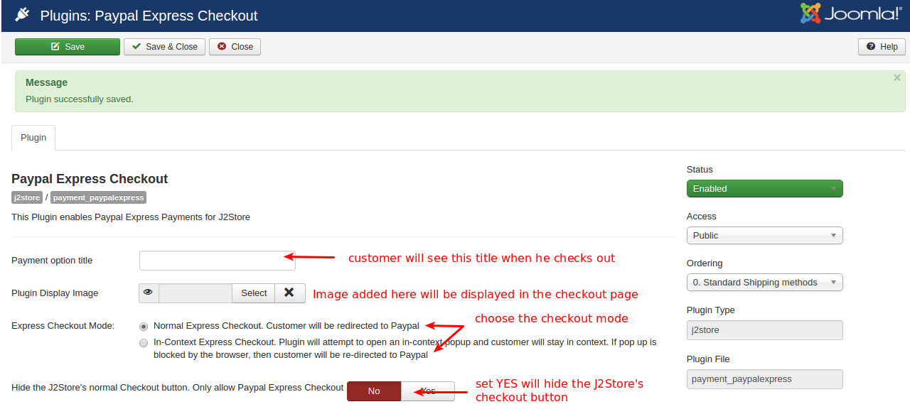
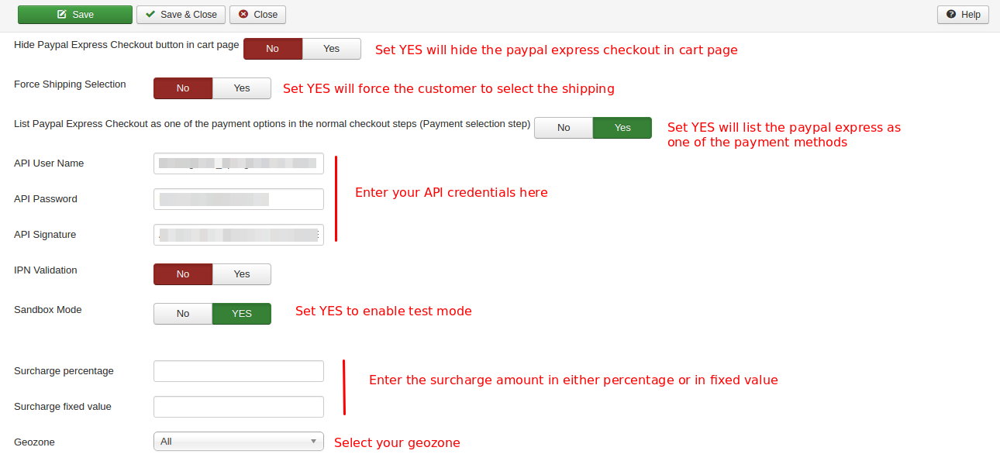
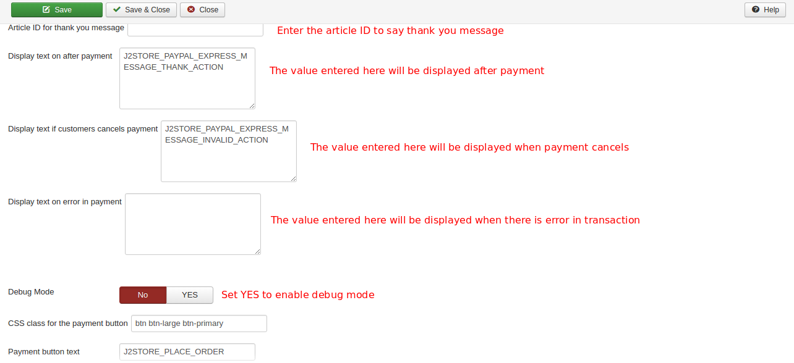
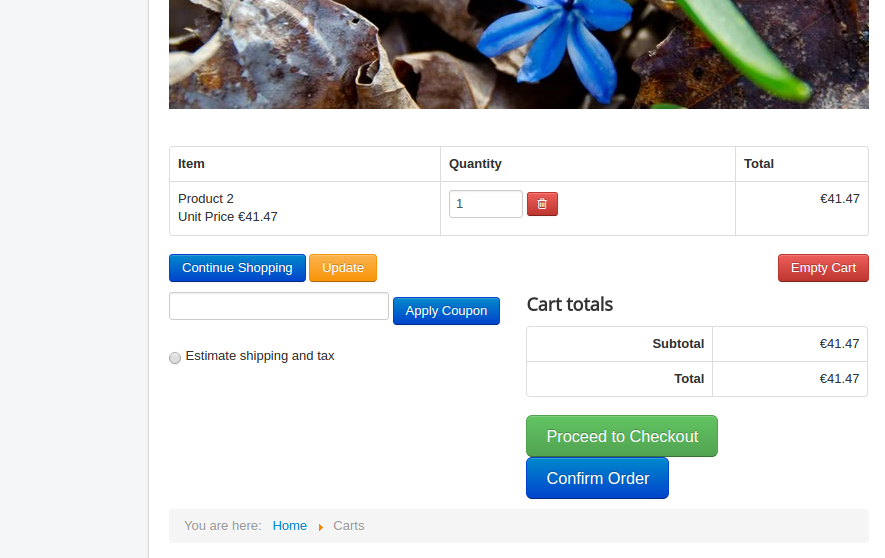
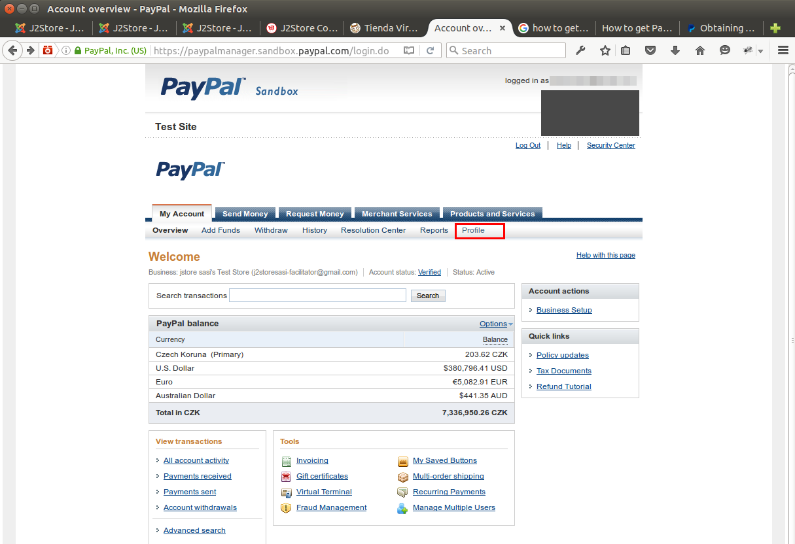
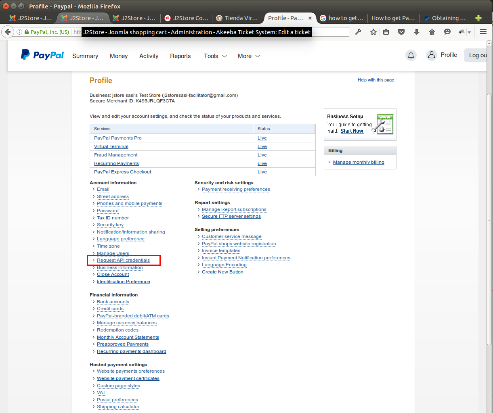
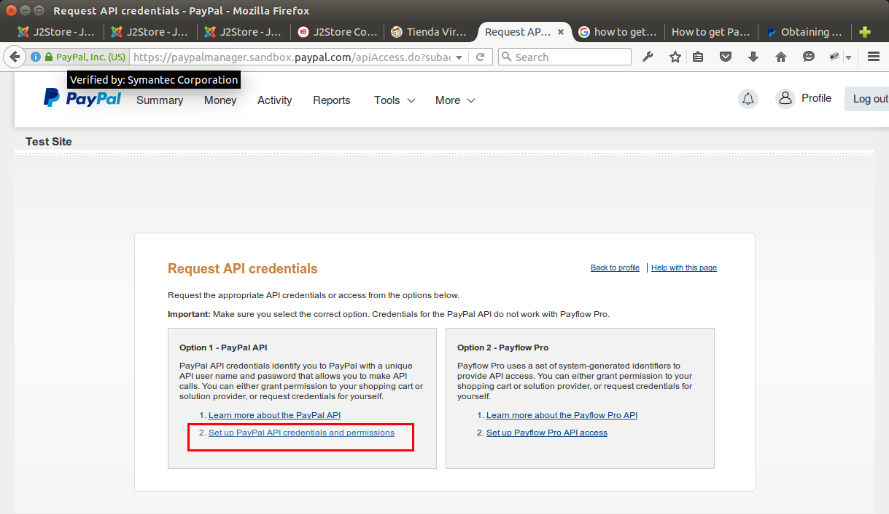
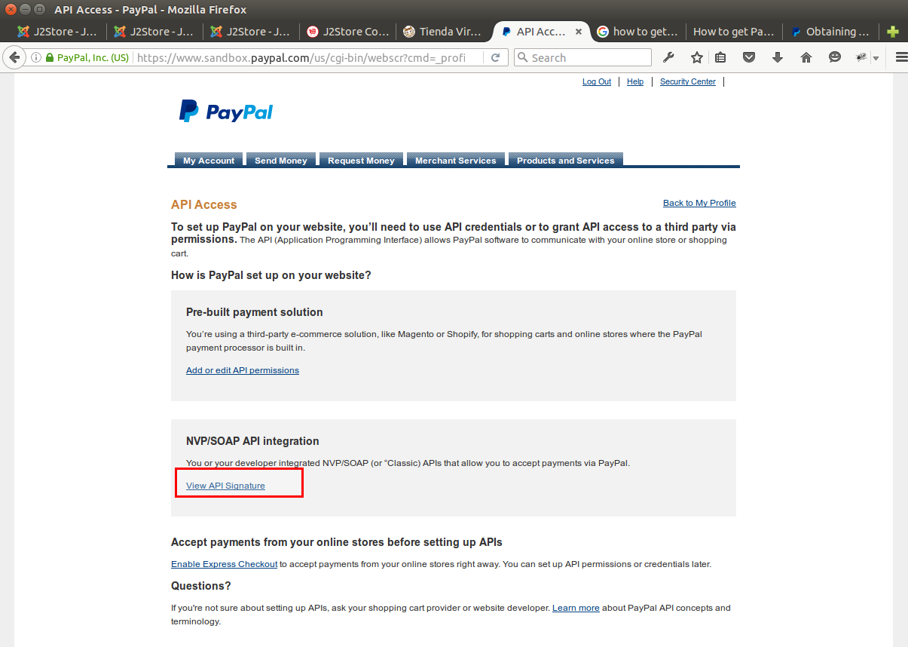
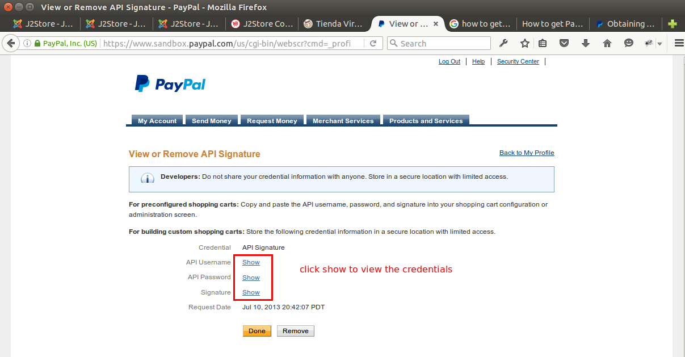
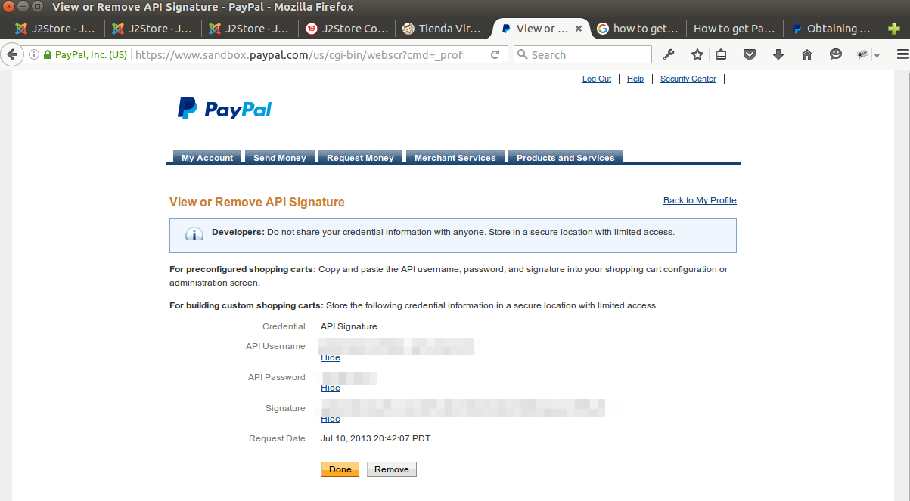

# Paypal Express Checkout

This feature saves your customer the trouble of entering billing and shipping information again and again. This is how it works.
Once the customer saved his API credentials in plugin's configuration, the paypal express checkout button will be added in the cart page
After the adding to cart process two options are presented to him. 
* Confirm Order
* Proceed to checkout (default option and you can hide this in plugin's param setting)

When the first option is selected (Confirm Order option), the customer can directly checkout without having to enter his billing/shipping details. Paypal can directly access customer information that has already been saved.

####System Requirements

* PHP 5.4 or greater

* Joomla 3.x

* J2Store 3.2.x or greater

####Installation Instructions

* Use the Joomla installer to install the plugin.

* In the backend, go to J2store Dashboard -> Payment methods and enable plugin.

* Open the plugin and enter the parameters (read the explanation about each parameter given below)

* Save and close it.

####Configuration

**Payment option title**

The value entered here will be used as the title for the payment. Customer will see this value when he checks out.

**Plugin display image**

This image will be displayed while payment options are listed in the checkout page.

**Express checkout mode**

* ***Normal Express Checkout***

  Choosing normal express checkout will redirect the customer to the paypal
  
* ***In-Context Express Checkout***

  Choosing this option will open an in-context popup and customer will stay in context.
  
**Hide the J2Store's normal Checkout button. Only allow Paypal Express Checkout**

Set this option to YES will hide the J2Store's normal checkout button in cart page and keep the paypal express checkout button.

**Hide Paypal Express Checkout button in cart page**

Set this option to YES will hide the Paypal Express Checkout button in cart page.

**Force Shipping Selection**

Choosing YES will force the customer to select the shipping method if the customer not chosen the shipping method when placing order.

**List Paypal Express Checkout as one of the payment options in the normal checkout steps (Payment selection step)**

Set this option to YES will list Paypal Express Checkout as one of the payment methods in the checkout steps.

**API User Name**

Enter the API username provided by Paypal.

**API Password**

Enter the API password provided by Paypal.

**API Signature**

Enter the API Signature provided by Paypal.

**IPN Validation**

Set this option to YES will enable the IPN validation.

**Sandbox Mode**

Set this option to YES will allow you to test your store with test account.

**Surcharge percentage and Surcharge fixed value**

Surcharge will be calculated based on the percentage of the total order and the cost will be added to the order. You can specify the surcharge value either in percentage or in fixed value.

**Geozone**

By selecting a geozone here, you can restrict this payment method to only customers of that geo-region. Choose All geozones to show this method to all customers.

**Article ID for Thank You message**

You can create a Joomla Article to say thanks to the users, who purchased in your online store. Enter the article ID here.

**Display text on after payment**

The text entered here will be displayed when customer completes the payment.

You can enter a language constant as a value here if you are using a multi-lingual site and then write a language override. Refer the Display text on selection parameter.

**Display text if customers cancels payment**

The text entered here will be displayed to the customer when he cancels the payment at the gateway (NOT in your site).

You can enter a language constant as a value here if you are using a multi-lingual site and then write a language override. Refer the Display text on selection parameter.

**Display text on error in payment**

The text entered here will be displayed to the customer when there is an error in the payment process.

You can enter a language constant as a value here if you are using a multi-lingual site and then write a language override. Refer the Display text on selection parameter.

**Debug Mode**

Choose YES to enable the debug mode. If you set this to yes, then debug messages will be logged and saved in the cache folder in your Joomla root directory. DO NOT select YES in the live site.

**Payment button text**

Text entered here will be added as the name of the payment button.

You can enter a language constant as a value here if you are using a multi-lingual site and then write a language override.

####Frontend Demo

####How to get API access credentials from paypal

1. Log in to your PayPal Business account.

2. Click the My Account tab.

3. Click the Profile tab. If you haven't already done so, you need to verify your account before requesting API credentials.

4. Click Request API credentials under Account information.

5. Click Set up PayPal API credentials and permissions under Option 1.

6. Click View API Signature under NVP / SOAP API integration.

7. Click SHOW to view the credentials.

8. Copy and paste the API username, password, and signature into your Paypal Express Checkout payment plugin's configuration.

