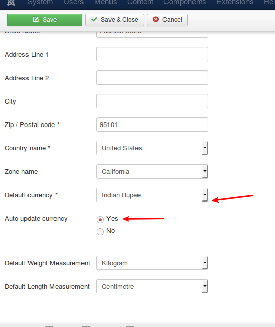
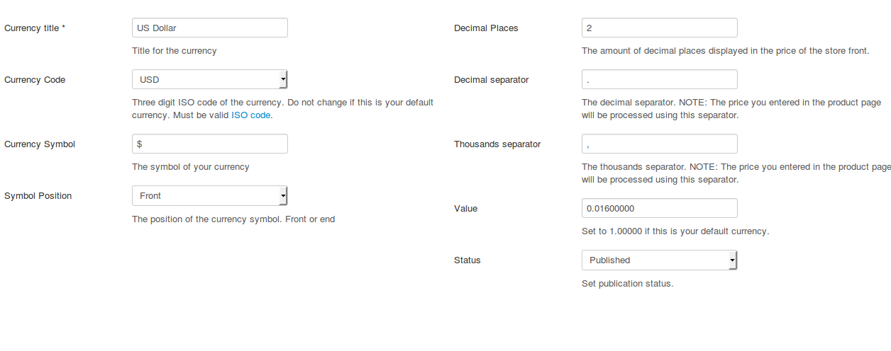
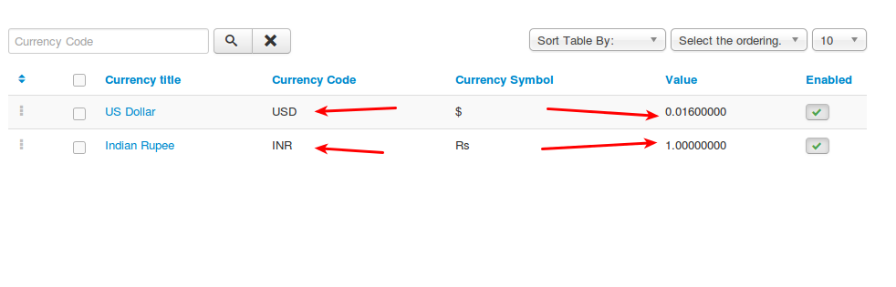

# Paypal Payment Plugin

* [Requirements](#requirements)
* [Installation Instructions](#installation)
* [Parameters](#parameters)
* [Troubleshooting Paypal Related Issues](#troubleshooting)
	* [Orders not confirmed. Status shows as incomplete or new](#orders_not_confirmed)
	* [Order status Failed](#order_status_failed)
	* [Currency is wrong. Paypal payment screen shows USD while my currency is different](#currency_is_wrong)
	* [Paypal duplicate invoice ID and how to solve it ](#paypal_duplicate)
		* [Solution 1: Set the Invoice Prefix](#invoice_prefix)
		* [Solution 2: Change settings in Paypal](#change_settings)
    * [Things don't appear to be working at the moment. Please try again later](#things_don't appear to be working at the moment)


## Introduction
Paypal standard plugin for J2Store allows you to accept payments via Paypal Payment Gateway. This uses the Paypal's Website Standard Payment. Customer will be redirected to Paypal to make payment securely 

<a name="requirements"></a>
## Requirements 
* PHP 5.2 or higher 
* Joomla 2.5.x 
* J2Store 2.0 or above 
<a name="installation"></a>

## Installation Instructions 
1. Use the Joomla installer to install the plugin. 
2. In the backend, go to Extensions->Plugin Manager and open the Paypal Payments 
plugin. (type=**j2store**). 
3. Enable the plugin 
4. Enter the parameters (read the explanation about each parameter given below) 
5. Save and close it. 

Now you can see the Paypal Payments as an option during the Check out process. 
<a name="parameters"></a>

## Parameters 
**Paypal Merchant Email Address**

This is your original paypal email/merchant email address, which you have used in Paypal. 

**Surcharge Percentage**

You can collect a percent of the total order value as surcharge / fee for using the Paypal option from your customers using this option.  You can enter a value here (for example: 2 ).  If you enter 2 here, then 2 % of the total order value will be added as a handling cost to the order.

This is optional parameter.

>NOTE: DO NOT enter any symbol like % here.

Leave empty if you dont want to charge.

**Surcharge Fixed**:

You can collect a  fixed surcharge / fee for using the Paypal option from your customers in addition to the order value.  You can enter a value here (for example: 2 ).  If you enter 2 here, then 2 will be added as a handling cost to the order.

Leave empty if you dont want to charge.

This is an optional parameter.

**Use SSL to post back to Paypal?**

If you are using SSL certificate (https), enable this with a **Yes**. If you dont know what SSL is, better leave it as **No** 

**Use Paypal Sandbox**

Paypal offers a testing suite called Sandbox. Before going live, you can test your store using the Paypal's sandbox feature. Read more about Paypal Sandbox at developer.paypal.com.

>IN LIVE SITE, THIS SHOULD BE SET TO NO. 

**Paypal Sandbox Merchant Email**

Your paypal sandbox email. 

**Article ID for Thanks you message**

You can create an article to say thanks, provide some information or instructions to the customers, who purchased in your online store. Enter the Article ID here. This will show, 
when customers return from the paypal. 

**Geozone**

By selecting a geozone here, you can restrict this payment method to only customers of that geo-region. Choose All geozones to show this method to all customers.

**PayPal Callback Text**

What the button on the PayPal site reads after the user has completed his transaction. Leave empty for the default 'Return to the merchant website' text. 

This is an optional parameter.

**Custom Header Image **

The URL to your logo so. This image will be displayed on the top of PayPal's checkout page instead of your merchant name. 

>WARNING! It must be an HTTPS URL, otherwise your clients will 
receive warnings about insecure content. 

This is an optional parameter.

**Header Background Colour**

The hex-code of your PayPal checkout page's header, e.g. FFFFFF for white (note: place no # in front the hex value) 

This is an optional setting.

**Header Background Colour**

The hex-code of your PayPal checkout page's header, e.g. FFFFFF for white (note: place no # in front the hex value) 

This is an optional setting.

**Header Border Color** 

The hex-code of your PayPal checkout page's header border, e.g. FFFFFF for white (note: place no # in front the hex value) 

This is an optional setting.

**Logo Image for display in Paypal**

The URL of the 150x50-pixel image displayed as your logo in the upper left corner of PayPal’s pages. Default: your business name (if you have a Business account) or your email address (if you have Premier account). If this is not working, try using the Custom Header Image param above. 

This is an optional setting.

**Display text on selection**

The text entered here will be displayed when customer selects this payment method. You can enter a language constant as a value here if you are using a multi-lingual site and then write a language override. Refer the tips below

>Tip - ONLY FOR MULTI-LINGUAL SITES

For example, enter a language constant:

J2STORE_TEXT_TO_DISPLAY_ON_SELECTION.

Now you can go to Joomla admin-> Language Manager->Overrides and create overrides for the language constant in all your languages.

**Display text before payment**

The text entered here will be displayed to the customer at the order summary screen before he makes the payment. You can enter a language constant as a value here if you are using a multi-lingual site and then write a language override. Refer the Display text on selection parameter.

**Display text after payment/order**

The text entered here will be displayed to the customer after he makes the payment. You can enter a language constant as a value here if you are using a multi-lingual site and then write a language override. Refer the Display text on selection parameter.

**Display text on error in payment**

The text entered here will be displayed to the customer when there is an error in the payment process.

You can enter a language constant as a value here if you are using a multi-lingual site and then write a language override. Refer the Display text on selection parameter.

**Display text on cancel payment**

The text entered here will be displayed to the customer when he cancels the payment at the gateway (NOT in your site).

You can enter a language constant as a value here if you are using a multi-lingual site and then write a language override. Refer the Display text on selection parameter.

**Payment Button Text**

The text of the payment button. The button will be displayed at the final checkout step.

<a name="troubleshooting"></a>
## Troubleshooting Paypal Related Issues

There could be many reasons why your Paypal Plugin is not working. This guide lists most common reasons and solutions for them.
<a name="orders_not_confirmed"></a>
### 1. Orders not confirmed. Status shows as incomplete or new

It means you are not getting the Instant Payment Notification (IPN) from Paypal.
The IPN may not reach your site, if :
 1. The Site is offline
 * The Site is in local server / local host / live in your local machine
 * You have created a menu for the Checkout and set its access level to Registered or Special or Something other than public. 
 * You have a firewall installed either in your site or by your host
 * You have disabled IPN in your Paypal account.


##### Solutions to above issues :

1. Go to Joomla admin - Global configuration. Set **Site Offline** to No
2. Host your site
3. Set the Checkout menu access level to Public
4. If you have a firewall like Admin Tools, then you can add Exceptions. Please consult with your firewall provider or with your host. 
 
if your site or your hosting server has a firewall (you can check with your host), then you may have to whitelist the Paypal's server IPs

Here you can get a list of IPs used by the Paypal servers
https://ppmts.custhelp.com/app/answers/detail/a_id/92

Paypal makes a remote post (IPN) to your site when a payment is made to inform us that payment has been made and you can mark the order complete. Firewalls normally block remote posts. So we may have to whitelist the IPs allowing them to do the remote post.

5. Enable the IPN in your Paypal account. 

Login to your Paypal account

Click Profile on the My Account tab.

Click Instant Payment Notification Preferences in the Selling Preferences column.

Click Choose IPN Settings to specify your listener's URL and activate the listener.

In the Listener's url enter the following url

```
http://<YOUR_DOMAIN>/index.php?option=com_j2store&view=checkout&task=confirmPayment&orderpayment_type=payment_paypal&paction=process&tmpl=component
```

NOTE: Replace <YOUR_DOMAIN> with your website. E.g: www.example.com

**Still no luck, check the IPN History**
Login to your paypal account and go to History -> IPN history. Check the recent IPN history and check the status.
If possible take a screenshot and contact our support team.
<a name="order_status_failed"></a>
### 2. Order status Failed

Are you using your Primary Paypal Email as your merchant email? If your order status says failed, then chances are that you are using a secondary email of your Paypal account.

Paypal allows you to add multiple emails in an account to accept payments. With the Paypal plugin for J2Store, make sure you are using your primary Paypal account email. You can check which is your primary email by signing into your Paypal account and then going to Profile -> Add / Edit emails page.


<a name="currency_is_wrong"></a>
## 3. Currency is wrong. Paypal payment screen shows USD while my currency is different

Paypal supports multiple currencies. However, it does not support all currencies of the world. Please ensure that your currency is supported by checking this page: https://www.paypal.com/multicurrency

If your currency is not supported, Paypal will automatically assume the currency as USD.

A workaround to this problem : Allow customers to shop in your currency and convert it to USD when they are redirected to paypal for payment.

Here is a step by step guide to set up auto conversion of your currency to USD.

Let us assume, your store is located in India and your currency is INR. But Paypal does not support INR.

Here is how you can overcome the issue.

####Step 1: Enable Auto currency update

Go to Joomla admin - j2store - set up - > configuration -> Store tab
Set your Default Currency as INR
Set Auto update currency to YES

####Step 2: Create multiple currencies
Go to Joomla admin - j2store - set up - currencies

You might have already created the INR currency. Open it and make sure its value is set to 1

**Now, create a new currency**

Currency Name: USD
Currency Code: USD
Currency Symbol: $
Decimal places: 2
Decimal Separator: .
Thousands separator: ,
Value: 0.061 (You can enter any value less than 1. Once saved, J2Store will automatically contact Yahoo Financial services and update the correct exchange value )
Status: Published

Save now.


You are all set now. Prices in your store will now display in INR. When the customer is redirected to paypal, he will be asked to pay in USD. 
J2Store will automatically do the currency conversion depending on the prevailing exchange rate.
<a name="paypal_duplicate"></a>

## 4. Paypal duplicate invoice ID and how to solve it
Paypal by default does not allow duplicate invoices. When you try to pay for a duplicate invoice id, Paypal will produce the following error:

>**The transaction was refused as a result of a duplicate invoice ID supplied. Attempt with a new invoice ID**

If this were to happen, one of the reasons could be that the configuration in Paypal is set to not accept duplicate invoices. You may receive orders from various places and if the invoice numbers are the same, Paypal recognises there is an invoice duplication.

There are two ways, by which you can fix this.
<a name="invoice_prefix"></a>

#### Solution 1: Set the Invoice Prefix

Please follow the steps:

1. From your J2Store Dashboard, go to - Set Up -> Configuration -> Order

>Note: This step is for V3. If you are using v2, then go to Set Up -> Store Profiles -> your store profile

2. Set the Invoice Prefix in the textbox provided, for e.g., INV-2015- or INV/2015/

3. Save & Close.

<a name="change_settings"></a>

#### Solution 2: Change settings in Paypal

Please try the following:

1. Log-in to your Paypal account
2. Click Profile
3. Under Selling Preferences, click Payment Receiving Preferences
4. Under Block Accidental Payments choose "No, allow multiple payments per invoice ID".
5. Save.

<a name="things_don't appear to be working at the moment"></a>
## Things don't appear to be working at the moment. Please try again later

Paypal has recently rolled out their cool " New Checkout! "

With this Paypal also seems to impose certain new technical restrictions
- Specified Character length for address fields, Product name and Product options. Length varies based on fields and is specified on their integration guide.
- Number of product options sent to paypal are limited to 7 options.

It seems there are recent technical restrictions imposed by paypal: (refer below image)


####How to fix it ?

We have updated the paypal plugin with fixes for these new technical restrictions. Please make sure you update your paypal plugin to latest (v.3.4)
With this update if you have used more than 7 options then the first 7 options are passed to paypal and others are ignored. Similarly if the product option character length is larger than allowed by paypal, those values are trimmed (cut off). This will make sure you do not get any errors and customers will continue to see checkout screen without any issues.

**NOTE:** Please take a backup before updating the plugin and test after installing.