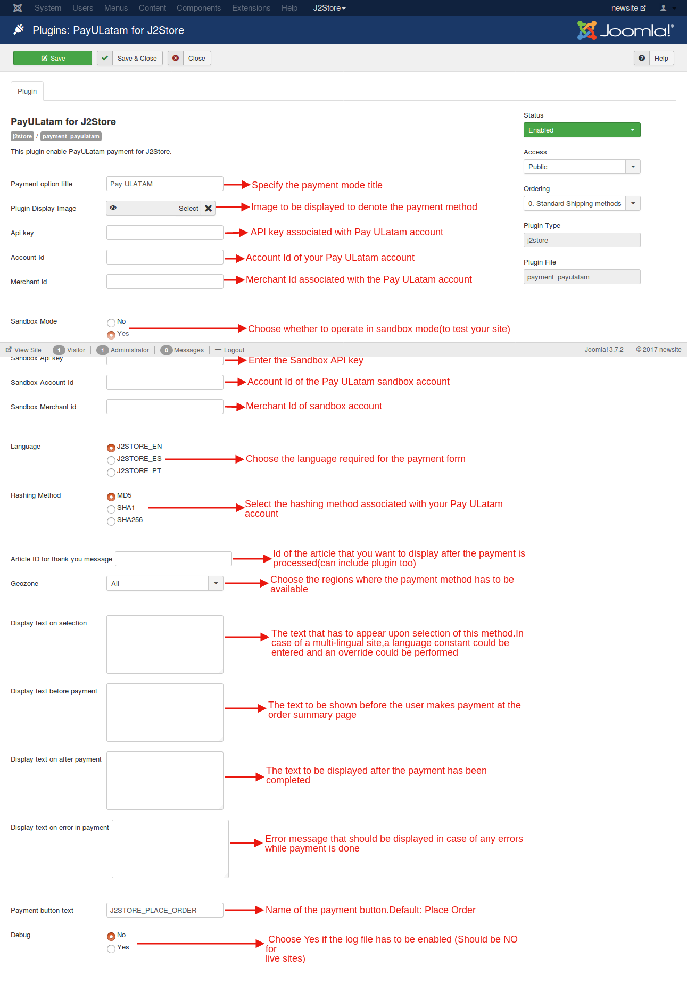

# Pay ULatam

This payment plugin is a for PayU plugin for online payments in Argentina, Brazil, Chile, Colombia, Mexico, Panama, Peru.

## Installation

This plugin can be downloaded from our site and installed using the default joomla installer.

## Configuration

Post installation, the plugin settings can be configured by the following steps:

* Go to Extensions->Extension manager->Plugins.

* Choose PayULatam for J2Store to configure.
## Settings

* **Payment Option title**

   Enter the title for the payment mode.

* **Plugin Display Image**

   Choose the image that has to be displayed when the payment methods are listed in the checkout page.

* **Api key**

   Enter the API key that is associated with your PayULatam account.

* ** Account Id**

   Specify the account id associated with your PayULatam account.

* **Merchant id**

   Mention the merchant id of your PayULatam account.

* **Sandbox Mode**

   Choose Yes if you wish the site to be operated in test Mode.

   **Note:** Not for live sites.

* **Sandbox Api key**

   Enter the API key associated with your PayULatam Sandbox account.

* **Sandbox Account Id**

   The account id of your PayULatam Sandbox account has to be provided here.

* **Sandbox Merchant Id**

   The Merchant Id of the Sandbox account should be keyed in here.

* **Language**

   Choose the language for the Payment form.

* **Hashing Method**

   Choose the hashing method associated with your PayULatam Sandbox account.

* **Article ID for thank you message**

   The Id of the article that has to be displayed after the payment is made.

   This could be an article or a plugin or anything that has to be displayed after the payment.

* **Geozone**

   This plugin provides option to restrict the payment method for certain regions.You could select the regions for which the payment should be available.

* **Display text on selection**

   Text to be displayed upon selection of this payment method has to be typed here.

   If the site is multi-lingual, then a language constant could be provided here and an override could be performed.

* **Display text before payment**

  Text to be displayed before completion of the payment could be entered here.

  In case of a multi-lingual  site, then a language constant could be provided here and an override could be performed.

* **Display text on after payment**

  Text to be displayed upon completion of the payment has to be specified here.

  In case of a multi-lingual  site, then a language constant could be provided here and an override could be performed.

* **Display text on error in payment**

  Error message that has to be displayed in case of any errors during payment should be given here.

  If the site is  multi-lingual, a language constant could be provided here and a override could be performed.

* **Payment button text**

  The default text being Place order,the name of the payment button has to be specified here.

* **Debug**

  Select Yes if you wish to enable the log files.

  **Note:** Not for live sites.

* Click Save.

**Relevant Screenshot**

 This Screenshot depicts the settings for the plugin:

 
