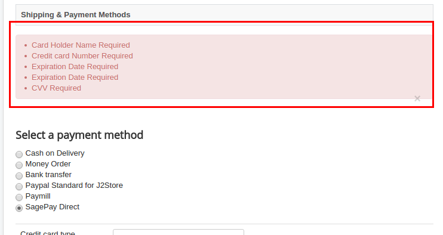
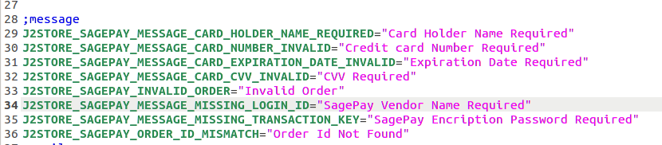
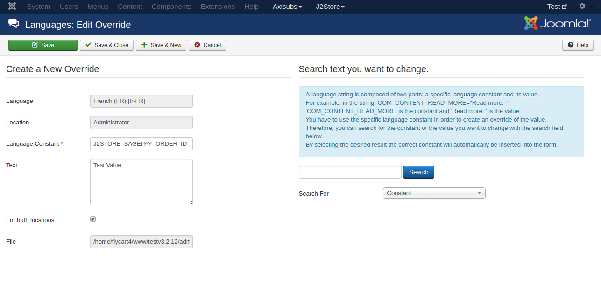

# How to write language override for plugin in multilingual site

Sometimes you need to translate some text (which is rendering from any apps or plugin) for your multilingual site. This guide will help you on how to translate them. Please keep following the instructions given below.

####Find the language constant

First thing, you have to find the language string for the text which you want to translate.

For example, if you are using Sagepay payment plugin in your site and wants to translate the error message, please open the downloaded plugin file.


Open the language folder and edit the .INI file.

Find the language constant for the text which you want to translate.

Once find the language constant, go to Extensions > Language > Overrides

Before creating the override, set the Filter to ADMINISTRATOR (of the language that you wanted to create override. Say, your language is French. Then you should select the German (fr-FR) Administrator in the filter)

Click **NEW** button.


Enter your language constant in the language constant text box and enter the value in the Text box.

Check For both locations and save.


```
NOTE: For translating the plugin's text in multilingual site, please dont't put the language strings directy into your site's language file. Please create a language override for the specific language.
```

