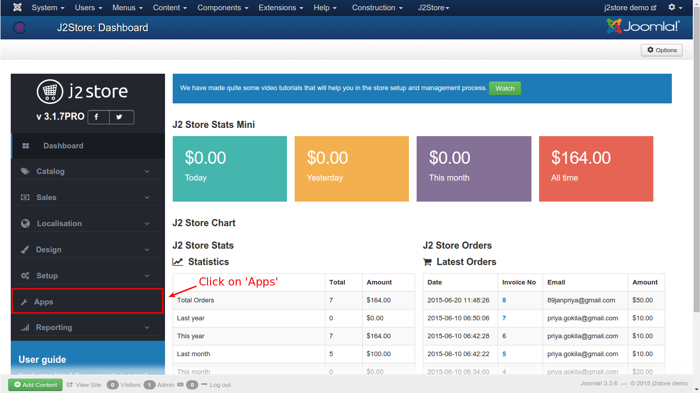
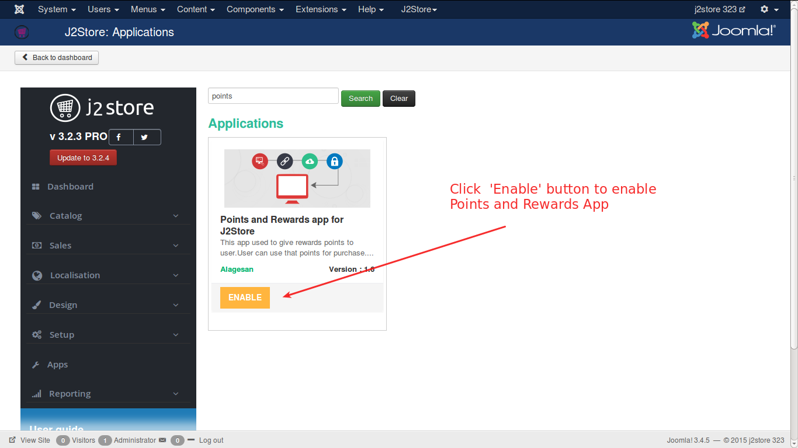

# Points and Rewards

This app used to give rewards points to user.User can use that points for purchase.

#### Requirements

* PHP 5.2 or higher
* Joomla 3.3 or above
* J2Store 3.2.x or above

#### Installation Instructions
1. Use the Joomla installer to install the app. 
2. In the backend, go to **J2Store Dashboard -> Apps** as shown in the image below. 

3. Click **Enable** in the Point and Rewards plugin. (type=j2store). 

4. After the app is enabled, click on **Open** to set the configuration for the app.

5. Enter the parameters (read the explanation about each parameter given below) 
6. Save and close it.

