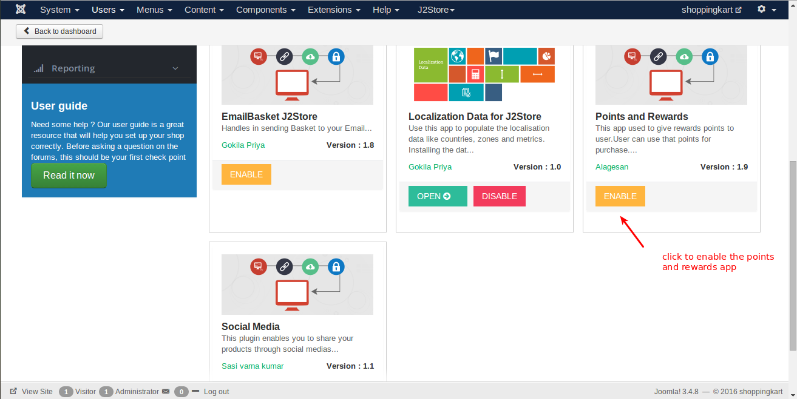
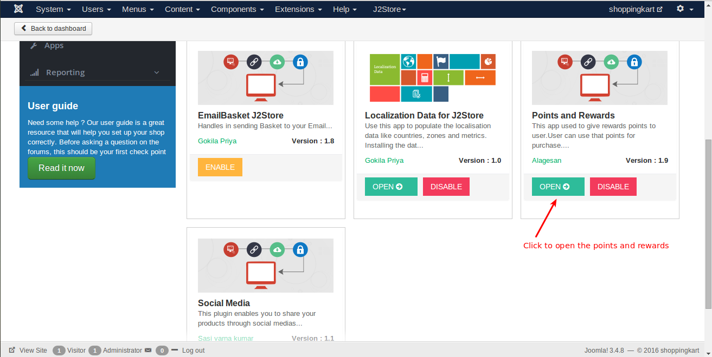
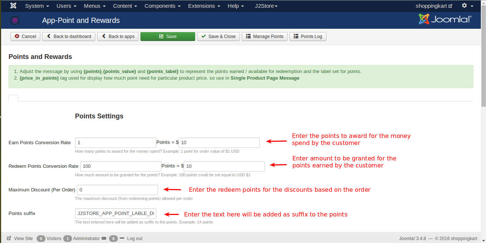
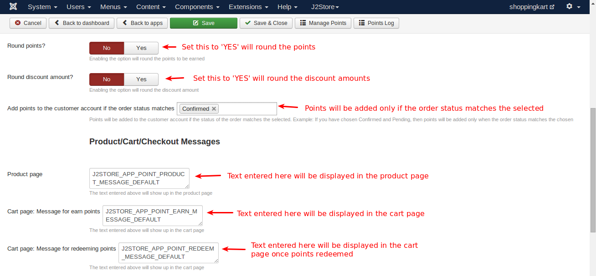
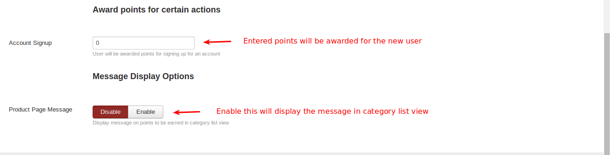
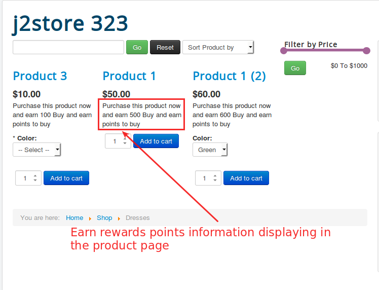

# Points and Rewards

This app used to give rewards points to user.User can use that points for purchase.

#### Requirements

* PHP 5.2 or higher
* Joomla 3.3 or above
* J2Store 3.2.x or above

#### Installation Instructions
1.Use the Joomla installer to install the app.
2.In the backend, go to **J2Store Dashboard -> Apps** as shown in the image below. 
3.Click **Enable** in the Point and Rewards plugin. (type=j2store). 

4.After the app is enabled, click on **Open** to set the configuration for the app.

5.Enter the parameters (read the explanation about each parameter given below)

6.Save and close it.

#### Parameters
The below image illustrates the settings of parameters:

##### Points Settings
* ***Earn Points Conversion rate***

     Enter the points to be awarded for the money spend by the customer. For example,**1 point = $10**. The customer will be awarded 1 point for the amount($10) he spent.
     
* ***Redeem points conversion rate***

     Enter the amount to be granted for the points earned by the customer. For example, **100 points = $10**. The customer will be granted $10 for the points he earned(100 points).
     
* ***Maximum Discount(Per order)***

     Enter the redeem points for the discounts based on the order.
     
* ***Points suffix***

     The text entered here will be added as suffix to the points. For example, 14 credits.
     

* ***Round points***

     Set this to **YES** will round the points. For example, if point is in decimal(0.60), it will change the decimal to whole number.
     
* ***Round discount amount?***

     Set this to **YES** will round the discount amount.
     
* ***Add points to the customer account if the order status matches Confirmed***

     Points will be added only if the order status matched the selected. For example, if you have chosen the status confirmed, then the points will be added only when the order status matched the selected. **Preferred status : Confirmed**
     
#####Product/Cart/Checkout/ Messages

* ***Product page***

     You can enter custom message you want to display in the product page about earning of reward points on every purchase of the product.
     
* ***Cart page: Message for earn points***
     You can enter custom message you want to display in the cart page about earning of reward points when customer complete the order.
     
* ***Cart page: Message for redeeming points***

     You can enter the redeem points message, so that customer can apply their points to get discount.
     

#####Award points for certain actions

* ***Account Signup***

     Enter the number of rewards for the new customer registration.
     
* ***Product Page Message***

     Set this **YES** will display the reward points information message in the category list view.
     

     
    
#### Custom Tags 
  1. Adjust the message by using **{points}**, **{points_value}** and **{points_label}** to represent the points earned / available for redeemption and the label set for points.
  
  2. **{price_in_points}** tag used for display how much point need for particular product price. so use in Single Product Page Message.
  
#### Front page
Go to J2store Product Shop 
You can see the information displayed about the rewards and points.

#### My Profile
 Go to Myprofile Menu -> Rewards (Tabs)
  
  Here you can see list of points you earned.
  

 