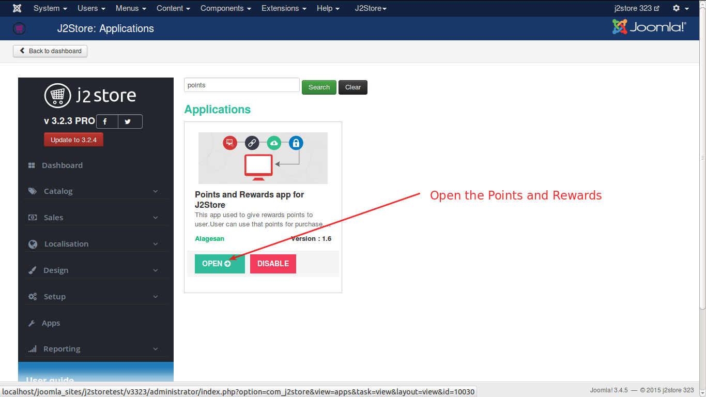

# Points and Rewards

This app used to give rewards points to user.User can use that points for purchase.

#### Requirements

* PHP 5.2 or higher
* Joomla 3.3 or above
* J2Store 3.2.x or above

#### Installation Instructions
1. Use the Joomla installer to install the app. 
2. In the backend, go to **J2Store Dashboard -> Apps** as shown in the image below. 

3. Click **Enable** in the Point and Rewards plugin. (type=j2store). 

4. After the app is enabled, click on **Open** to set the configuration for the app.

5. Enter the parameters (read the explanation about each parameter given below) 
6. Save and close it.

#### Parameters
The below image illustrates the settings of parameters:

* #### Points Settings
    * ###### Earn Points Conversion rate
         Enter how many points the customers, should earn for each dollar spent.

    * ###### Redeem Points Conversion rate
        Points are earned for purchases based on the conversion rate you set. For example, customers could earn 1 point for every dollar spent.

    * ###### Maximum Points Discount 
      you can set Maximum number of points should a customer to, apply discount to his order.

    * ###### Points Label 
* #### Product / Cart / Checkout Messages 
    * ###### Single Product Page Message

    * ###### Earn Points Cart Page Message

    * ###### Redeems Points Cart Page Message 

* #### Points Earned for Actions
    * ###### Points Earned for Account Signup

* #### Display Category View Message Options
    * ###### Product Page Message Enable/Disable
    
    
    

 