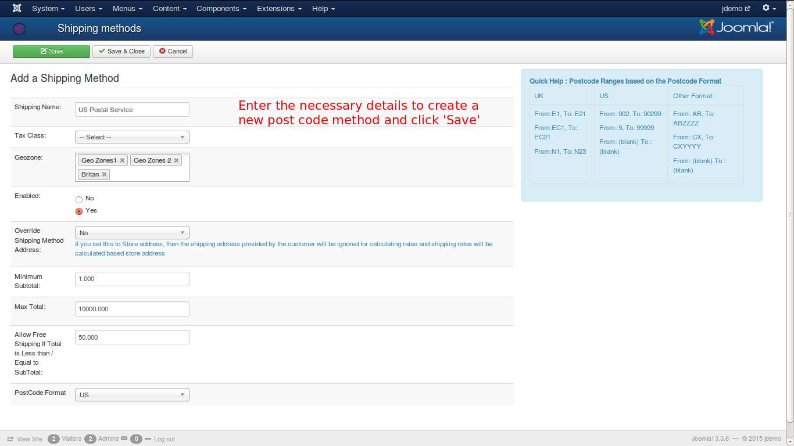
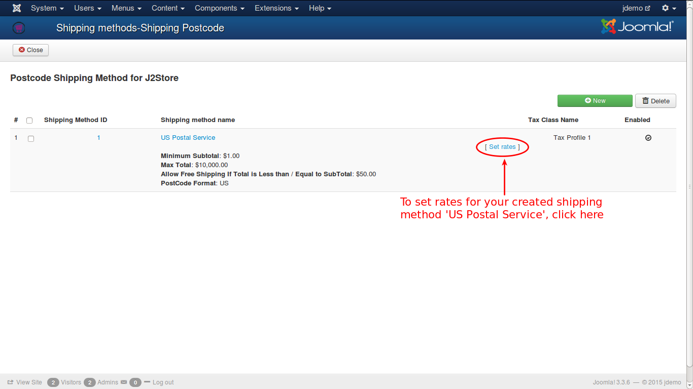
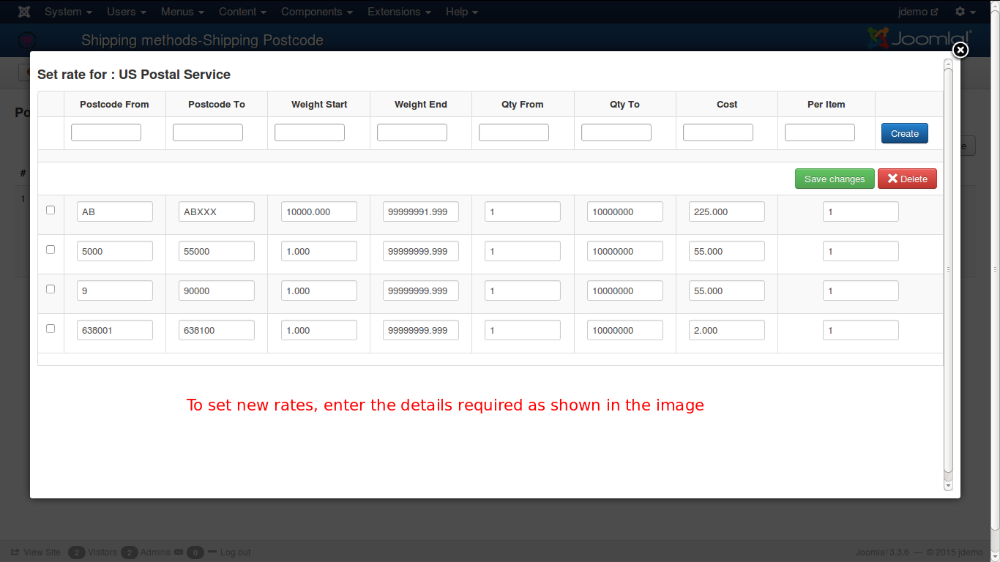
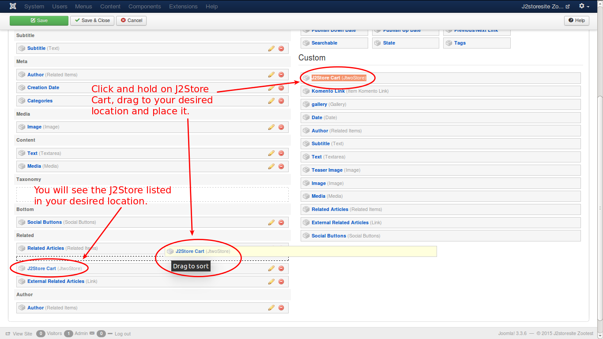

# Postal Code Shipping Plugin

The plugin integrates a postal code based shipping method for J2Store. It will calculate the shipping cost based on the postal code range, weight range and quantity range. You can use all three or just one of them.

### Requirements 
* PHP 5.3+ 
* Joomla 2.5 / 3.x + 
* J2Store 2.6.8 + 

### Installation 

You can install the plugin through the standard Joomla installer. 

### Configuration 

#### Shipping Method name
Enter a name for this shipping method. This is what your customers will see at the checkout.

#### Tax Class 
The value selected will be used in calculating tax rates.

#### Enabled
The value  selected  yes will enable the shipping plugin while displaying in the checkout.

#### Geo zones
Choose geozones for which this shipping method is available. Choose at least one.

#### Override Shipping Method
If you set this to Store address, then the shipping address provided by the customer will be ignored for calculating rates and shipping rates will be calculated based on store address.

#### Min SubTotal
If you enter a value here, then this method will apply only if the order subtotal is greater than or equal to the value.
	
#### Max SubTotal
The shipping method will apply only if the order subtotal is less than or equal to the value entered here. 

>Enter -1 to turn off this filter

#### Postal Code Format

Choose the postal code format. Most of the countries follow the US based zip codes.
**Example**: 95100 to 95300

Quite a few commonwealth countries including **UK**, follow a different post code system. 

If you are not sure about post code, do not select any format here.

Now, **Save&Close** the method.

#### Set Rates 
**To Set Rates** click on the link  "set rates" of the postcode Shipping method.

 

##### Postcode From
The starting range of the zip code

##### Postcode To
Ending range. 	

##### Weight Start
Starting weight range. Leave it empty or enter 0 if you dont 	want to  use weight range.

##### Weight End
Ending range. Leave it empty or enter 0 if you are not using weight range.

##### Quantity From
Starting quantity range (Based on total quantities in the order). Leave it empty or enter 0  if you dont want to use Quantity range.

##### Quantity To
Ending Range. Leave it empty or enter 0 if you dont want to use the Quantity range.

##### Cost
The shipping cost.

##### Per Item (Cost / number of Item)
It is bit tricky. Leave this as 1 if you do not understand.

The cost entered per item can be 1. If the cost is for 2 items (2 nos ) , you can enter 2 here. The cost will be divided by two. 

Example:  Shipping cost is 50 USD for 2 items. 50 / 2 = 25

Example 1 : 
Suppose within the United States, you want to charge $3.00 for postcodes starting with 902,  $5.00 for other postcodes starting with 9, weight range is 1 to 10 and qty range is 1 to 100

**RATE #1**
Geo Zones: United States
Cost Brackets:
- Postcode From: 902, To: 90299, Charge: 3.00
- Postcode From: 9, To: 99999, Charge: 5.00
- Weight Start: 1.000  To : 10 .000,
- Qty From: 1 To:100

Example 2:

Suppose you are based in London, and only ship to London postal districts. You charge $2.00 per item for shipping for a weight range of 1 to 10 and qty range of 1 to 100, then you would enter:

**RATE #1**
Geo Zones: United Kingdom
Cost Brackets:
- From: E1, To: E21, Charge: 2.00, Per: 1
- From: EC1, To: EC5, Charge: 2.00, Per: 1
- From: N1, To: N23, Charge: 2.00, Per: 1
- From: NW1, To: NW12, Charge: 2.00, Per: 1
- From: SE1, To: SE29, Charge: 2.00, Per: 1
- From: SW1, To: SW21, Charge: 2.00, Per: 1
- From: W1, To: W15, Charge: 2.00, Per: 1
- From: WC1, To: WC3, Charge: 2.00, Per: 1
- Weight Start: 1.000  To : 10 .000,
- Qty From: 1 To:100

Example 3:
Suppose your postcodes are made up of 6 alphanumeric characters, and you want to charge $1.00 for shipping to postcodes beginning with AB, $2.00 for postcodes beginning with CX, and $4.00 for all other postcodes.  No weight or qty ranges are used.

Then you would enter:

RATE #1

Cost Brackets:
- From: AB, To: ABZZZZ, Charge: 1
- From: CX, To: CXZZZZ, Charge: 2
- From: (blank), To: (blank), Charge: 4
- Weight Start: 0.000  To : 0 .000,
- Qty From: 0 To:0

>Note: You could also enter AB0000 and CX0000 for the "From" postcodes.

#### Debug
If you set this to yes, then debug messages will be logged and saved in the cache folder in your Joomla root directory. 

>Set this to NO in Live websites. 

*** Sample rates *** 
  
  
  
###Frontend
 ***Listing postcode shipping method***
 
Finally you can see the shipping postcode method listed.
 
 
 
#### Support 
You can contact ***support@j2store.org*** if you have any questions. 