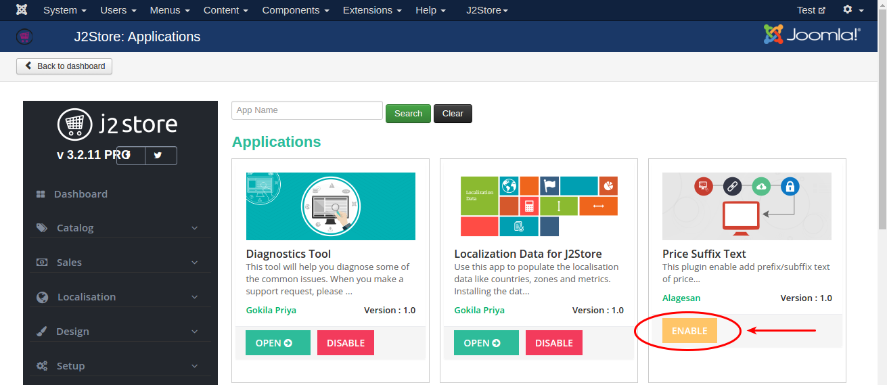
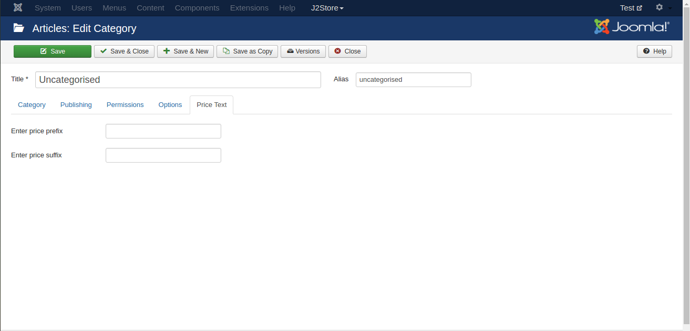
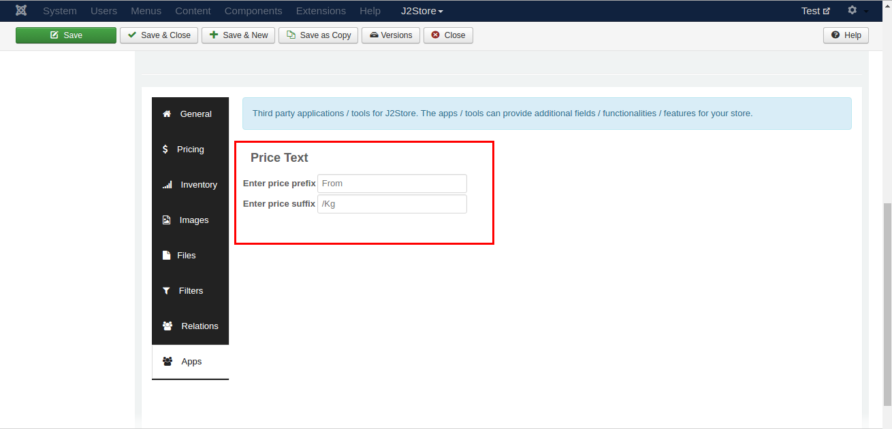
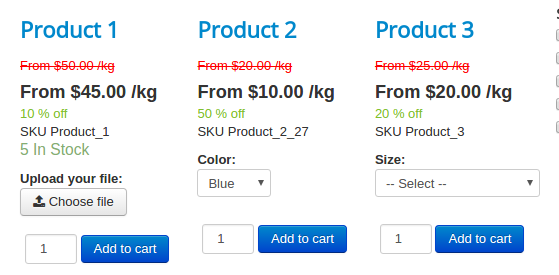

#Price Suffix Texts

This plugin enables you to add prefix and suffix text to the product's price. Sometimes you may need to add either unit(Kg, Ltr, Gm, etc) at the end of the price or to show the customer about the starting price of the product. For example, **From $45 per Kg**. This can be achieved by using this app. You can enter price suffix / prefix text for category and particular product also.

####Requirements

* PHP 5.4 or higher
* Joomla 3.3 or above
* J2Store 3.2.x or above

####Installtion

1. Use the Joomla installer to install the app.

2. In the backend, go to J2Store Dashboard -> Apps as shown in the image below.

3. Click Enable in the Price Suffix Text app.

4. Once the app is enabled, now you are ready to add the price prefix and suffix text.

####Add prefix / suffix text

Using this app, you can able to add prefix / suffix text in category level and also  to the particular product.

**Price text in category level**

Go to Category manager > YOUR_CATEGORY > price Text tab.

**Add price text to the particluar product**

Go to article manager > open YOUR_ARTICLE > J2store Cart tab

Navigate to the Apps tab where you can see the Price text app.

Now enter your price's prefix and suffix text in the text box.

Save & Close.

####Frontend

####Support

Still have questions? You can post your questions in our support forum: http://j2store.org/forum/index.html

