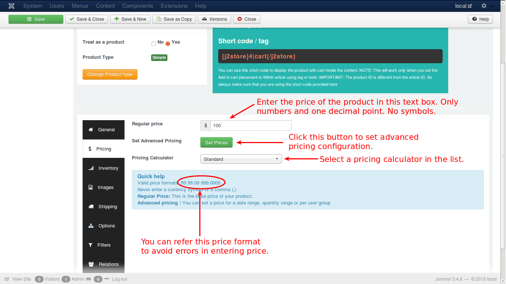
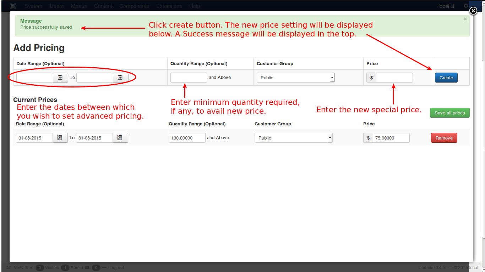

# Pricing

In this section you will understand how to set regular pricing and advanced pricing for a product.

Now, see the image below:

As illustrated in the image, you can set the regular pricing by entering the value in the text box. If you want advanced pricing, click the 'Set Prices' button and it will open up a pop-up window to allow you to set an advanced price setting.

Let us see how it happens. Check the image below:

First select the dates, between which you wish to set the advanced price. 

Then enter the minimum quantity required to avail this special price.

Select the customer group to which you offer this special price.

Now enter the new price and click create.

The price will be added and displayed below. You can edit that if you need, and click save all prices.

If you want remove that, you can do it by clicking the remove button.

