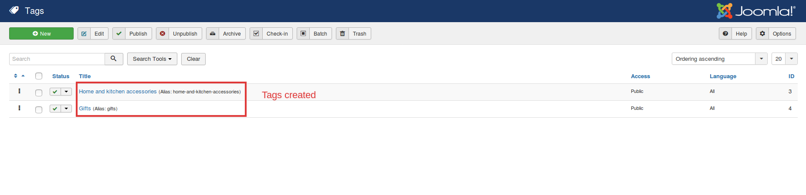
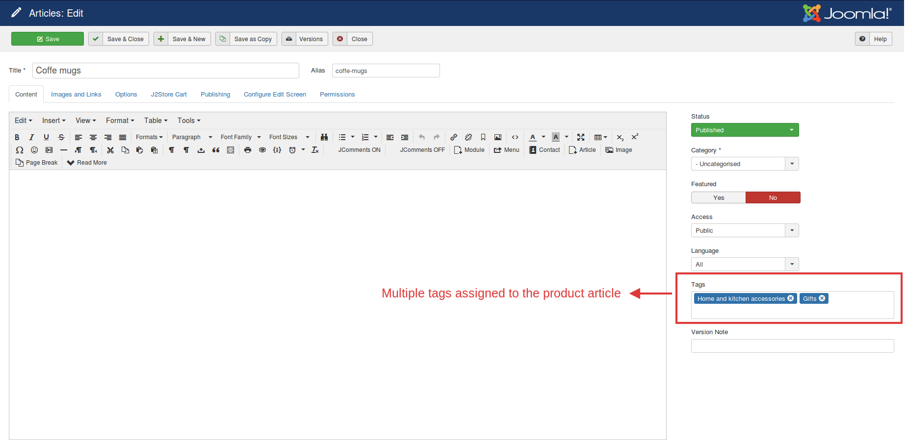
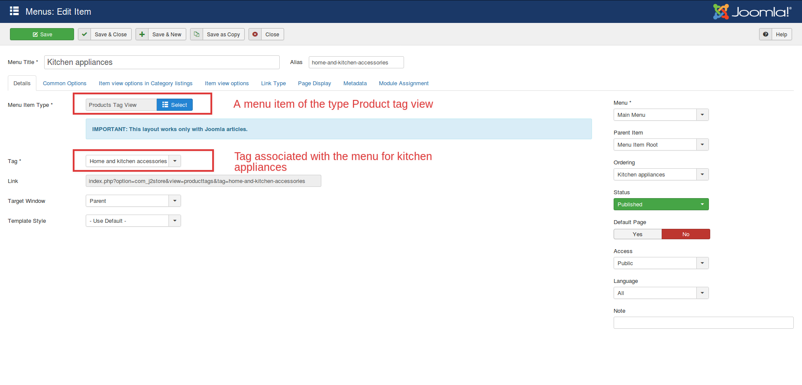
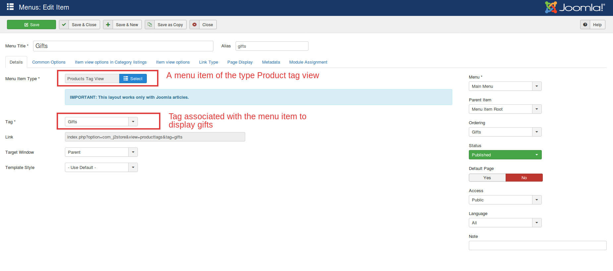
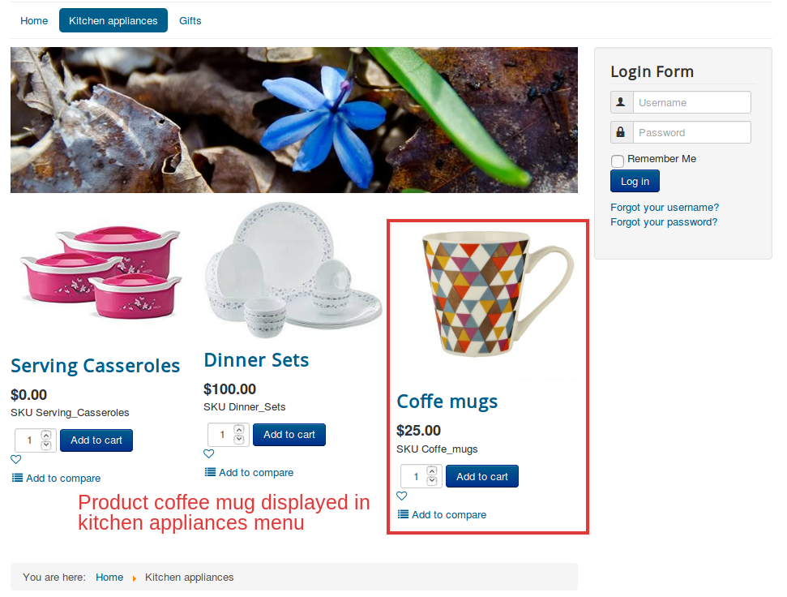
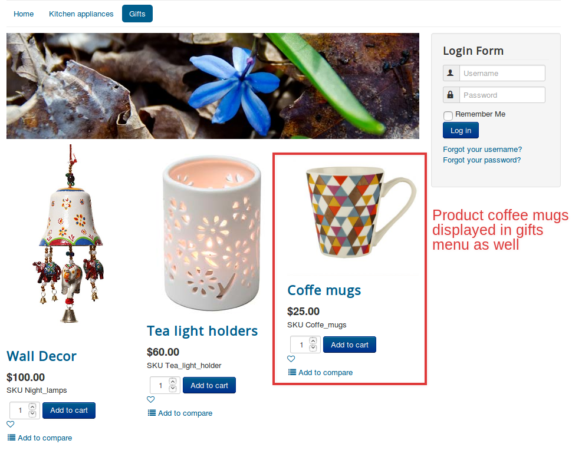

## Assigning a product to multiple categories

With the conventional list layout, it is possible to organize products based on their categories. However, there is one catch. It is not possible to assign a product to multiple categories.

Overcoming this, now we have the tag layout where it is possible for a product to be assigned to multiple categories.

### Steps to be followed:
 * Create tags that you wish to link with the product.
 * Create a product and add the tags to the product.
 * Create menus and link the tags with the respective menus.

### Scenario

  Products like Coffee mugs should be available under two categories- Kitchen appliances and Gifts.

### Steps to be done:

* Create two tags:
    * Gifts
    * Kitchen appliances
* Create a product named coffee mugs.
* Assign both the tags to the product article.
* Create menu items of the type Product tag view:
   * Kitchen appliances associating  the tag kitchen appliances
   * Gifts associating the tag Gifts
* Now the product coffee mugs will be available in both Kitchen appliances and Gifts.

Likewise, we can assign products to as many categories as we wish.

### Relevant Screenshots:

The front end view is like this:

