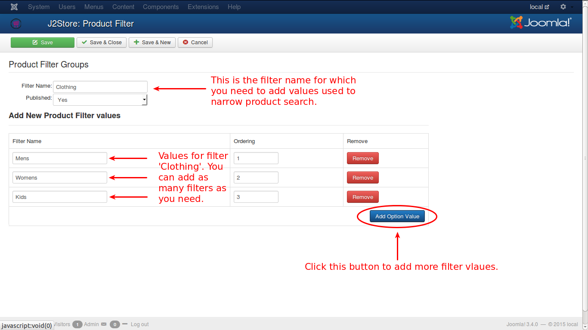

# Product Filters

These are used to narrow out the search for a particular product.

In this page, first Fiter Groups are created and in each group some Filter Names will be added, and based on the Filter Name, products will be searched.

* E.g., Filter Group : Clothing
    * Filter Names
        * Mens
        * Womens
        * Kids

This is illustrated in the image below:

#### Adding filters to product

* Go to Article manager > Open your product
* Move to J2Store cart tab
* Navigate to Filters tab
* Type the first few letters of the unique name of the product filters in the search box.
* It will display the search results in dropdown. Choose the filters from dropdown and save the product.

#### Frontend

