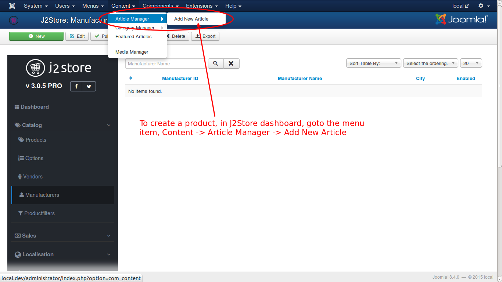
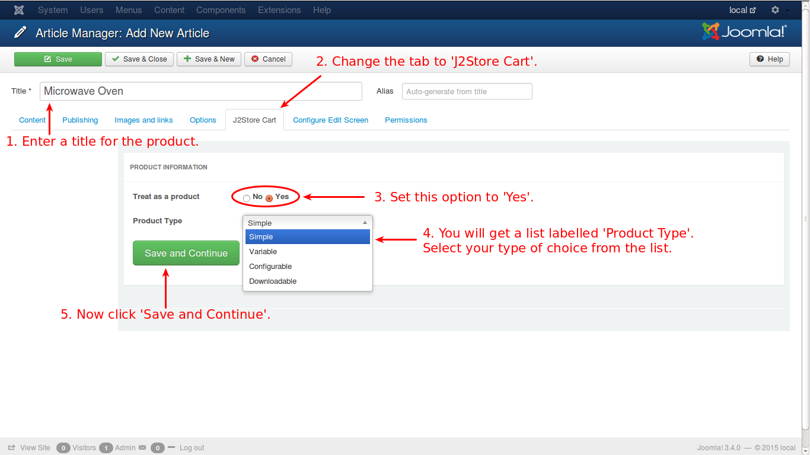
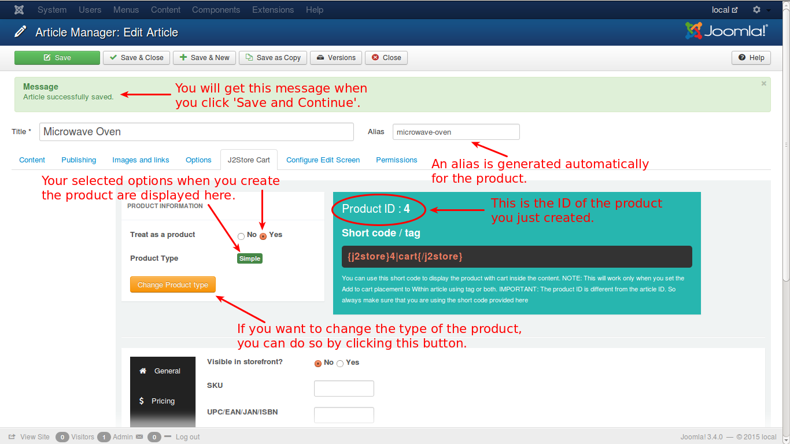

# Products

**J2Store** implements an **innovative concept** in creating products. It uses the ***Joomla articles as products***. So, to ***create an article is to create a product.***

This page describes about the different product types, how to create them etc.

See the image below:

Select the submenu item, '**Add New Article**'. You will get a screen as it is in the image below:

If you click '**Save and Continue**', you will get this screen. 

In **J2Store**, products are classified into four types namely,

1. **[Simple](./assets/images/http://j2store.gitbooks.io/user-guide/content/simple_product.html)**
2. **[Variable](./assets/images/http://j2store.gitbooks.io/user-guide/content/variable_product.html)**
3. **[Configurable](./assets/images/http://j2store.gitbooks.io/user-guide/content/configurable_product.html)**
4. **[Downloadable](./assets/images/http://j2store.gitbooks.io/user-guide/content/downloadable_product.html)**

Based on the type of the product, the data and the options associated with the product will vary. Each one is explained exclusively.