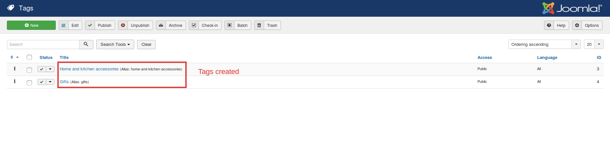
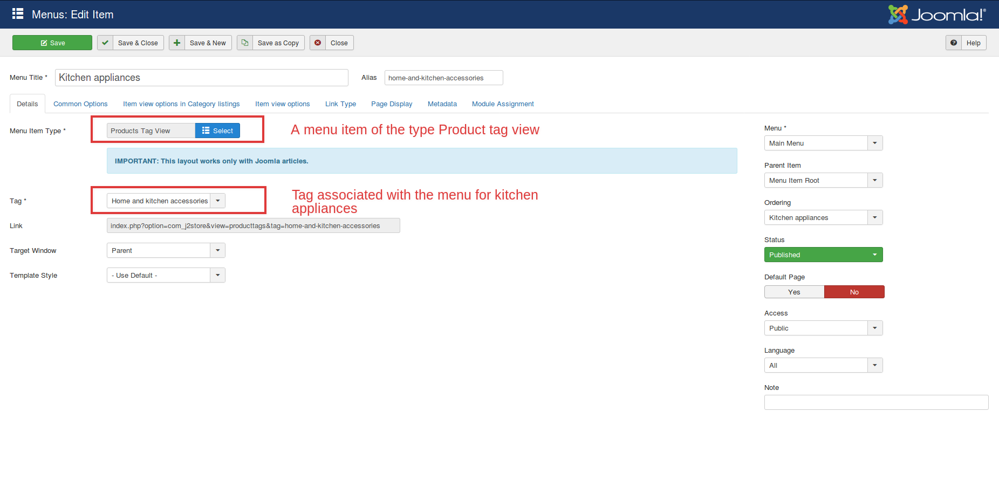
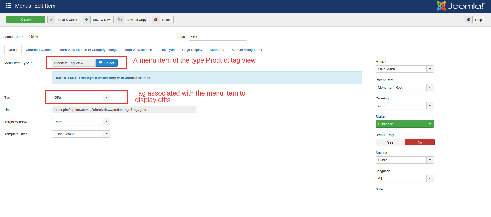
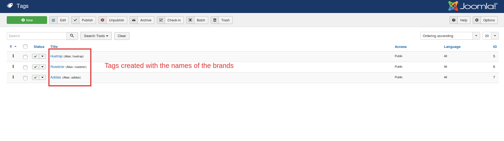
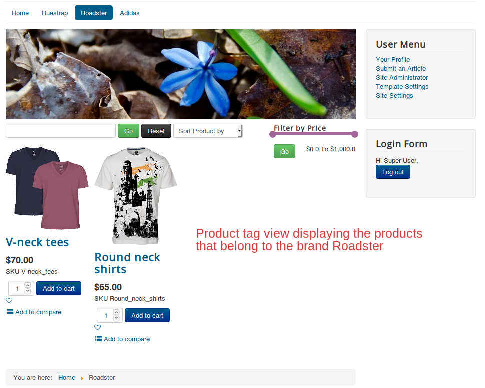
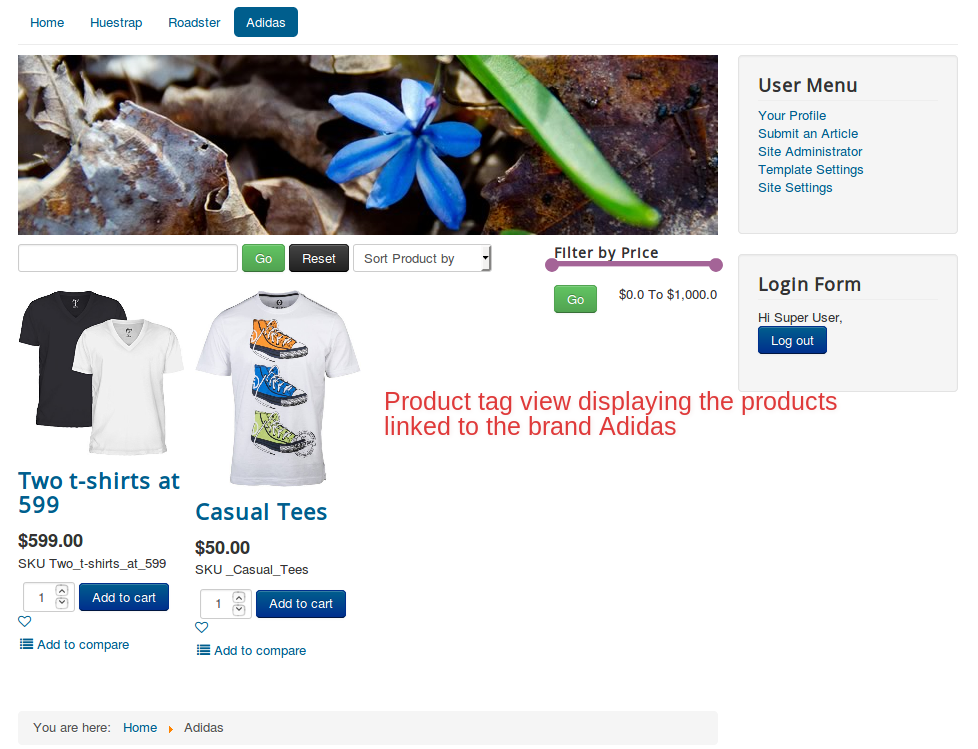

# Usecases

So, what are the uses of the new menu item Product tag view?
Here is all what you can achieve with the tag layout of J2Store:
 *  **[Assign a product to multiple categories](#multicat)**
 *  **[Display brand-wise products.](#brand-wise)**

## Assigning a product to multiple categories:

With the conventional list layout, it is possible to organize products based on their categories. However, there is one catch. It is not possible to assign a product to multiple categories.

Overcoming this, now we have the tag layout where it is possible for a product to be assigned to multiple categories.

### Steps to be followed:
 * Create tags that you wish to link with the product.
 * Create a product and add the tags to the product.
 * Create menus and link the tags with the respective menus.

### Scenario

  Products like Coffee mugs should be available under two categories- Kitchen appliances and Gifts.

### Steps to be done:

* Create two tags:
    * Gifts
    * Kitchen appliances
* Create a product named coffee mugs.
* Assign both the tags to the product article.
* Create menu items of the type Product tag view:
   * Kitchen appliances associating  the tag kitchen appliances
   * Gifts associating the tag Gifts
* Now the product coffee mugs will be available in both Kitchen appliances and Gifts.

Likewise, we can assign products to as many categories as we wish.

### Relevant Screenshots:

The front end view is like this:

## Displaying products brand-wise

If you own a multi-brand store, then this feature might help you the most.
You could display your products brand-wise. All you have to do is this:

  * Create tags with the brand name.
  * Create products and link them to their corresponding brands(tags).
  * Create menu items of the type Tag view and associate the tags with them accordingly.

##  Scenario  

 Our goal is to list the shirts in the store according to their brand.
 We have following brands:
  * Huetrap
  * Roadster
  * Adidas

## Steps to be done:

* Create tags of the name Huetrap, Roadster and Adidas.
* Create corresponding products and link them to the tag Huetap and repeat the similar process for other brands.
* Create menu items that associate with the brand tags respectively.

## Relevant Screenshots

