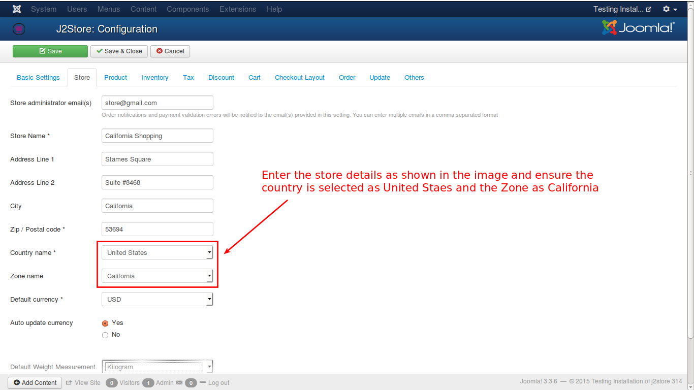
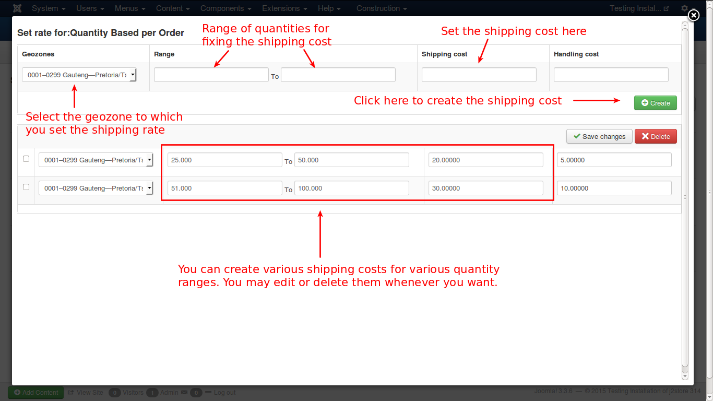

# Quantity based per Order - Example

To create a shipping method of type **Quantity based per Order**, follow the steps given below:

> Assume that you have a store in California, USA. You will get orders from all over USA. You need to ship the consignment to the customer, with shipping rate based on the quantity of items per order. Let us see how a **Quantity based per order** shipping method can be created for your store.

1. Go to **J2Store Dashboard -> Setup -> Configuration** and select the **Store** tab, as shown in the image. Enter the details and ensure that **United States** and **California**, are selected for country and zone, respectively.

2. Go to **J2Store Dashboard -> Localization -> Geozones** and click on the **New** button in the top left corner to create new geozone, as shown in the image. 

Enter the name for the geozone as **Default Geozone** and select country and zone as **United States** and **California** respectively, as shown below. Click **Save & Close**.

3. Go to **J2Store Dashboard -> Setup**

4. Select **Set Up -> Shipping Methods**

5. From the list, click on the **Create / Edit / Link** in the **Standard Shipping Methods** category

6. From the window you get after you follow the previous step, click on the **New** button in the right side, as indicated in the image below.

7. You will get the form to create new shipping method. Fill in the details as shown in the image.

8. **Save & Close** window. Now you can see the created shipping method in the list as show in the image below. Now, you need to set the rate for the shipping method. To do that, click on the link **Set Rates**.

9. You will get a pop-up window to set the rates for the shipping method, as shown below. 

Now all are set and your shipping method is ready for use.
