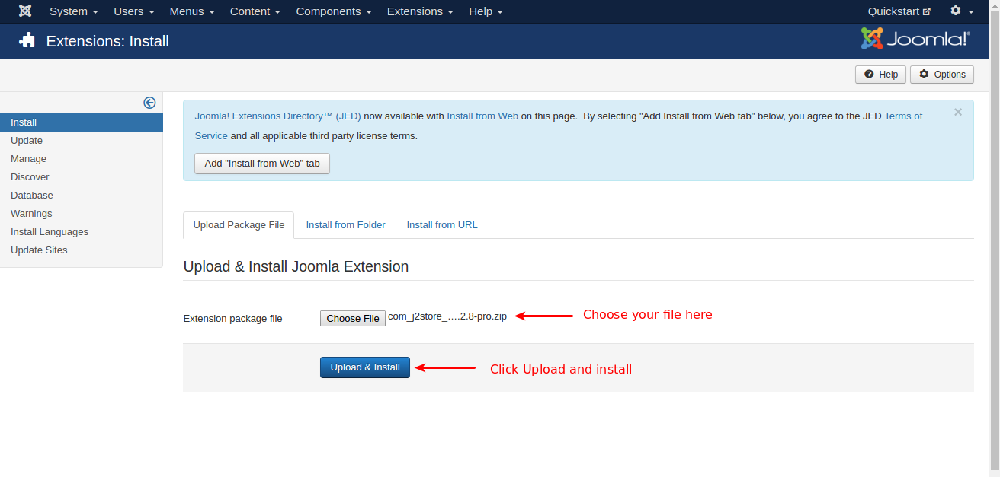
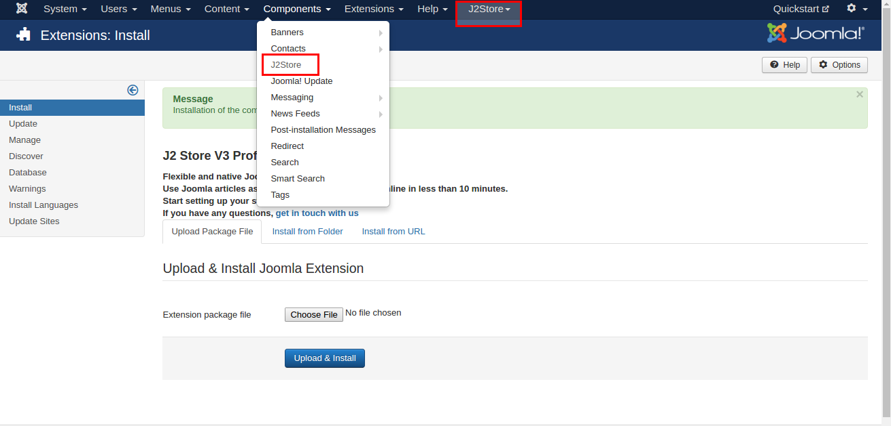
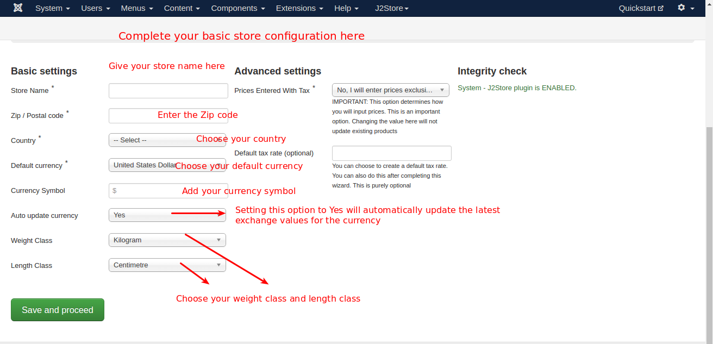
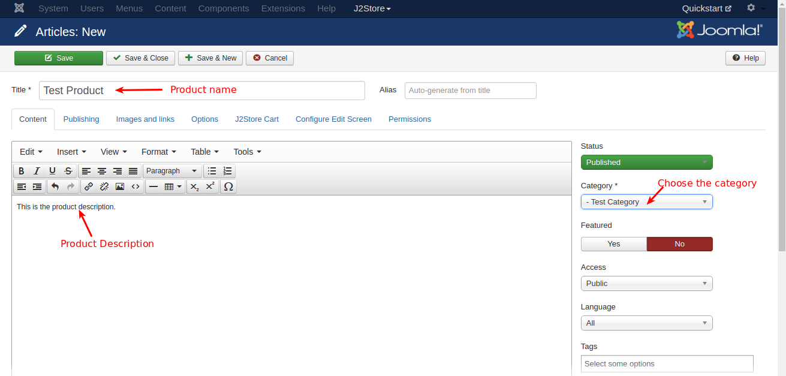
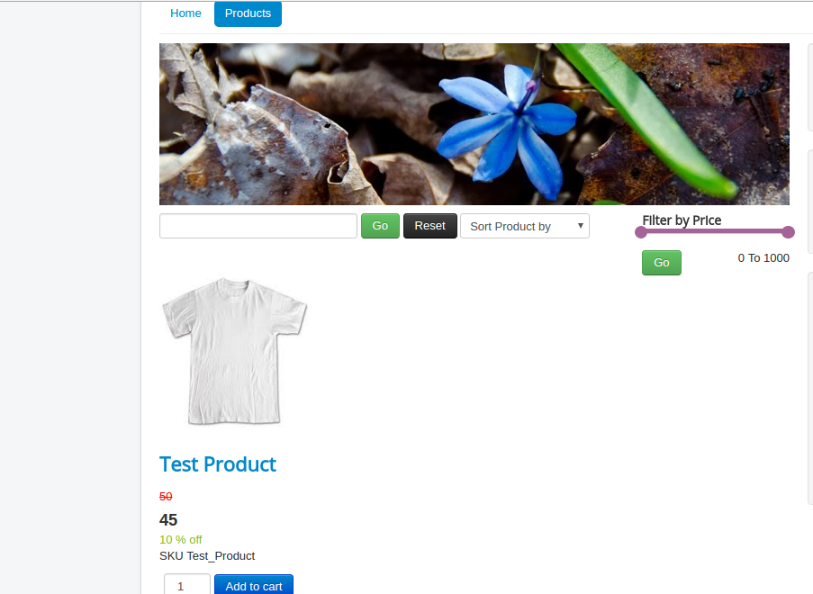

#J2store Quick Start Guide

Here is the quickstart guide for setting up an online store with Joomla and J2store.

The guide with screenshots walks you step-by-step to set up your Joomla shop within minutes.

##Download, Installation, Configuration of J2store

####Download

Download your J2store Component Package from our J2store official website.
Login into the J2store and go to My downloads tab where you can download the J2store package.
 
####Installation

Use the Joomla installer to install the J2store package.

1. Go to Joomla Extension > Manage

2. Choose and select your file.

3. Click Upload & Install.

####Configuration

1. Once installed, you will get J2store in the Joomla component list and also separate J2store tab in Joomla backend.

2. Now, Go to J2store > Dashboard.

3. Fill all the fields in the basic settings and click Save & Proceed.

##Creating Product

1. Since J2Store uses the default Joomla articles as its products, it lets you use native content as product.

2. Go to Content > Articles > Add new article. Now, new article page will open.

3. Give the title of the product, add your description about the product in the content tab and choose the category in which you want to display the product.

4. Now, go to J2store Cart tab, choose **YES** to Treat as a product then choose your **Product Type** from the list(Simple, Variable, Configurable, Downloadable) and then click **Save and Continue**.

5. After saving, again go to J2store cart tab. Now you can see the options to add image for product, set prices, add filters / Tax / Shipping.

##Display Product

It is very easy and flexible to display the product in frontend via menu. Please follow the procedure given below.

1. Go to Menu manager -> Main menu and create a new menu item.
2. Give the menu title and choose the menu type as J2store > Product List View

3. Choose the Category which have chosen when creating product. The category added in the product and the category added in the menu should be same.

4. In the menu you can see these three tabs common options, Item view options in category listings, Item view options.

   **Common Options:** Here you can choose the layout(bootstrap 2, bootstrap 3).
   
   **Item view options in category listings:** Here you can choose which are things should be displayed in product pages. For example, you hide / show price, images, filters, etc..
   
   **Item view options:** Here you can choose which are the things should be displayed in product view page.

##Frontend

Now Go to frontend of your site and check.

