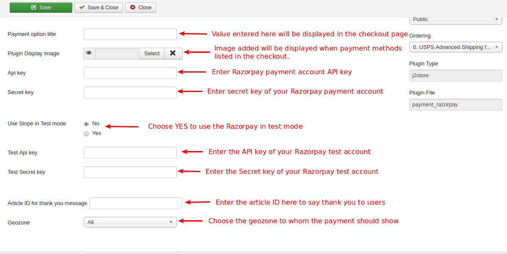
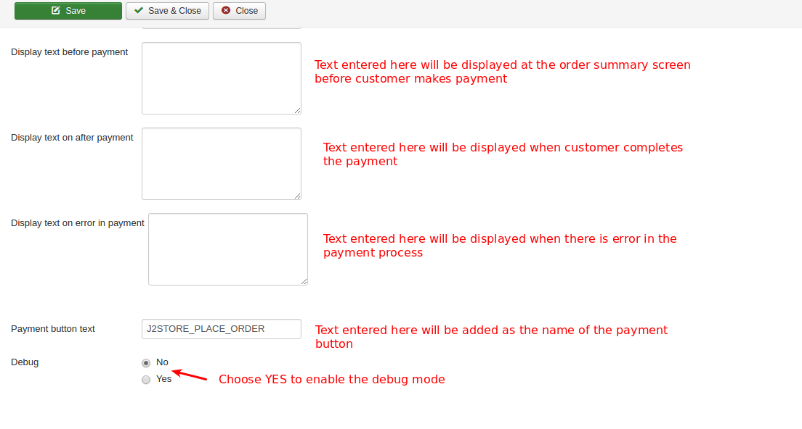

# Razorpay

This plugin integrates Razorpay payment gateway with J2Store Joomla eCommerce solution. It offers a fast, affordable and secure way for ecommerce to accept payments online.

#### System Requirements

1. PHP 5.4 or greater

2. Joomla 3.x

3. J2Store 3.2.x or greater

#### Installation Instructions

1. Use the Joomla installer to install the plugin.

2. In the backend, go to J2store Dashboard -> Payment methods and enable plugin.

3. Open the plugin and enter the parameters (read the explanation about each parameter given below)

4. Save and close it.

#### Configuration

The plugin has the following parameters need to be addressed.

**Payment option title**

The value entered here will be used as the title for this payment method. Customer will see this value when he checks out.

**Plugin Display Image**

This image will be displayed while payment options are listed in the checkout page.

**Api key**

Use the API key associated with your Razorpay account.

**Secret Key**

Use the secret key associated with your Razorpay account.

**Use Razorpay in Test mode**

Set **YES** to use the Razorpay in test mode instead of live mode.

**Test Api key**

Enter the API key associated with your Razorpay test account.

**Test secret key**

Enter the secret key associated with your Razorpay test account.

**Article ID for thank you message**

You can create a Joomla Article to say thanks to the users, who purchased in your online store. Enter the article ID here.

**Geozone**

By selecting a geozone here, you can restrict this payment method to only customers of that geo-region. Choose All geozones to show this method to all customers.

**Display text on selection**

The text entered here will be displayed when customer selects this payment method. You can enter a language constant as a value here if you are using a multi-lingual site and then write a language override. For example, enter a language constant:

J2STORE_TEXT_TO_DISPLAY_ON_SELECTION.

Now you can go to Joomla admin-> Language Manager->Overrides and create overrides for the language constant in all your languages.

**Display text before payment**

The text entered here will be displayed to the customer at the order summary screen before he makes the payment. You can enter a language constant as a value here if you are using a multi-lingual site and then write a language override. Refer the Display text on selection parameter.

**Payment button text**

Text entered here will be added as the name of the payment button.

You can enter a language constant as a value here if you are using a multi-lingual site and then write a language override.

**Debug**

Choose YES to enable the debug mode. If you set this to yes, then debug messages will be logged and saved in the cache folder in your Joomla root directory. DO NOT select YES in the live site.

**Support**

Still have questions? You can post in our support forum: http://j2store.org/forum/index.html

Thank you for using our extension.