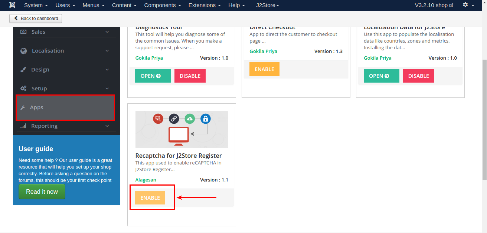
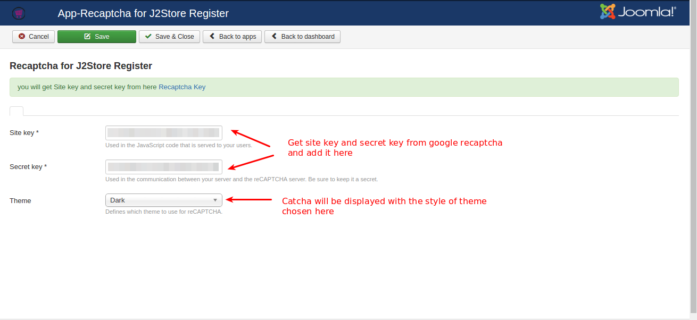
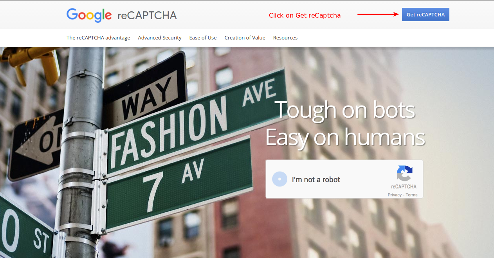
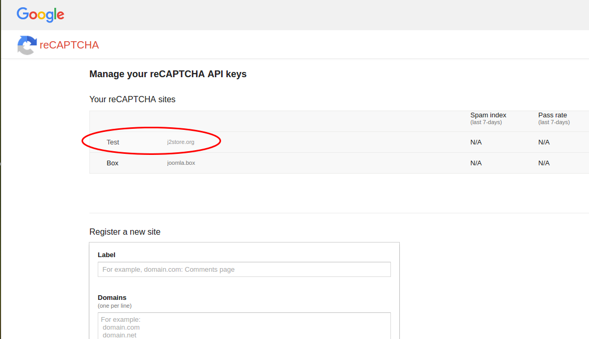
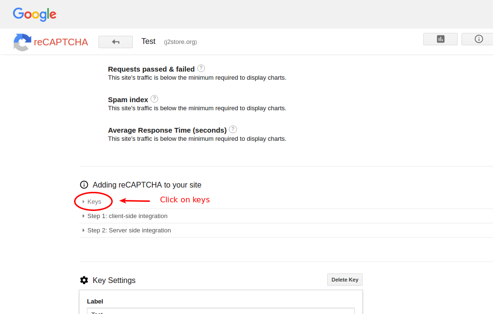
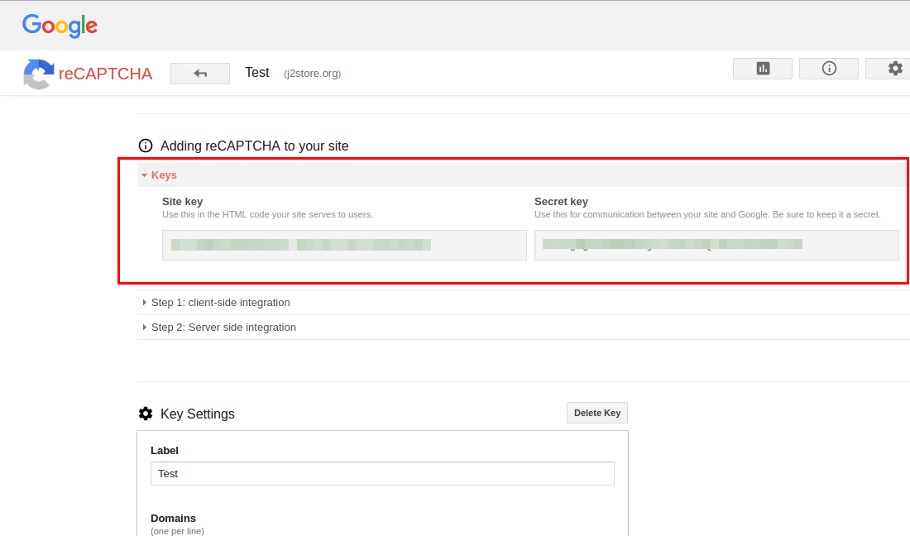
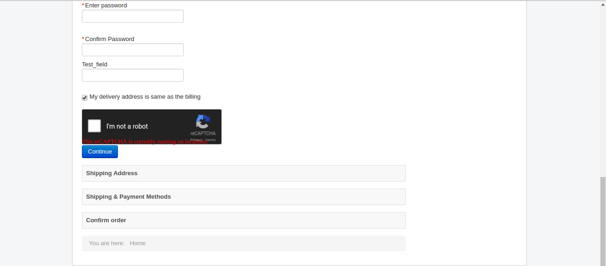

# Re-Captcha for J2Store Register

This app lets you add the re-captcha for registration in the chackout page. It is a system designed to establish that a computer user is human.

#### Requirements

* PHP 5.4 or higher
* Joomla 3.3 or above
* J2Store 3.2.x or above

#### Installation Instructions

1. Use the Joomla installer to install the app.

2. In the backend, go to J2Store Dashboard -> Apps as shown in the image below.

3. Click Enable in the Recaptcha for J2Store Register app.

4. Once the app is enabled, click on Open to set the configuration for the app.

#### Configuration

**Site key and Secret Key**

  You can get the **site key** and **secret key** from http://www.google.com/recaptcha
  
**Theme**

  You can choose either Dark or Light. ReCaptcha will be displayed with the style of theme chosen here.
  
  
#### How to get Site Key and Secret Key ?

To get the site key and secret key, Login into your google account and go to http://www.google.com/recaptcha

Click on Get reCAPTCHA button.

Once clicked on the GetreCAPTCHA button, you have to choose the site. Choose the site as like the image given below

Move to the section **Adding reCAPTCHA to your site** and click / expand on keys to view the site key and secret key. Please refer the image below.

#### Frontend Display

#### Support

Still have questions? You can post your questions in our support forum: http://j2store.org/forum/index.html

Thank you for using our extension.