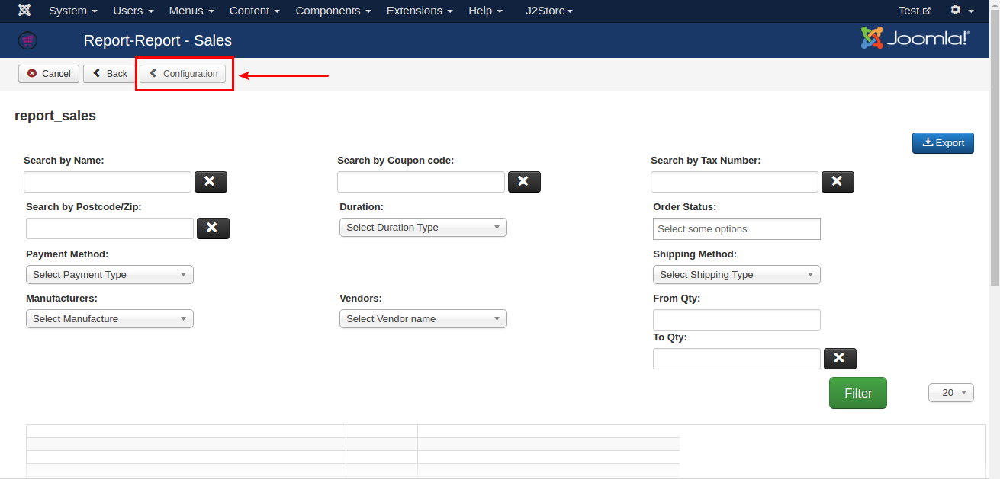
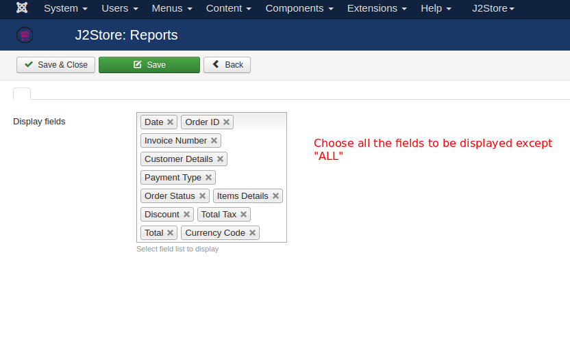
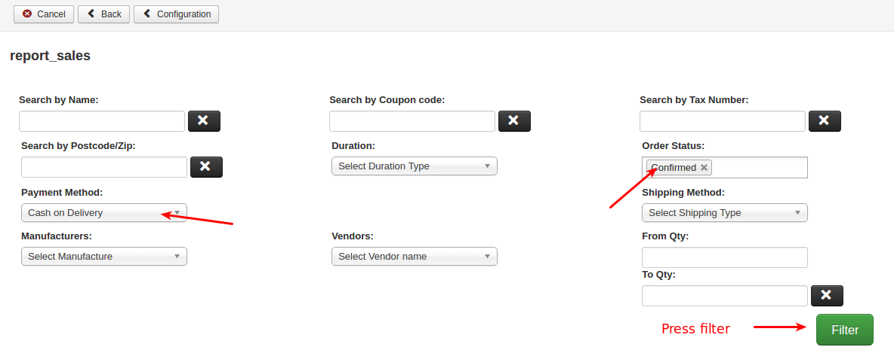
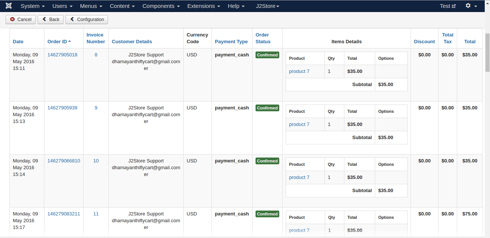
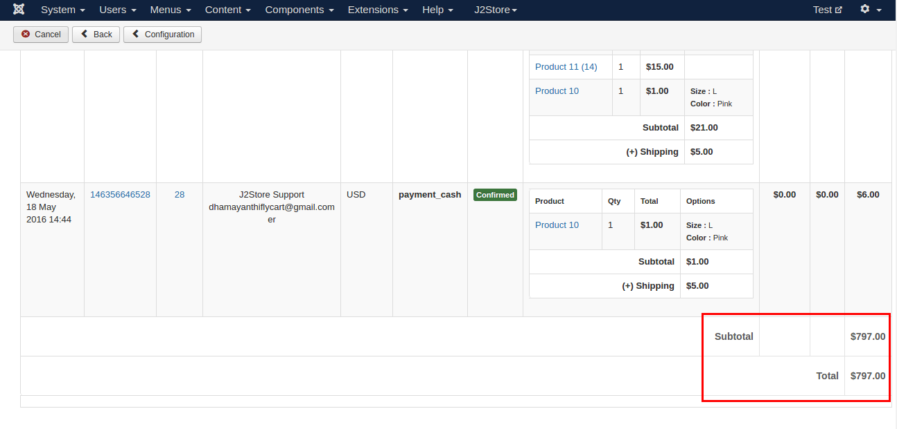

# Report Sales

Report Sales plugin allows store owner to prepare or present a document containing order information based on payment type, customer name, coupon code, manufacturer, vendor, order status, shipping method, post code and Tax number.

#### Configuration

Once you installed the plugin using joomla installer, go to J2Store Dashboard > Reporting > Reports.

Enable and open the Report-Sales plugin.

Before going to start filter and take sales report, it is very important to set up the configuration. Click **Configuration** button on top left.

Choose all the fields to be displayed **except ALL**.

Save and close.

#### Sales Report

With this plugin, you can use filter to sort the orders. For example, choosing any one of the payment methods will display the orders which have been placed using the payment method you have chosen in the filter.

Follwing pictures will explain you

