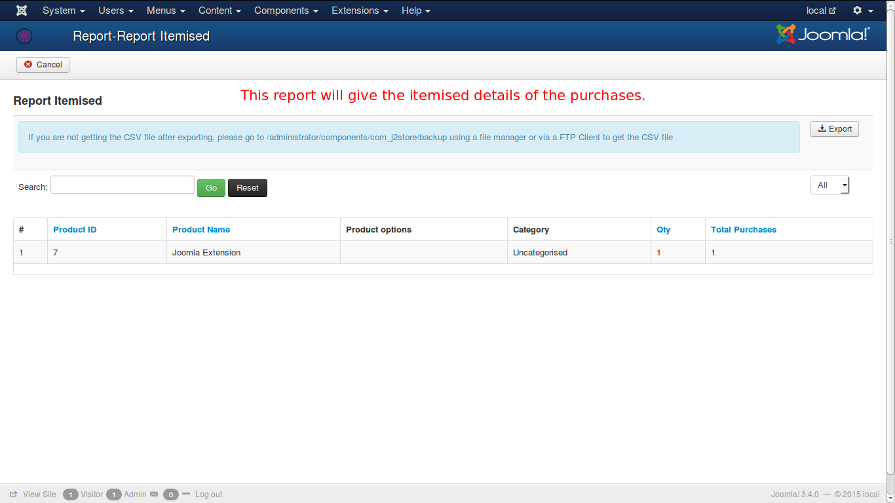

# Reports

A report, is a document that presents information in an organized format for a specific audience and purpose.

A more detailed definition goes like this: A document containing information organized in a narrative, graphic, or tabular form, prepared on ad hoc, periodic, recurring, regular, or as required basis. Reports may refer to specific periods, events, occurrences, or subjects, and may be communicated or presented in oral or written form.

This can be understood with the help of an example like this:

If a store sells some particular products, then the weekly report will contain the product id, product categories, product name, product options, no of products,  etc.

Check the image below:

