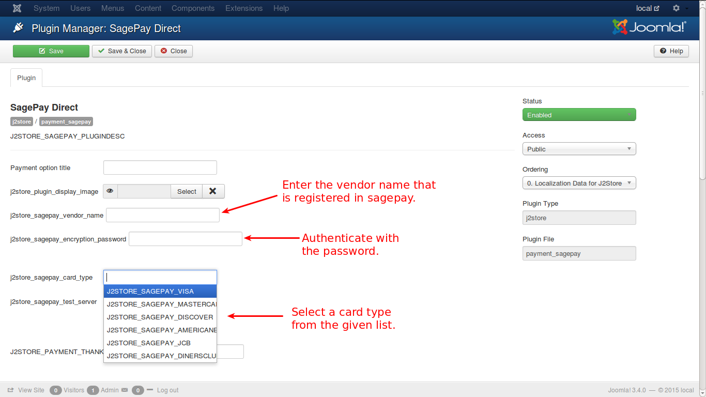

# Sagepay Direct

This is another payment gateway that can be used for online payments. This section helps you understand how it can be configured for making payments online.

See the image below:

Enter the details as shown in image above. You need the vendor name, which is registered with Sagepay, an encryption password to authenticate, a card type from which the payment is going to be made.

