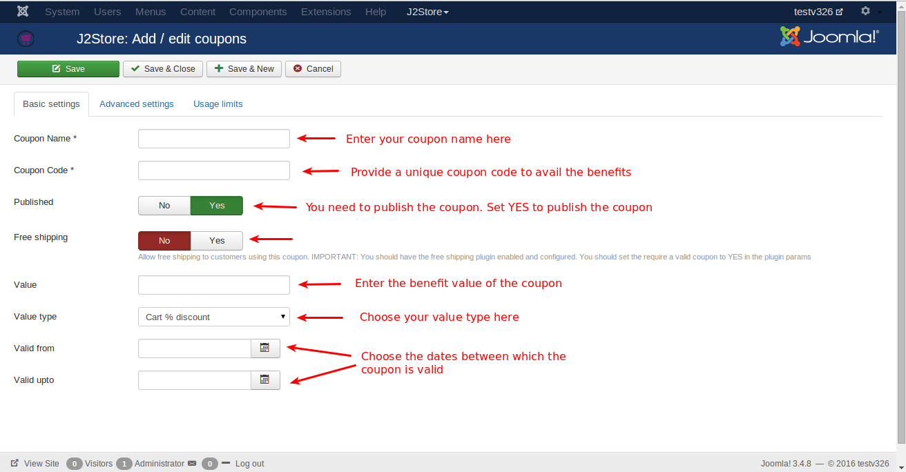
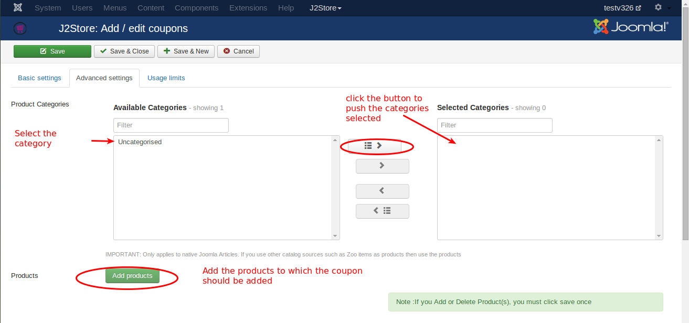
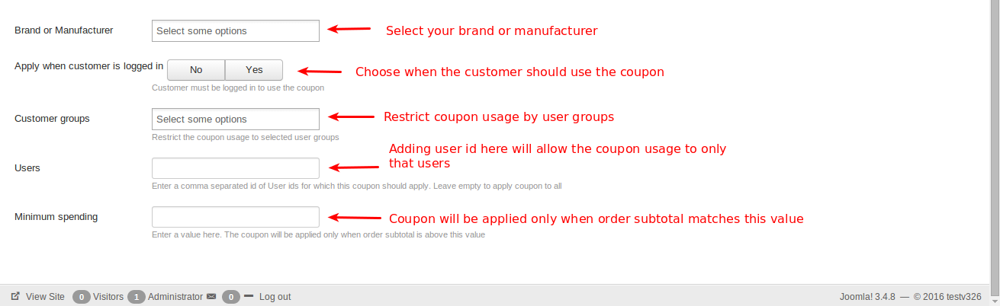
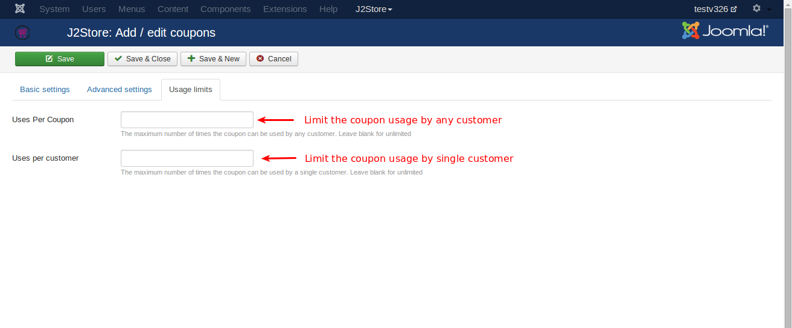

# Coupons

#### ***This is J2Store PRO exclusive feature***

Coupons are vouchers preloaded with specific values and discount credentials that enable customers to shop online with extra privileges.

The above image shows how to create a coupon and add the details for a coupon. See the images below for a complete information on creating a coupon.

Coupons hold the following information required for a successful process of purchase.

####Basic Settings
* **Coupon Name** - Name of the coupon you wish to offer
* **Coupon Code** - Unique code assigned to the coupon for the customers to make use of the coupon
* **Published** - Set this to '**Yes**' to make the coupon available to customers
* **Free Shipping** - Set this to '**Yes**' to make shipping free of cost
* **Value** - Value of the coupon
* **Value Type** - Value of the coupon is fixed amount or a specific percentage of the order value
* **Valid from and Valid upto** - Set the coupon validation here. Choose the dates between which the coupon is valid.

####Advanced Settings
* **Product Categories** - Choose the categories to which the coupon must applied.
* **Products** - Coupon usage applicable to the products added here.
* **Brand or Manufacturer** - Coupon usage applicable to the brands or manufacturer added here.
* **Customer Groups** - Coupon usage will be restricted to the user groups selected here.
* **Users** - IDs of users for whom the coupon should apply, empty for all customers
* **Minimum spending** - minimum value required to avail the coupon privilege.

####Usage limits
* **Uses per coupon** - limit of using the coupon for privileges by any user, empty value is for unlimited use
* **Uses per customer** - limit of using the coupon for privileges by one customer, empty value for unlimited use

#### Free shipping after coupon applied

####Videos

**[Coupon for selected product](https://www.youtube.com/watch?v=MS6BrPdDyVk)**

**[Coupon for cart wide and each cart item](https://www.youtube.com/watch?v=5Xbs8AaE3wM)**

**Additional Note**

For any coupon to be displayed on the add to cart page, it must be enabled in the following places:

*Under J2Store->Settings->Configuration->Discount tab->Enable Coupons.

*Under the main Coupon's page in J2Store->Sales->Coupons.Click on the Checkbox under the field Enabled to enable/disable individual coupon.

* In the coupon's basic settings under J2Store->Sales->Coupons and choose the coupon which you want to    enable or disable.
