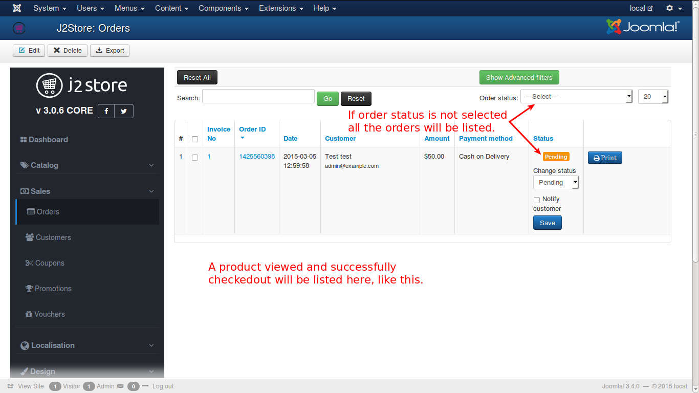

# Orders

A customer views the product and completes the checkout process, it is transformed into an order. Orders are listed here according to their statuses. They are as follows:

#### New

When the customer reaches the last step of the checkout, the order is saved with the status - NEW.  This means, the customer has NOT PAID. It is an UNPAID order.

#### Confirmed

As soon as the customer makes a successful payment, order status is marked - CONFIRMED.  
 
#### Failed

If the payment is not successful or if there is an error message from the gateway due to validation or some other reasons, then the order status is marked as - FAILED.

The above are the primary workflow.

#### Pending

This will be used sometimes with certain gateways (like PayPal). This usually means. Payment is successful. However, you will have to manually review this payment. Example: eCheck payments in PayPal takes at least 5 to 7 business days to clear. Sometimes, PayPal marks a payment from customers from certain countries (Egypt, Nigeria, for example) as Pending and would want you to review or it might go their Fraud prevention team for a review.
In those cases, the order is marked PENDING.
This status is not used by all gateways

#### Cancelled

This is primarily for the administrator. (In a few gateways, if customer cancels during the payment screen, the status is automatically marked as Cancelled). The store admin can mark an order cancelled.
In high traffic sites that manage low inventory, there is an option to auto cancel orders if the payment is not confirmed within XX time. J2Store has this option under the Inventory settings.

#### Processed

An internal order status for store administrator. You can use it for any purpose you like depending on your business nature.

Every order will possess some important information that explains about it. They are:
* **Invoice No** - The number of the document that completes the process of that order
* **Order ID** - ID for reference that tracks all the processing steps
* **Date** - The date in which the order is completed
* **Amount** - The total value of the order after billing
* **Payment Method** - The method in which the customer has paid for the order viz., bank transfer, paypal, moneyorder, etc
* **Status** - Completed or still in process - like information

Check the image below to understand clearly.

#### Adding shipping tracking ID

If you have enabled shipping in your site, in admin order history page you can see the text box to enter shipping tracking ID. Enter your shipping tracking ID and click save.

Now go to J2Store > Design > Email Templates and add the short tag [SHIPPING_TRACKING_ID] in your email template.

