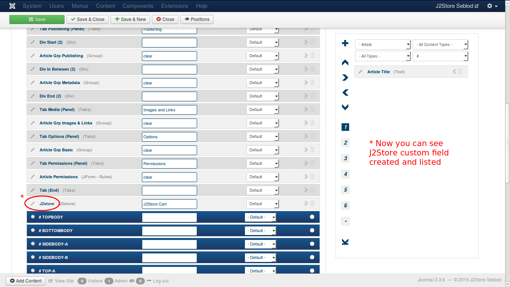
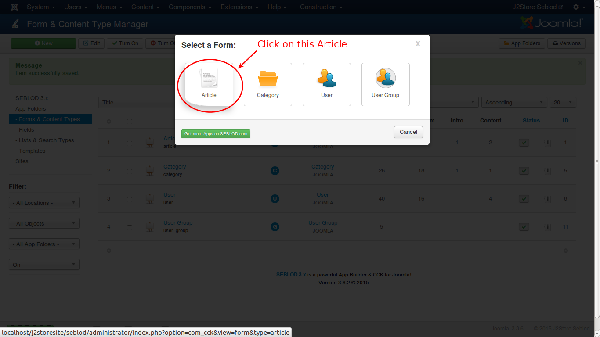

# Seblod

### Introduction

The plugin integrates Seblod content construction kit with J2Store, thus adding ecommerce capability to Seblod. 

#### Requirements
* PHP 5.2 or higher
* Joomla 3.x
* J2Store 3 or above
* Seblod 3.x
* Plugin plg_cck_field_j2store

#### Installation Instructions 
1. Use the Joomla Extension manager to install the plugin.

#### Adding J2Store Field 
1. In the backend, go to Components -> Seblod, as shown in the image below:

2. Click on the icon ***Forms & Content Type***. Click on the admin menu link ***Construction*** then ***Forms & Content Types***.

3. In the "Form & Content Type Manager", you should click on the item "Article".

4. Now we have to add j2store custom field to the ***Article*** content type. To acheive this, click on the **+** button, placed at the right of the ***Contruction*** block. A Form in pop-up window appears.

5. To add a ***Text*** field to an ***Article*** content type:

6. Choose App Folder ***Seblod***, then choose type ***J2store*** field.

7. Save the changes. Now J2store field will appear under the Fulltext field (at the bottom of your form on the first tab).

8. Now save and close the article. Click on the Add Content Button at the bottom of the page.
 

9. Now Choose the article Icon from the  pop up window.

10. Add New Article->, Enter the title and other required fields, Save the article Once. You can Click the J2Store cart Tab -> Set ***Yes*** to **Treat as Product** and choose the type of the product. Save the changes.
 

11. Now you can Configure your product. Set ***Yes*** for Visible in store to view at frontend.

12. Save the changes.

### Displaying Products at Front end

1.Go to Jooml admin Control panel -> Choose the Menu -> Menus -> Menu Manager -> Menu Item -> New 

   a.Enter the Menu Title.

      

   b.Choose the Menu Item type "Seblod" -> choose " List & Search".
   

   c. You will see Search Type input, select Articles from the  List.
   

  d. Save the changes.
  