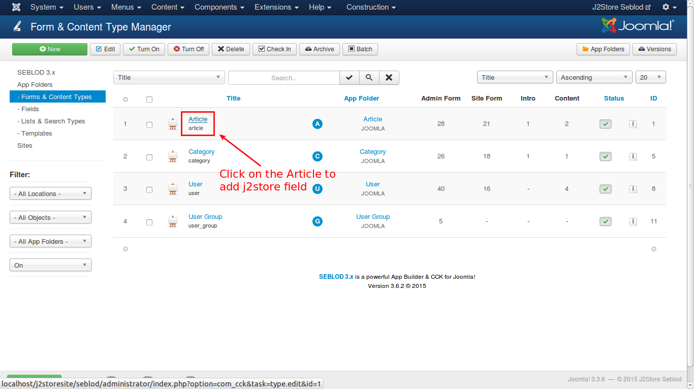
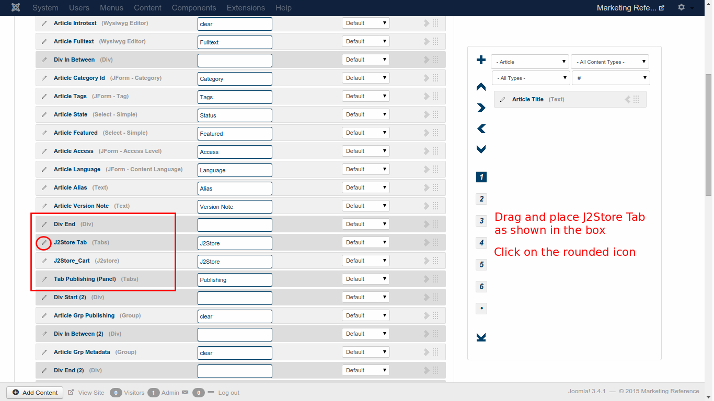
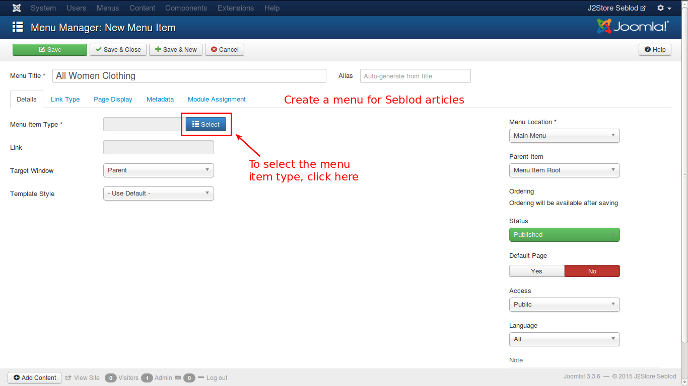

# Seblod

### Introduction

The plugin integrates Seblod content construction kit with J2Store, thus adding ecommerce capability to Seblod. 

#### Requirements
* PHP 5.2 or higher
* Joomla 3.x
* J2Store 3 or above
* Seblod 3.x
* Plguin plg_cck_field_j2store

#### Installation Instructions 
Use the Joomla Extension manager to install the plugin.

#### Adding J2Store Field 
1. In the backend, go to Components -> SEBLOD 3.x, as shown in the image below:

2. Click on the icon "Forms & Content Type". Click on the admin menu link "Construction" then "Forms & Content Types".

3. In the "Form & Content Type Manager", you should click on the item "Article".

4. Now we have to add j2store custom field to the "Article" content type, click on the "+" (button is placed at the right of the "Contruction"  block). A Form in window popup appears.

5. To add a "Text" field to an "Article" content type:

6. Choose App Folder **Seblod**: then choose type "J2store" field.

7. Save the changes. Now J2store field will appear under the Fulltext field (at the bottom of your form on the first tab).

8. Save and close the article. 

9. Go to the menu, **Content** -> **Article Manager** -> **Add New Article**. You will get the screen as shown below:

Now scroll down. You will see the integrated j2store product type as shown below:

10. The J2Store element appears at the bottom because, it is placed below the End of the Tab in the construction layout. So we need to rearrange the element to appear in the tabs. Consider the below image:

11. We need to add the J2Store element in the tab. To create a tab panel, click on the + sign in the right side and follow the procedure as shown in the image:

In the above image, enter the details as shown and click **Save & Close**. The tab panel will be created. You need to rearrange the tab, as shown below:

By clicking on the rounded icon, you can confirm the tab panel details and close it.

12. Now, add a new product. You will see the screen like this:

13. Now you can Configure your product, Set **Yes** for Visible in store to view at frontend.

14. Save the changes.

### Displaying Products at Front end

1. Go to Joomla admin Control panel -> Choose the Menu -> Menus -> Menu Manager -> Menu Item -> New 

   a.Enter the Menu Title.

      

   b.Choose the Menu Item type "Seblod" -> choose "List & Search" .

   c.You will see Search Type input, select Articles from the  List.

  d. Save the changes.
  
2. Finally you can see the list of articles from Menu you created at frontend.  

3. click on the Article title to view the product. 

4. Now you can add the product to the cart. Finally you can see Item added to the Cart.

 

 