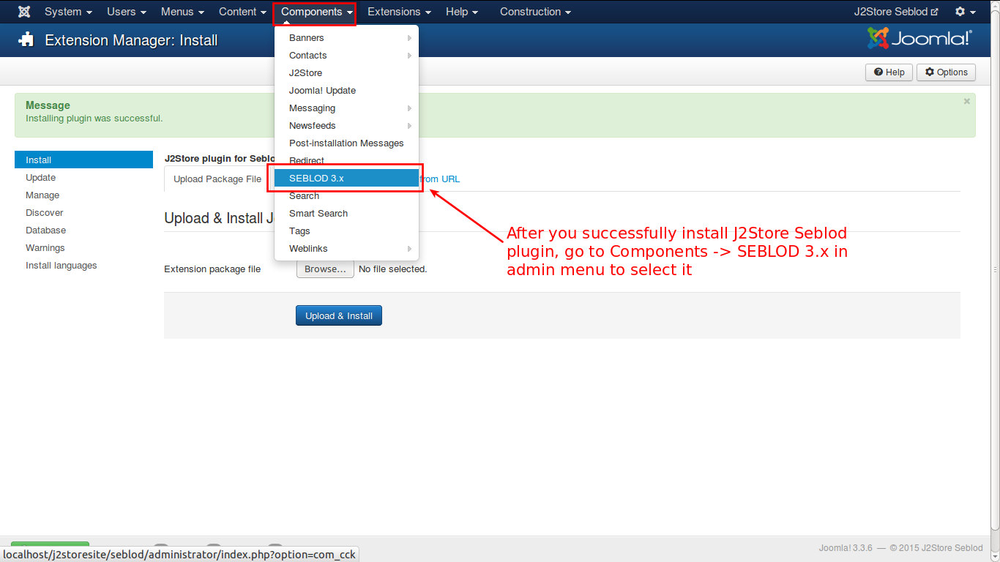

# Seblod

### Introduction

The plugin integrates Seblod content construction kit with J2Store, thus adding ecommerce capability to Seblod. 

#### Requirements
* PHP 5.2 or higher
* Joomla 3.x
* J2Store 3 or above
* Seblod 3.x
* Plguin plg_cck_field_j2store

#### Installation Instructions 
Use the Joomla Extension manager to install the plugin.

* **[Configure J2Store in admin](#configure_j2Store_in_admin)**
* **[Show J2Store content in Front-end](#show_j2Store_content_in_front_end)**

##Configure J2Store in admin
 

In this section, you will see how to create a SEBLOD article in the backend and frontend.

#### Adding J2Store Field 
1. In the backend, go to Components -> SEBLOD 3.x, as shown in the image below:

2. Click on the icon **Forms & Content Type**. Click on the admin menu link **Construction** then **Forms & Content Types**.

3. In the **Form & Content Type Manager**, you should click on the item **Article**.

4. Now we have to add j2store custom field to the **Article** content type, click on the "+" (button is placed at the right of the **Contruction**  block). A Form in window popup appears.

5. To add a **Text** field to an **Article** content type:

6. Choose App Folder **Quick Folder**: then choose type **J2store** field.

7. Save the changes. Now J2store field will appear under the Fulltext field (at the bottom of your form on the first tab).

8. Save and close the article. 

9. Go to the menu, **Content** -> **Article Manager** -> **Add New Article**. You will get the screen as shown below:

Now scroll down. You will see the integrated j2store product type as shown below:

10. The J2Store element appears at the bottom because, it is placed below the End of the Tab in the construction layout. So we need to rearrange the element to appear in the tabs. Consider the below image:

11. We need to add the J2Store element in the tab. To create a tab panel, click on the + sign in the right side and follow the procedure as shown in the image:

In the above image, enter the details as shown and click **Save & Close**. The tab panel will be created. You need to rearrange the tab, as shown below:

By clicking on the rounded icon, you can confirm the tab panel details and close it.

12. Now, add a new product. You will see the screen like this:

13. Now you can Configure your product, Set **Yes** for Visible in store to view at frontend.

### Product Creation in Front end

1. To create the product in the frontend, follow the procedure, illustrated with the help of images. In the Control Panel menu, go to **Construction** -> **Forms & Content Types**

2. Now, from the resulting screen, choose **Article** as shown below:

3. Click on the **Site Form** as shown in the image below:

4. In the right hand side, click on the '<' symbol, next to the **J2Store Tab** and it will be added to the form as shown in the below image.

5. After that, in the right side, near the '+' sign, choose 'All App Folders' in the select list and you can see a list of items displayed below. Scroll down to locate **J2Store_Cart** and add it to the construction layout, by cliking in the '<' arrow seen in the extreme right of the item. All these actions are illustrated in the image below:

Place the **J2Store Tab** and **J2Store_Cart** items in the positions, as depicted in the image by drag and drop.

6. Go to Joomla admin Control panel -> Menus -> Menu Manager -> Add New Menu

   a.Enter the Menu Title.

     

   b.Choose the Menu Item type **SEBLOD** -> choose **Forms**.

   c.From **Content Type (Form)** input, select **Article** from the  List.

  d. Save the changes.
  
7. In control panel, go to **Construction -> Forms & Content Types** and click on **New**. In the resulting screen, enter the details as shown in the image below:

8. You will get the screen like this, after you have rearranged J2Store Tab. Now, click **Save**

9. Thats it. You have successfully created a SEBLOD article. You can choose it in the following ways.
    
    I. Click on the **Add Content** as shown in the following image. 

If you click on the **Add Content** you will get this pop-up window:

  II. In main menu, go to **Content -> Article Manager** and click on the **New** button as shown below:

You will get the pop-up like this:

10. But before you add an article in this type, you need to do edit the article you have created further. Open it for editing.

Still you need to follow some more steps to complete the procedure. Arrange the items in the construction layout as shown in the image below:

11. Now, **Save** the page and create an article of type **Form_Article** and you will have the product creation page like this: 

**The images below illustrates how to create a product in your frontend**

In your site frontend, you can see the newly created SEBLOD article, listed in the top right. See the image:

As shown in the image, click on the **New Article** and you will get the product creation page as shown in the next image. Enter a name for the new product and content for the product. This is **Contents** tab. Now, go to **J2Store** tab. Here, select **Yes** to ***Treat as a product*** option and now click on **Save**. 

Your product is created and you can configure the product with the product specific details, change the product type, set prices, etc.

##Show J2Store content in Front-end

This section will help you understand how to display the SEBLOD article in front end.

The display can be achieved in the following methods:

* **Category Blog View**
* **Single Article View**
* **Search & List View**

To display SEBLOD articles in the frontend, you need to create a menu exclusively and then you can display it. 

### Category Blog View
Before you proceed to view the article in frontend, you need to check one thing. Go to **Components -> J2Store -> Setup -> Configuration**. Go to **Cart** tab. Now, check the setting of **Add to cart placement** option. Ensure it is selected with **Within article using tag** as shown in the image below.

To achieve front end category blog view, we need to follow a few procedures as explained below:

#### Create a Menu Item
In the backend main menu, go to **Menus -> Main Menu**. You will get the **Main Menu Items** list, as shown in the image below:

Click on the ***Add New Menu Item*** or ***New*** button, as pointed out in the image. You will get the screen as shown in the image below: 

Enter a name for the new menu item and click on the **Select** button to select the type of the menu item.

As shown in the image, click on the **Articles** and you will get a list down the option. From the new list, select **Category Blog**. Now, you will get a new option below the menu item type, named ***Choose a category***. From that option, select **Product** as illustrated in the next image.

#### Edit SEBLOD Form Article Content Section
After you have finished, go to **Components -> SEBLOD 3.x** and in the screen that is delivered, choose **Form & Content Type Manager**. It will give you the screen that is shown in the following image:

As shown in the image, select the **Intro** tab. Select **All App Folders** and locate **J2Store_Cart**. Add it by clicking on the **'<'** symbol. Now, click on the *pencil* symbol to edit the cart options, as shown in the image below:

You can edit the cart options by changing the text in the field as per your wish, for time being **mainimage|cart**. Save the settings.

Now, go to the front end view of the site. You will get the home page as shown below:

Your home page will display the products in your online store. Note that the new menu item, **Category Blog View** you have created is listed in the main menu list. Click on that and you will get the view as shown in the below image:

### Single Article View

To achieve the single article view, follow the steps, as illustrated in the images below:

As shown in the image, click select the **Form & Content Types** menu. You will get the screen as shown below:

Click on the **Article** and you will get the settings and configuration of **Article**. Check for the settings as shown in the next image.

If the settings match the image above, you are done. If there is no ***J2Store_Cart*** listed on the left side, you can create on using the **+** sign on the right side. Now go to the frontend. All the articles will be listed in the site, as shown in the image below:

You will get all the articles listed here. Click on any one article's name, as shown underlined in the image. You will get the single article view.

You can see the additional images, the cart, the **Next** button etc., in the view. If you hover on the additional images, they will be displayed in the main window, with a zoom effect. 

This is how we achieve single article view.

### SEBLOD List & Search Type View

In order to acieve the SEBLOD list and search view, you need to create a new menu item of type list and search. The following images illustrate the procedure.

As shown in the image, go to **Menus -> Main Menu -> Add New Menu Item**

You will get the screen to enter the menu items details. Enter a name for the menu item, say **SEBLOD List Articles** and then click on the *Select* button to choose the menu item type. You will get a pop-up window as shown below:

Click on **SEBLOD** and you will get a list below. From the list, select **List & Search**. Now you will get a new field below the one you have dealt with just before, as **Search Type(List)**. Choose **Articles** in this field, as shown in the next image. 

Leave other fields untouched. The Link will be created automatically. Now, **Save & Close** the menu item. 

Go to frontend of your site.

You can see the menu item **SEBLOD List Articles**. Click on that and you will get the seblod articles listed down. These are depicted with the help of the following images.

When you add the articles to your cart and click on the checkout link, the  frontend of your site will look something like this:

You can checkout with a single click. It is not necessary for you to be a registered user. You can checkout as a guest. Later if you want, you can register.