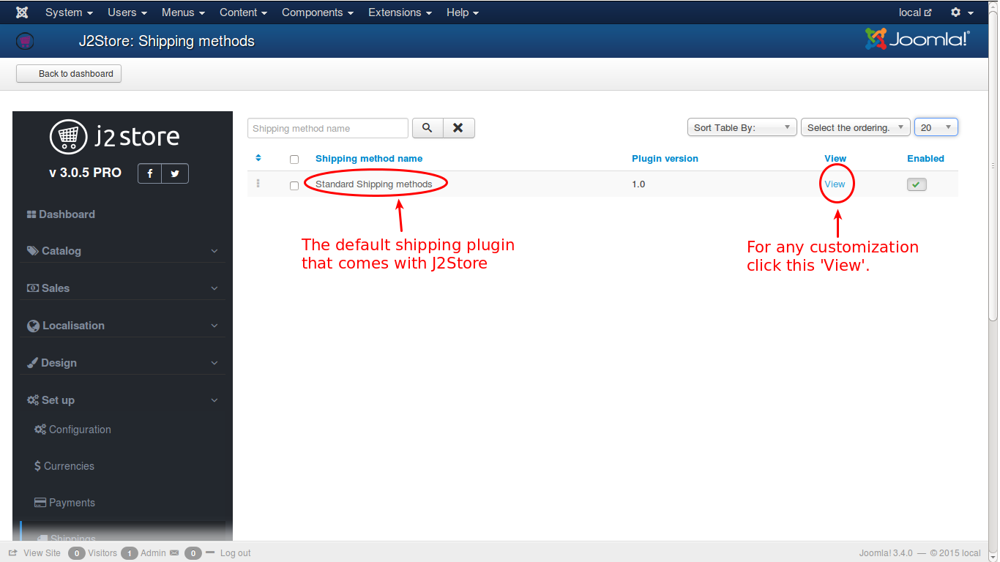

# Shipping Methods

J2Store implements multiple, geozone based shipping methods. This view lists out all the shipping plugins available. By default, j2store comes with the Standard Shipping Methods plugin, which implements seven methods

In this section, you can understand the functionality of shipping methods with some examples.

The shipping methods screen will look like this:

#### [Standard Shipping Methods](http://j2store.gitbooks.io/user-guide/content/standard_shipping_methods.html)

This is shipping plugin which is available in J2Store by default. It has seven shipping types. They are individually explained in detail.

