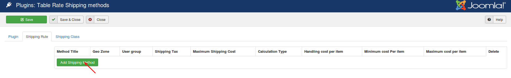

# Table Rate Shipping

The table rate shipping plugin extends J2Store's default standard shipping options giving you highly customizable shipping options.

Define multiple shipping rates based on location, price, weight, or item count.

1. Add multiple shipping rules per shipping zone
2. Several types of calculation method: Per order, per item, per class
3. Add rules based on Weight, Number of items and price.
4. Add costs per row, per item cost, a percentage and per weight unit

By using Table Rate Shipping it is possible for you to create complex rules for applying shipping cost.

You can define multiple rates based on the customer's address, have multiple rates per zone, and add rules based on product weight, number of items, shipping class and price.

* **[Basic settings](#basic-settings)**
* **[Creating shipping method](#create-shipping-method)**
    * **[Creating shipping rule](#create-shipping-rule)**
* **[Shipping class](#shipping-class)**
* **[Examples](#examples)**
    * **[Create a shipping method with shipping class](#example-1)**
    * **[Applying multiple rules to the same shipping class](#example-2)**
    * **[Calculating shipping cost by weight](#example-3)**

### Requirements

1. PHP version 5.4 and above
2. J2Store 3.2.25 +
3. Joomla 3.x

### Installation

1. Download Table rate shipping plugin from our site and install it via Joomla installer.

2. After installing the package, go to J2Store > Setup > Shipping methods and enable **Table Rate Shipping methods**.

3. Once activated, open the plugin and start configuring shipping method.

### How the table rate shipping works

When a customer checks out items in their cart, the plugin looks at the customer's destination (geozone) and then uses the table of rates you created to calculate total shipping. Each geozone can have its own rules, or multiple sets of rules, based on your shipping requirements.

You have to create shipping zones and its rules for calculating the shipping correctly.

### Configuration

#### Plugin settings

Before start creating shipping method, you will have to select the weight unit globally. Handling cost is **optional**.

### Creating Shipping method

Navigate to Shipping rule tab and start creating shipping method by clicking on the button **Add shipping button**.

**Method title**

Give the name of your shipping method. For example: **Table rate**

**Geo Zone**

You can assign the shipping method to multiple zones. So that the shipping cost will be calculated by checking customer's destination address.

**User group**

Do you have different price for different customers ? And also wants to define the shipping cost for different customers ? Its also possible with this advance shipping plugin. The shipping method can be assigned to single or multiple usre group so that the shipping cost will be applied to the customer who is associated with the user group selected here.

**Shipping tax**

If you would like to include tax to the shipping tax, you will have to select the tax profile here.

**Maximum shipping cost**

You can assign a maximum shipping cost to a method. For example, if the shipping total calculated is greater than the maximum cost, the price is decreased to maximum cost amount.

**Calculation type** - Here you can decide how the plugin should calculate the shipping cost. The plugin provides three types of calculation methods:

   * **Per order** - This type of calculation method calculates the shipping cost for the entire cart. If there are multiple shipping costs in the cart, the class with the highest priority will be used. These can be set in the plugin that appears underneath the rate table when per order is selected.
   * **Per item** - This type calculates the shipping cost by checking each item in the cart with the rates defined in the plugin.
   * **Ship class** - Each shipping class in your cart is totaled and offered at a final rate.

**Handling cost per item**

Apply a additional fee to the shipping cost calculated per item or per order or shipping class.

**Minimum cost per item**

Set a minimum cost to the calculated item. The item calculated could be an individual item or shipping class based on above settings.

**Maximum cost per item**

Set a maximum cost to the calculated item. The item calculated could be an individual item or shipping class based on above settings.

#### Creating shipping rule

After filling all the fields on shipping method, click **save** and you will be asking to create shipping rule for the shipping method you created.

Click on **Add Rule** button to create shipping rule.

**Shipping class** - If you would like to calculate the shipping based on shipping class, then you will have to select the shipping class here. If you don't want to use shipping class, select **No class**.

**Condition** - This parameter allows customer to decide what product information the plugin should use to calculate shipping rates. Your options are:

1. Price – the price of the items
2. Weight – the weight of the items
3. Item Count – the number of an individual item

**Min-Max**

The minimum and maximum range should be given here for the chosen condition. For example, if you have chosen **Item count** as a condition, then you have to give the quantity range using these parameters.

**Break**

This option is used to stop calculating further shipping rates if you reach this row of the table.

**Abort**

Enable this option to disable all rates or the shipping you are editing if the row you are editing matches any item/class being quoted.

**Row cost**

This is the base cost for shipping. This cost will be added to the shipping cost.

**Weight cost**

Enter the cost per weight unit for the products.

**Percentage (%) cost**

The percentage of the products total should used to calculate shipping.

### Shipping class

Shipping classes are used to restrict shipping by products. For example, you may have a product that weighs very large and needs special shipping price. In this case, you can use shipping class and create a shipping rule for that specific product. Multiple shipping classes can be created here. For example, **special, normal, store pickup.**

You can create tables of rates that apply to different shipping classes. This gives you considerable flexibility when creating shipping methods.

After creating shipping class, you will have to associate this shipping class to the product which needs special shipping charge.

### Examples
Lets see some of the working examples below:

#### 1. Create a shipping method with shipping class

Consider a store owner is selling Teddy bear. His customer often buy multiple quantities of teddy bears. He wants to charge shipping cost of $4 and also would like to charge $2 for each teddy bear. Lets see how to create shipping rules for this scenario:

1. Create a geozone. If you wants to apply a shipping charge to the customers only from **United States**, then you will have to create a geozone for the country United States.

2. Then, go inside the plugin and create a shipping method.

3. Give a name for your shipping method and choose the geozone and user group.

4. Choose **Ship Class** as your calculation type and save. (**Note**: You should have to create shipping class under the tab **Shipping class**).

5. Now create the shipping rule like below
    * Choose your shipping class. For example, **Sample**.
    * Condition - Item count
    * Min-Max - 1 to 100
    * Item cost - $2
    * Row cost - $4

See the table below :

When customer purchasing cap, they will be charged like below

* 1 Teddy bear : $6
* 2 Teddy bears : $8
* 3 Teddy bears : $10

#### 2. Applying multiple rules to the same shipping class

Consider the store owner would like to apply shipping with on the basis of item's quantity. For example, when people buy more than 2 teddy bears, then the shipping charge should be $16. So the original rate should be edited to a Minimum of 1 and maximum of 2 and then add the following shipping rule:

1. Choose shipping class. For example, **Special**
2. Condition - Item count
3. Min : 3 and Max : 1000
4. Item cost - $2
5. Row cost - $16

The table setup should be like below:

When customers purchase Teddy bears, they will be charged like below:

* 2 teddy bears costs $8 for shipping (2*2)+4
* 3 teddy bears costs $22 for shipping (3*2)+16

#### 3. Calculating shipping cost by weight

The shop owner decided to charge for a shipping based on weight. It’s more cost efficient for him to ship by weight, so he plans to re-structure his shipping rates like below:

    0-0.5kg: $3.75
    0.5-1kg: $5.30
    1kg-2kg: $9.50

In this case, we are going to calculate the shipping based on the weight of the entire order so choose **Per Order** as the calculation type. He needs to create three rows, one for each rule he wishes to create. These will apply to any shipping class, with the weight condition, and a minimum and maximum weight applied.