# USPS

Need to ship internationally? USPS range of cost-effective service options ship to more than 180 countries. You can even pay for postage and print your own shipping label and integrated custom form right from your own printer.

#### Requirements

   + PHP 5.2 or higher
   + Joomla 2.5 or above
   + J2Store 2.7.3 or above

#### Installation

You can install this USPS shipping plugin, using joomla installer.The following steps help you for successful installation.

##### Step 1

  +  In the joomla admin, go to Extensions -> Extension Manager ->install

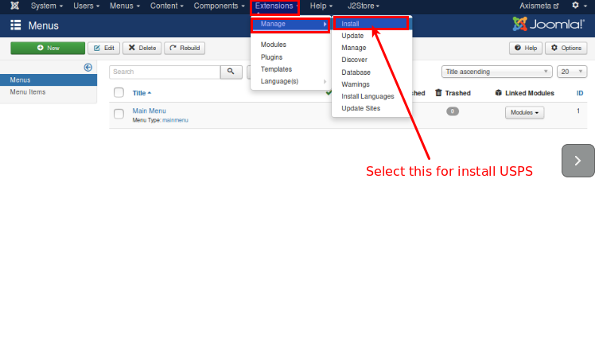

##### step 2

+ Click on the Browse button and select USPS Shipping (type=j2store) and click on Upload & Install

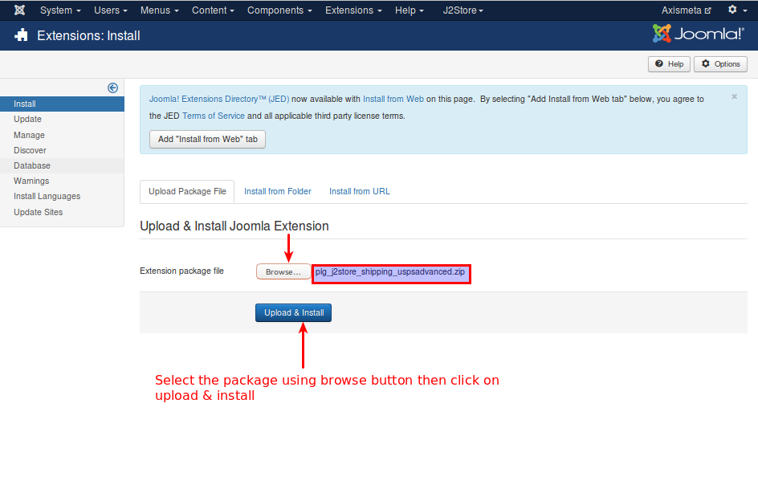

##### step 3

+ Select J2store ->setup -> shipping methods

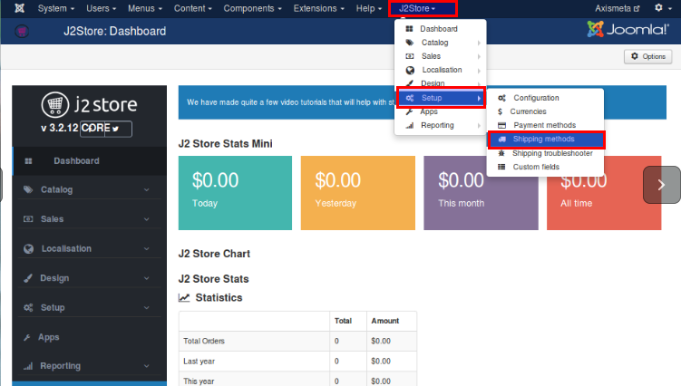

##### Step 4

+ Now, the USPS Advanced shipping for J2Store page will appear on the screen.
+ Enable the plugin.
+ Configure the shipping plugin by entering the plugin parameters.
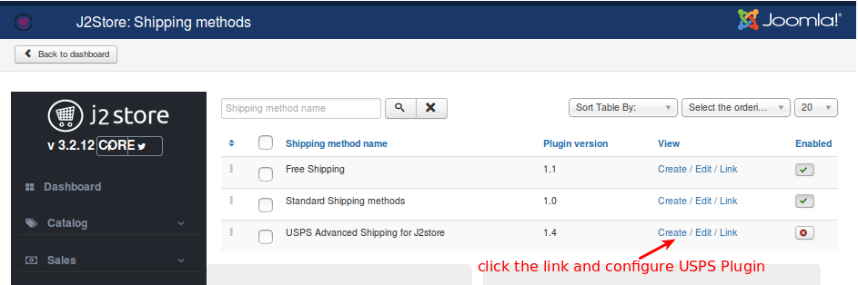

#### Configuration

#### USPS API SETTINGS

##### Web Tools Username

Enter the valid username associated with your USPS account.

##### Orgin postal/ Zip code

Enter the Postcode from where you ship.

Refer the below image

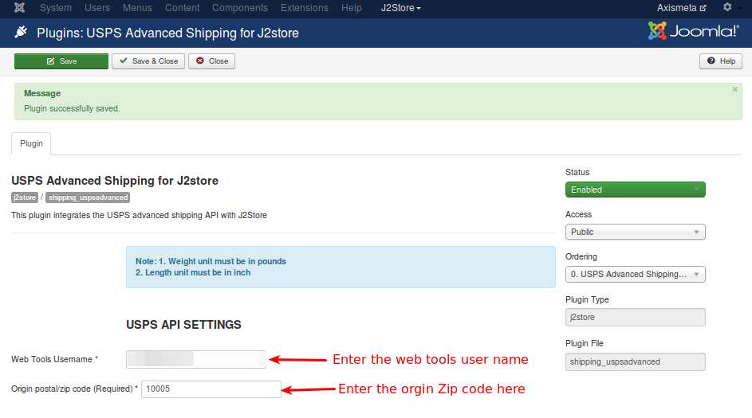

##### USPS COMMON SETTINGS :

##### Domestic Services :

USPS offered  lot of domestic services . You can select more than one service. If you need to know more about the USPS Services please refer the following link [USPS](http://www.usps.com/).

##### International Services

USPS offers lot of international services. You can add multiple options from the list.

##### Handling cost

If you need to charge a handling cost for the shipping, you can enter here.

##### Dimension unit

Select the desired unit in which you want to measure the dimension, like, inch, milimeter and centi metre. Preferred unit **Inch**.

##### Weight unit

Select the desired unit in which you want to measure the weight, like, kilograms, pounds etc. Preferred unit **Pound**.

#####  Display Delivery Time
If you want to show  the  delivery time means set it yes othewise set it as no.

##### Tax class
If shipping is taxable and you want to add tax rate, select a tax profile in this option.

#####  Geozone

If you want to limit this shipping method to particular areas, then you can select the corresponding geozone in this option. If this shipping is applicable to all areas, then set it to All.

##### Debug
If you set this to Yes, then an error log file will be maintained in the cache folder. It suitable for test account.

+ Set this option to No in live site

##### Use Test Server

USPS Shipping offers a testing suite called test server. Before going live, you can test your store using USPS test server feature.

Refer the below image

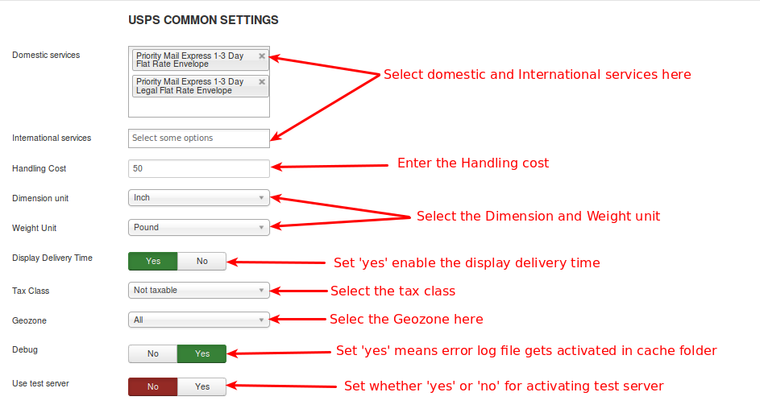

####  Enable standard api service

Set this to **YES** will enable the standard API service of USPS (i.e) once standard API enabled, it will pass to the USPS server and get the standard rates from USPS server.

##### Shipping rate based on ?

There are 2 options available

1)**Commercial Rate :**

Commercial Base Pricing is always cheaper than the retail rates. Commercial Base Pricing is a discounted rate offered to U.S. Postal Service (USPS) to customers. It is the common price for all the customers of USPS.

2)**Retail rates :**

Shipping rate changes based on the surcharges, fees, and other factors.

##### Packing type

Usps offes 3 types of packing.

**1) Individual Packing**

Each products cosider as a seperate unit and packing it into the individual boxes. Each product will be packed seperately.

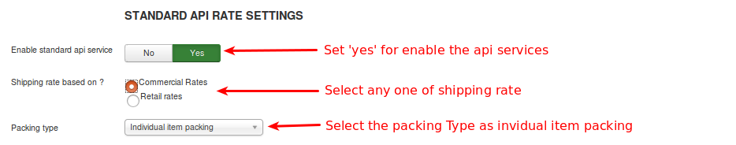

Output will diplayed as like below image

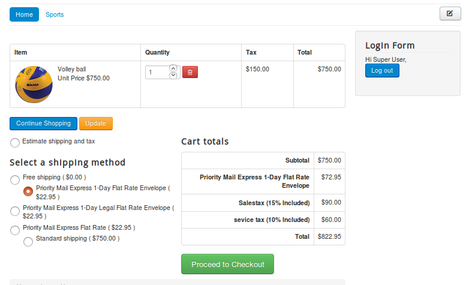

**2)Box packing :**

The box packing included with this shipping method lets you pack all the items into single box for which you have to define height, width, length, weight and max-weight. Packing is mainly volume based but also considers item size.
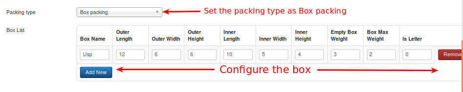

If you choose box packing then you will have to create/set box size.The box will have the following fields.

+ Name: This allows you to name your custom packages.

+ L (in), W (in), H (in): The first set of dimensions are the outer dimensions of the package. These are the dimensions passed to the API. If you are working with a flat rate box via the API (i.e., Regional Boxes), use the API’s ‘inner dimensions’ for your box’s outer dimensions. Your box must ‘fit’ inside.

+ Inner L (in), Inner W (in), Inner H (in): The second set of dimensions are for the inner dimensions of the packaging. This should be the outer dimensions minus the thickness of the package walls. These dimensions are used for packing and items must fit within them (they cannot be the same size as the products, allow for a little extra room).

+ Weight of Box (lbs): This is the weight of the empty box by itself. This weight is added to the total weight of the contents.

+ Max Weight (lbs): This is the maximum weight your box can hold. This includes the weight of the box and the contents.

+ Letter: This checkbox determines whether your package is a letter (envelope) or a box.

After configuring the USPS settings, then the important thing you have to do is to enter the dimensions for your product. Refer the image below
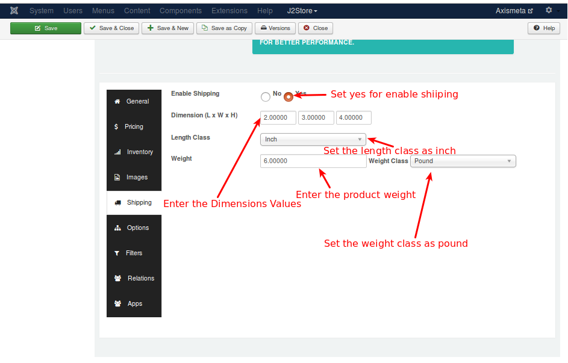

**3)Weight Based Packing :**

In this each product has different weight. Product having less than 70 lbs will be packed up into the single pack. If the products exceeds the 70 lbs it does not pack up.

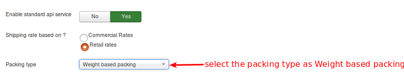

After configuring the USPS configure the following thing in J2store also. 

####  Enable Flat Rate box based on

It is important to note that Flat Rate Shipping prices come directly from the USPS API, and you cannot add or modify pricing for this option.

It has four options like enable the flat rate box, disable the flat rate box, enable priority services only and enable expresses services only.

##### Enable flat Rate box :

Choosing this option will enable express services and also the priority services.
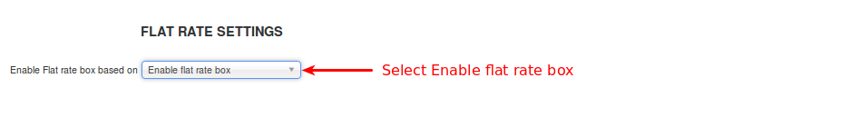

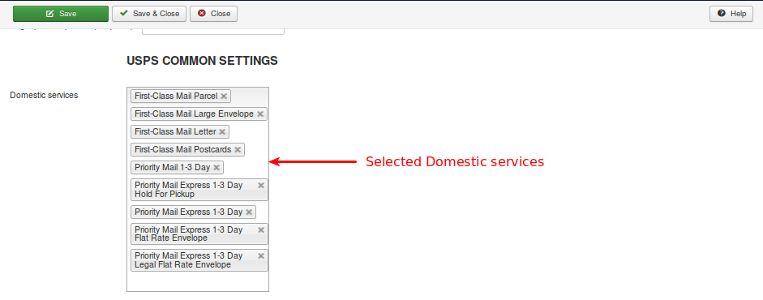

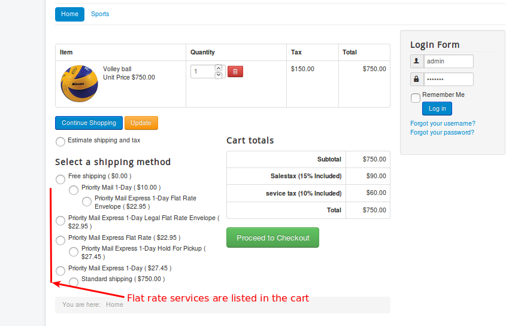

##### Disable Flat Rate box :

If you select this option, it will disable all flat rate services.

Refer the below images for better understanding
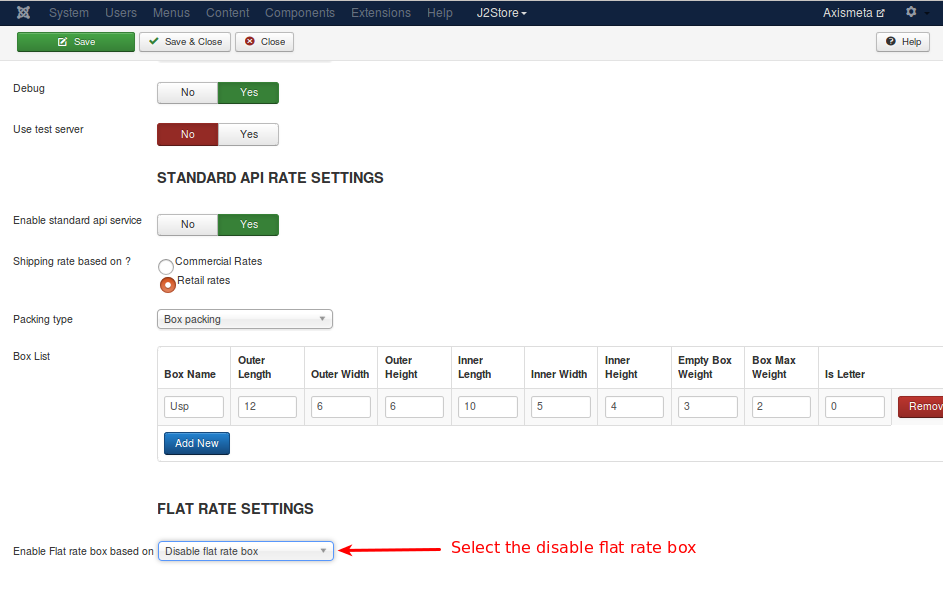

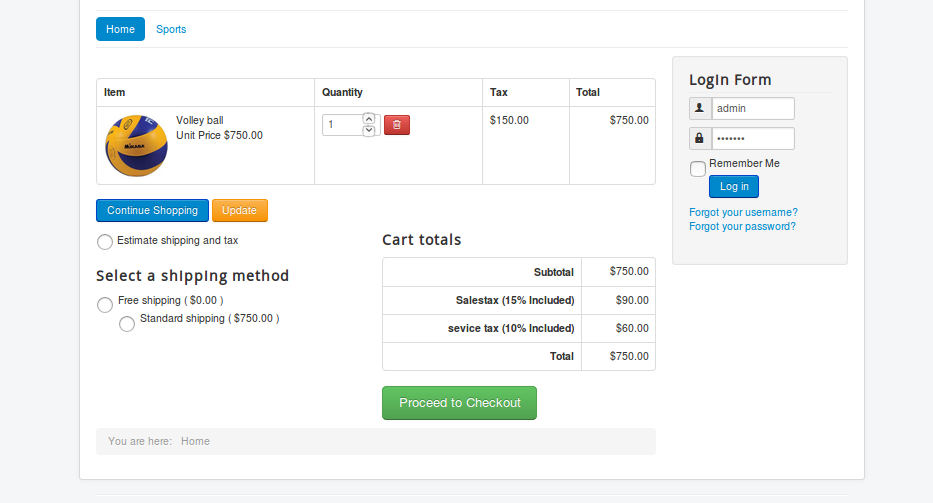

##### Enable priority Services only

It only enables priority services in cart page.

Refer the below images

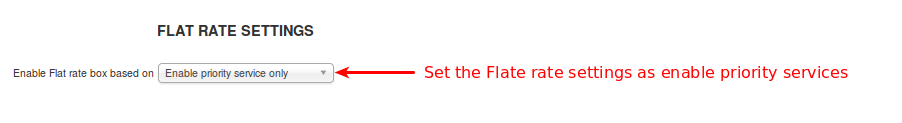

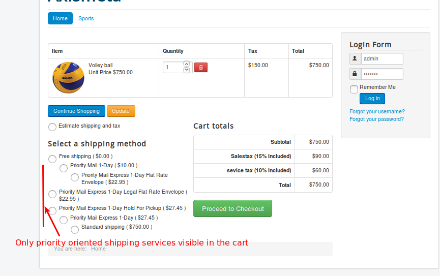

##### Enable Express Services :

Choosing this option will enable only the express services.

Refer the below images

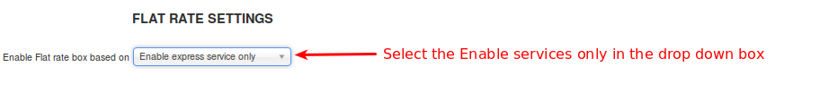

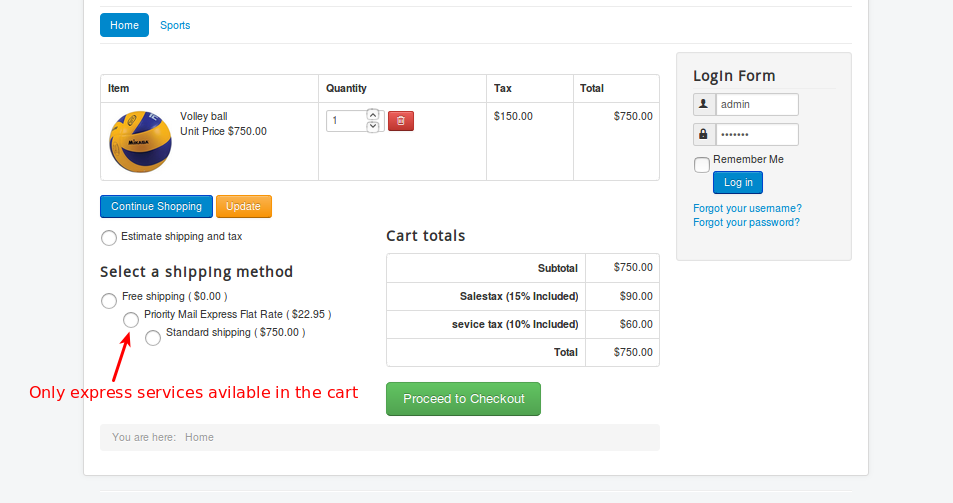

####Advanced package handling

This type of handling method applies to Box packing type and Flat rate services. For scenario, consider you are having only two boxes (Box 1, Box 2) and 7 items needs to be packed. Pack the first three items into Box 1 and second three items into Box 2. To pack the item 7, you need one more box (Box 3). So you need multiple boxes to pack the items. In this case, you can decide the cost for additonal box should be applied or not.

By this Advance Package handling method you can use the following options to charge and un-charge the unpacked item.

**Unpacked item handling**

* **Get a quote for the unpacked item by itself**

  Choosing this option will get a quote or charge for the unpacked item (i.e.) it will display the charge for multiple boxes (Box 1, Box 2, Box 3). This is the default option.
  
* **Ignore item - do not quote**

  Choosing this option will display the charge for Box 1 and Box 2 and will ignore the Box 3.
  
* **Abort - do not return any quotes for the standard service**

  Choosing this option will cancel sending quotes for all the boxes.
  
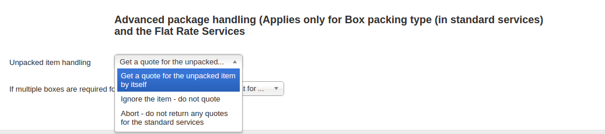
  
**If multiple boxes are required for shipping?**

* **Quote by adding the cost for all boxes required for packing**

  This is the default option. Choosing this option will add the cost for all the boxes (Box 1, Box 2, Box 3).
  
* **Abort - do not return any quotes**

  Choosing this option will cancel quotes for all the boxes and will not return any cost.

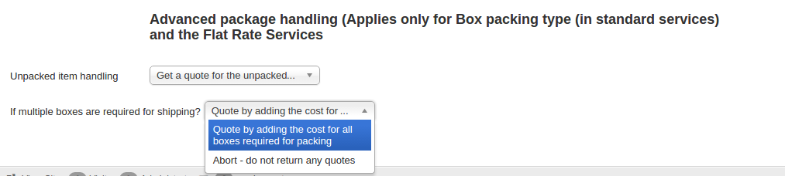