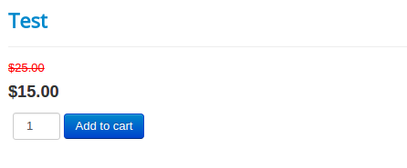
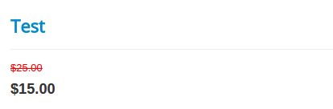
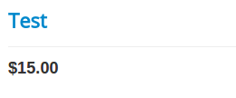
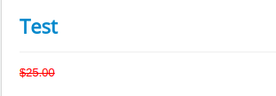
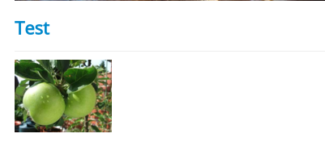
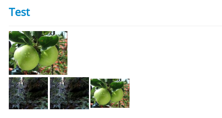
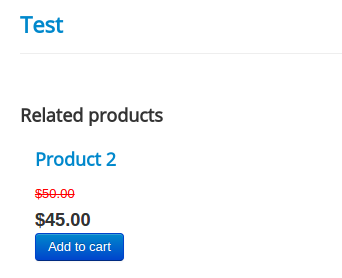
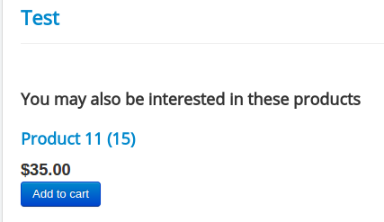
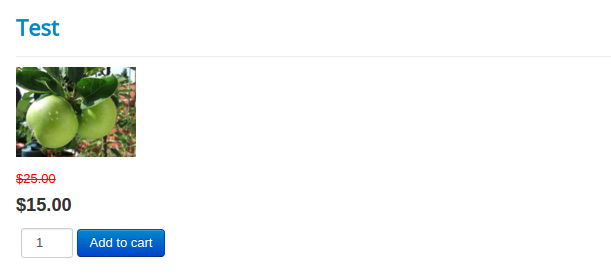

# Short Codes

Shortcodes are for Joomla article layouts.

The purpose of providing those short codes are because Joomla layouts are not under j2store's control. It is developed and maintained by Joomla.

However product list layout / product pages are meant for displaying product and maintained by J2Store. It already has the code (PHP code) in its view files to display products and elements.

However, article layouts / core joomla layouts dont. That is why the short code is processed. So the short codes are provided for Joomla layouts. They wont work in J2Store's product layouts.

>Adding more short codes to j2store pages (which already processes the products) would result in force processing / invoking j2store again and again resulting in performance issues.

### Additional short codes

In addition to the primary short code, you can also use the following additional codes inside {j2store}{/j2store} . Each code should be separated by a pipe (|) symbol.

To place this shortcode, first and most important thing is to change the Add to placement mode.

Go to J2Store > Configuration > Cart tab
Set the Add to cart placement to Both or Within article using tag.
Save.

**Example:**
    
    {j2store}xx|upsells|crosssells{/j2store}
    
    
These additional short codes will work in all **Add to cart** placement modes. Please use these codes judiciously and wisely for better performance.

### List of shortcodes available and their description

* **cart** - Full cart with price, options and add to cart button
{j2store}XX|cart{/j2store}

* **price** - This short code indicates both regular price and selling price
{j2store}XX|price{/j2store}

* **saleprice** - This code is for only the selling price
{j2store}XX|saleprice{/j2store}

* **regularprice**  - This denotes only the regular price
{j2store}XX|regularprice{/j2store}

* **thumbnail** - This indicates a thumbnail is added via the j2store cart -> images tab
{j2store}XX|thumbnail{/j2store}

* **mainimage** - This shortcode indicates a main image is added via j2store cart -> images tab
{j2store}XX|mainimage{/j2store}

* **mainadditional** - This is an indication of both main and additional images are added via j2store cart -> images tab
{j2store}XX|mainadditional{/j2store}

* **upsells** - This shows up-selling of products
{j2store}XX|upsells{/j2store}

* **crosssells** - This shows cross selling of products
{j2store}XX|crosssells{/j2store}

####Example

{j2store}1|thumbnail|cart{/j2store}

