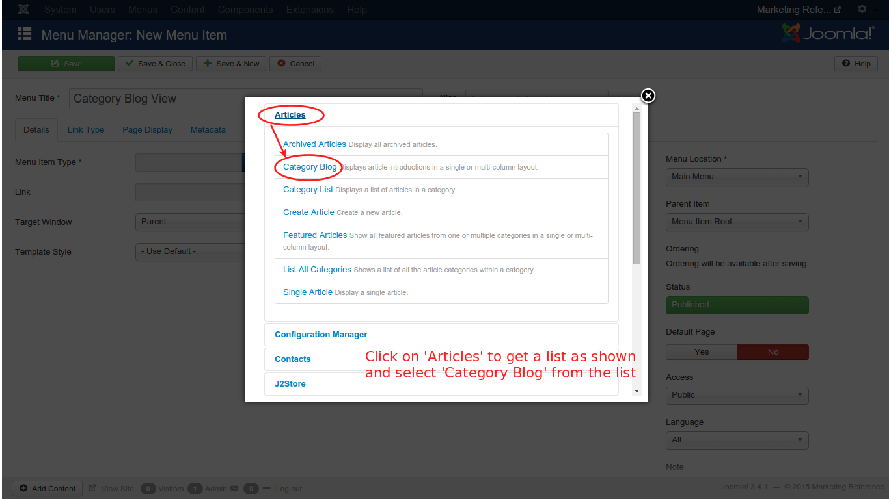

# Show J2Store content in Front-end

This section will help you understand how to display the SEBLOD article in front end.

The display can be achieved in the following methods:

* **Category Blog View**
* **Single Article View**

To display SEBLOD articles in the frontend, you need to create a menu exclusively and then you can display it. 

### Create a Menu Item
In the backend main menu, go to **Menus -> Main Menu**. You will get the **Main Menu Items** list, as shown in the image below:

Click on the ***Add New Menu Item*** or ***New*** button, as pointed out in the image. You will get the screen as shown in the image below: 

Enter a name for the new menu item and click on the **Select** button to select the type of the menu item.

As shown in the image, click on the **Articles** and you will get a list down the option. From the new list, select **Category Blog**. Now, you will get a new option below the menu item type, named ***Choose a category***. From that option, select **Product** as illustrated in the next image.

Before you proceed to view the article in frontend, you need to check one thing. Go to **Components -> J2Store -> Setup -> Configuration**. Go to **Cart** tab. Now, check the setting of **Add to cart placement** option. Ensure it is selected with **Within article using tag** as shown in the image below.

Now, go to the front end view of the site. You will get the home page as shown below:

Your home page will display the products in your online store. Note that the new menu item, **Categort Blog View** you have created is listed in the main menu list. Click on that and you will get the view as shown in the below image:

