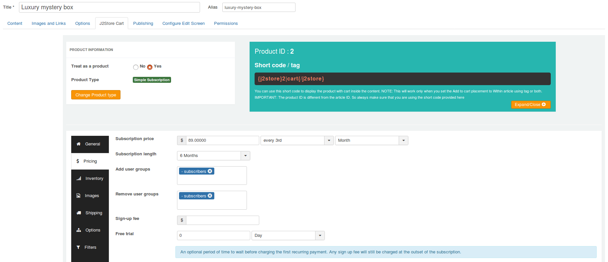
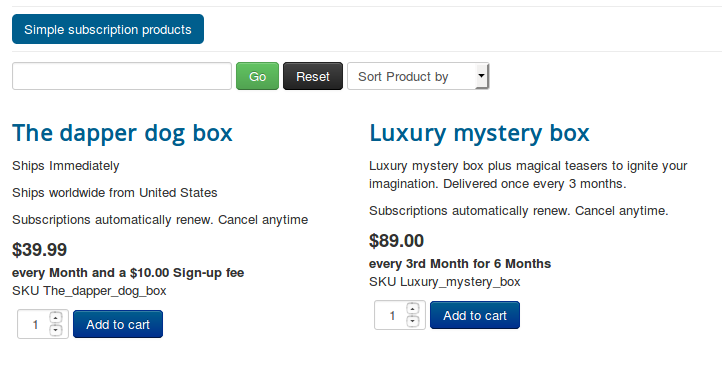

## Creating simple subscription product

**[Watch the video tutorial for creating simple subscription product](https://www.j2store.org/support/video-tutorials/creating-simple-subscription-product.html)**

1. Go to Article Manager > create new article > Move to J2Store cart tab

2. Choose **YES** to Treat as a Product and select **Simple Subscription** as Product Type and click **Save and Continue**.

3. Set **YES** to Visible in storefront and navigate to **Pricing** tab.

4. Pricing tab, where you could set your subscription product's price, customer group, expiry date, etc.

You can set images, shipping, filters to your subscription product.

#### How to setup pricing for subscription product ?

- **Subscription price :** Enter the membership price (for example, $29) based on either daily or weekly or monthly or yearly basis.

   For example, if you would like to give subscription price $29 for only 3 months, then enter $29 in the first text box and then choose **every 3rd** from the dropdown list and then choose **month** from third dropdown list.

- **Subscription length :** The subscription length duration will be listed based on the recurring period you selected above.  For example, if your subscription product's duration period is only for 3 months, Choose 3 months. So the subscription will end at the  end of 3rd month.

  If you would like to give a life time price for your subscription product (i.e.) wants to collect $29 at the end of every 3 months for lifetime, choose **Never Expire** to Subscription length. So $29 for every 3rd month for lifetime.

- **Add / Remove user groups :** Users will be added and removed from the Joomla user groups when their subscription to the level is enabled or disabled.

- **Sign-up fee :** This app allows you to collect one time set up fee or sign up fee from your customers. Enter your sign up fee here. For example, $5 or $10.

- **Renewal discount :** If you wants to give the same discount to the customer during renewals. Checking this checkbox will override any renewal discount set globally in the app settings.

- **Set Advanced Pricing :** If you want advanced pricing, click the 'Set Prices' button and it will open up a pop-up window to allow you to set an advanced price setting.

#### Frontend demo

#### Example

Consider, the store owner likes to provide 3 months subscription plan and wants to collect price of $9.99 at the end of every month for 3 months.

Let's see below steps to implement above scenario.

**Step-1:** Create a new product with type **Simple subscription**

**Step-2:** On general tab, set YES to visisble in storefront.