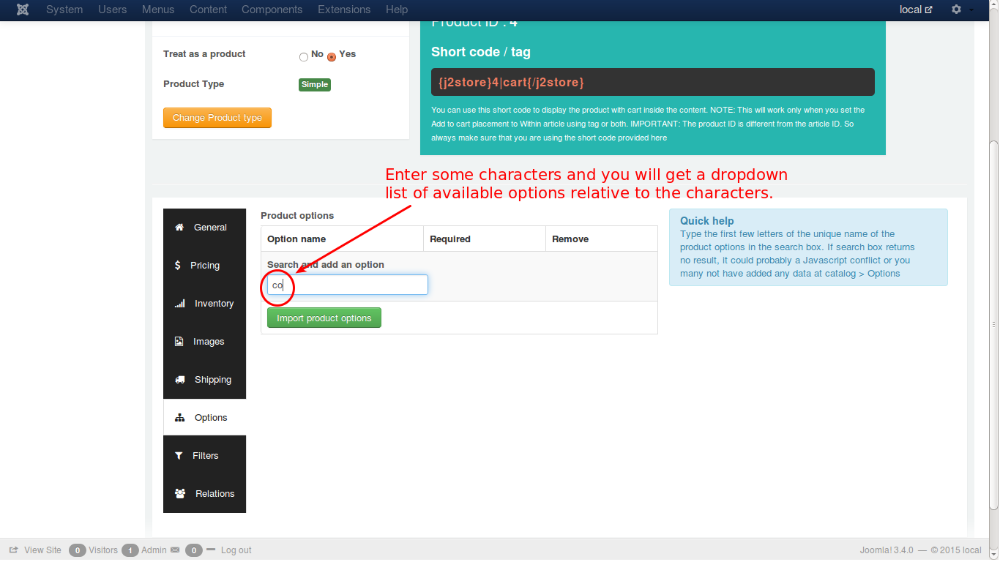
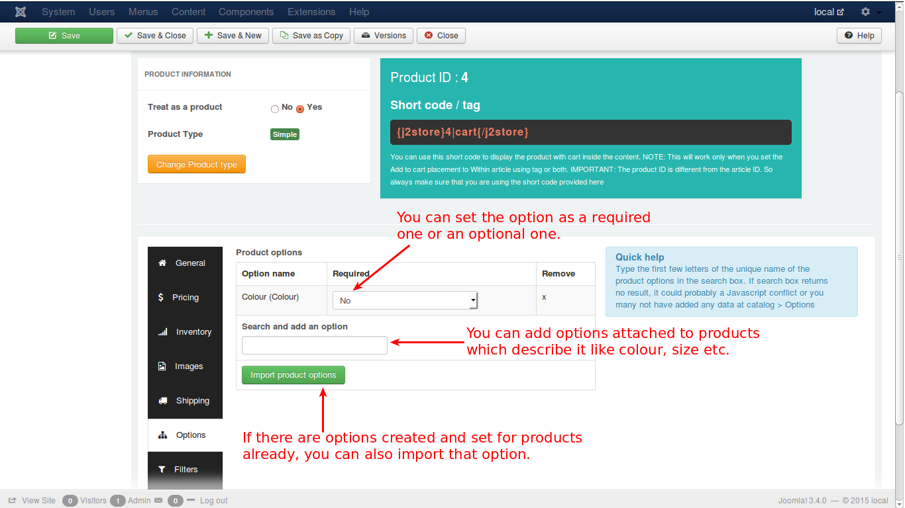

# Options

In this tab, you can set your preferred options for a particular product like, colour of the product, size of the product, weight of product, mass of the product etc.

See the image on how to set the option for a product.

Once you select the option from the dropdown list, it will be added as you can see in the image below.

In the image, you have a text field to enter the option name like colour, size etc. Just enter that in the text field. It will be set as preferred option.

If an option is created and set already, you can also import it here rather create a new option. Click the button and it will direct you to the predefined options, if any.