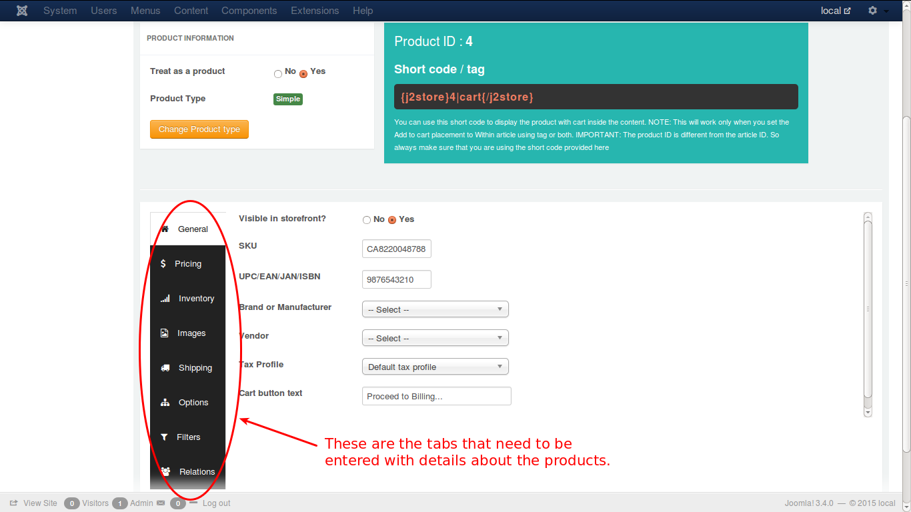

# Simple Product

Any product available for sales without any variants or options to change the attributes, can be termed as simple product. 
There are many tab pages with lot of options that need to be addressed to configure the **simple** product type.

See the image below:

### Creating a simple product

Lets explore through the tabs for how to create and set up the configurations for a simple product, with the help of illustrative images.

The tabs that are available in configuring a simple product are:

* **[General](./assets/images/http://j2store.gitbooks.io/user-guide/content/general.html)**
* **[Pricing](./assets/images/http://j2store.gitbooks.io/user-guide/content/pricing.html)**
* **[Inventory](./assets/images/http://j2store.gitbooks.io/user-guide/content/simple_inventory.html)**
* **[Images](./assets/images/http://j2store.gitbooks.io/user-guide/content/simple_images.html)**
* **[Shipping](./assets/images/http://j2store.gitbooks.io/user-guide/content/simple_shipping.html)**
* **[Options](./assets/images/http://j2store.gitbooks.io/user-guide/content/simple_options.html)**
* **[Filters](./assets/images/http://j2store.gitbooks.io/user-guide/content/simple_filters.html)**
* **[Relations](./assets/images/http://j2store.gitbooks.io/user-guide/content/simple_relations.html)**