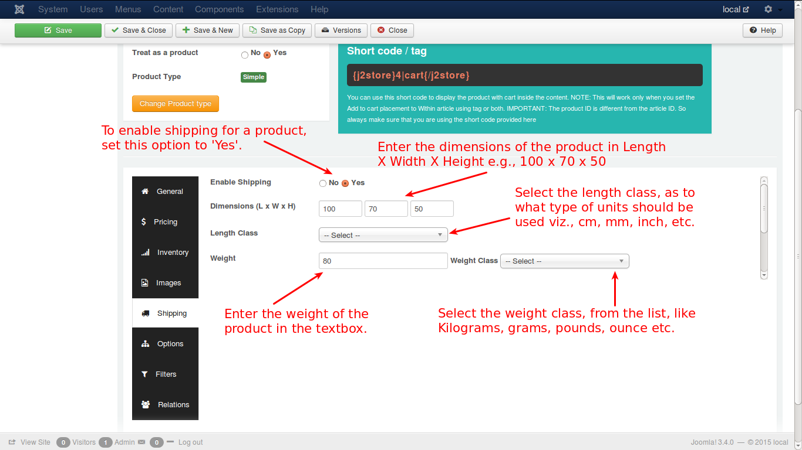
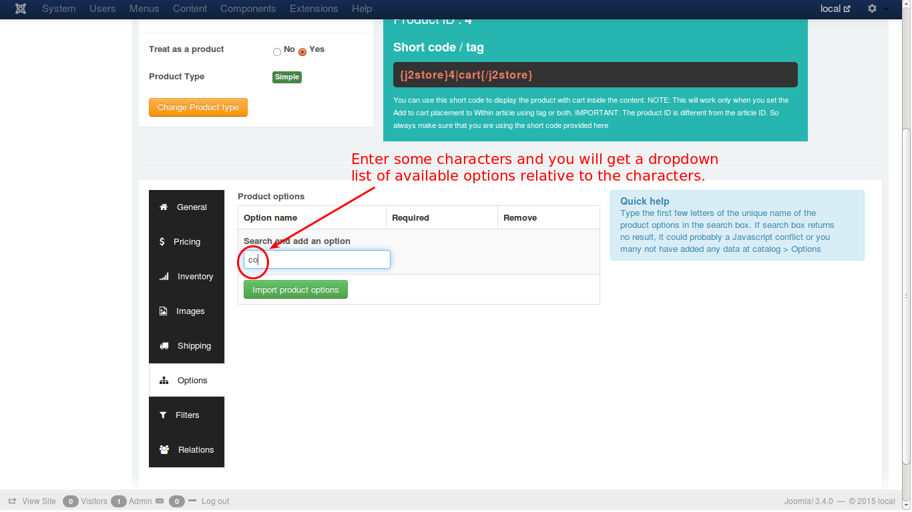
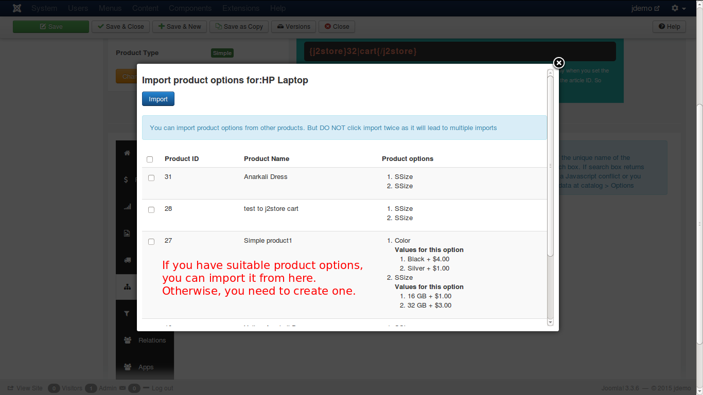

# Simple Product

- **[Introduction](#introduction)**
- **[Creating a simple product](#creating-simple-product)**
	* **[General](#general)**
	* **[Pricing](#pricing)**
	* **[Inventory](#inventory)**
	* **[Images](#images)**
	* **[Shipping](#shipping)**
	* **[Options](#options)**
	* **[Filters](#filters)**
	* **[Relations](#relations)**
	* **[Apps](#apps)**
- **[A step-by-step example to create a simple product](#example)**

## Introduction
A most common product type. It suits the requirements of most of the store owners.

You can create a simple product with or without product options. The inventory for this product type is managed for the primary product (Not for the options). All option types can be associated with the simple product.

## Creating a simple product

Lets go through the available settings / fields for the simple product type.

### General
The general tab has several fields, in which we need to enter the necessary and relevant details, attached with the product.

Have a look at the image below:

* **Visible in Storefront** - IMPORTANT: Set this to YES if you want this product to be shown in the storefront. 
* **SKU** - Enter the SKU number of the product
* ***UPC/EAN/JAN/ISBN*** - Enter ***UPC/EAN/JAN/ISBN*** code for the product whichever is relevant
    * **UPC** - Universal Product Code (In US/North America)
    * **EAN** - European Article Number (Outside North America/Europe)
    * **JAN** - Japanese Article Number (Only in Japan)
    * **ISBN** - International Standard Book Number (Globally)
    * **MPN** - Manufacturer Part Number (Globally)
* **Brand or Manufacturer** - Select the brand or manufacturer of the product from the available list
* **Vendor** - Select the vendor from whom the product is available for purchase - ***Note: This feature is available in J2Store PRO version only***
* **Tax Profile** - Specify whether the product is taxable and if so, select the tax profile relevant to the product
* **Cart Button Text** - Enter the text to be displayed in the cart button

### Pricing
Add the price of your product. Depending on your requirement, you can also choose to configure an advanced pricing from here.

Now, check the image below:

As illustrated in the image, you can set the regular price by entering the value in the text box. If you want advanced pricing, click the '**Set Prices**' button and it will open up a pop-up window to allow you to set an advanced price setting.

Let us see how it happens. Check the image below:

* Select the dates (optional), between which you wish to set the advanced price. *This option is not mandatory. For instance, you can offer a special price throughout the year, for a bulk purchase.* 

* Quantity range for this price to apply. This is also optional and if there is no minimum quantity required, just leave it as empty.

* Select the customer group to which you offer this special price. Default: Public

* Now enter the special price and click **Create**.

The price will be added and displayed below. You can edit that if you need, and click **Save all prices**.

If you want to remove that, you can do it by clicking the **Remove** button.

### Inventory

#### * This is J2Store PRO exclusive feature *

This tab has the configuration setup facility for inventory management. Here you can set the following details with respect to inventory. Check the image below:

From the image you can understand the following:

* **Manage Stock** - To enable Stock Management - Select **Yes**
* **Stock Quantity** - Enter the initial stock quantity
* **Allow Backorders** - Choose from the options whether or not to allow backorders to customers, i.e., the customer can order a product even if there is no stock
* **Stock Status** - Select stock status i.e., **In stock** or **Out of stock**
* **Notify if stock goes below** - Set minimum stock level for low stock alert
* **Quantity Restriction** - Choose whether purchase quantity is restricted and if Yes, set the limits for minimum and maximum quantity for a purchase by entering the quantities in the fields provided
* **Use store configuration** - If you select '**Use store configuration**', you cannot enter max and min quantity fields, as they will be disabled

### Images
In this tab you can add images that can help the customer to understand more clearly, the product he wants to buy. Images help the prospect to imagine how the product intended to purchase will look like.

See the image below:

Let us understand this with an example. 

Lets assume that a customer would like to purchase a car. Now, car images need to be loaded in this tab. 

* **Main Image** - The main image will be a general photo image of the car, that has to be uploaded by clicking on the 'Select an image' button and select the appropriate image from the files.

* **Thumbnail Image** - The thumbnail image would be something that represents the original product, but it would be a much smaller one to fit into a button, that will be shown up in the cart. By seeing this, the customer will understand that his product is displayed on the button and will click the button to see more details about the car.

* **Additional Images** - Additional images help the customer to know more details about the car, which will be showing the car view in many angles, and the customer will understand it clearly how it looks like, what the technical details of the car, the colour, and so on.

### Shipping

This tab has the configuration setting for shipping. Any product that has been purchased, has to be shipped to the customer, if the product is physically deliverable.

Consider the image below:

As shown in the image, you need to do the following activities to configure shipping:

* **Enable Shipping** - Select **Yes** to enable shipping
* **Dimensions** - Enter the dimensions of the packed product in **Length x Width x Height**
* **Length Class** - Choose a length class from the list e.g., **cm, mm, inch**, etc.
* **Weight** - Enter the net weight of the product when packed in the field provided
* **Weight Class** - Select the weight class from the list like **Kg, grams, pounds**, etc.

### Options

In this tab, you can set your preferred options for a particular product like, colour of the product, size of the product, weight of product, mass of the product etc.

See the image on how to set the option for a product.

Once you select the option from the dropdown list, it will be added as you can see in the image below.

In the image, you have a text field to enter the option name like colour, size etc. Just enter that in the text field. It will be set as preferred option.

If an option is created and set already, you can also import it here rather create a new option. Click the button and it will direct you to the predefined options, if any.

### Filters
Filters are certain attributes that help narrow the search of a particular product.

For e.g., assume that a customer searches for purple t-shirts in the store. Now, the productfilter is set as colour > purple, to narrow the search. See the image below:

Now the cart will display only the purple t-shirts.

### Relations

Relations are used to promote sales by suggesting the customer with higher value products than the one being looked and additional products to be bought with a particular product.

* In this tab page, relations are set for Upsells and Cross sells
* An ***upsell*** is to get the customer to spend more money – buy a more expensive model of the same type of product considered for purchase.
* A ***cross-sell*** is to get the customer to spend more money buy adding more products from other categories, additionally, along with the product intended for purchase.
* **Example**:
    The terms cross-sell and upsell are often used interchangeably because, let’s face it, this gets confusing. Say the customer is viewing a Laptop with 2GB/500GB for $500.

You can suggest the customer with some options, so that the customer may be convinced to buy one of your options, thus promoting a higher sale for you.

Your suggestions could be like this:

   * 4GB/500GB-> $550 - Upsell, same product family, more expensive
   * 4GB/1TB -> $700  - Upsell, same product family, more expensive
   * Laptop Bag -> $25 - Cross sell, related product, additional sell

### App

Custom fields / settings from applications will be displayed in this tab.

*****

## A step-by-step guide to create a simple product

**J2Store** implements an innovative concept in creating products. It uses the Joomla articles as products. So to create a product is to create an article.

So, lets create an article a.k.a a simple product

### Creating an article / product

Have a look at the image below:

As given in the above illustration, click in the top menu or in the left pane of the control panel. You will get a new screen like this.

* Enter a name for the product you want to create.
* Select the 'J2Store Cart' tab below.
* Select 'Yes' in the option 'Treat as product'.
* The next option is product type. From the available list, select 'Simple', as shown in the image. 
* Now click the button, 'save and continue'.

Your product will be saved, and it will continue to configure the product. See the image below:

Now, add a description to your product in the editor. Lets add the other primary details of the product. See the image below.

In general tab of the simple product, you can set up the basic information about the product like SKU, Universal Product Identifier, Brand etc and you can decide whether the product is to be displayed in store front. Next is pricing tab.

Here, enter the price of the product. If you want to set advanced prices, like special discounts, click the 'Set Prices' button ant you will get a pop-up window, where you can set the special prices. See image below to understand how it is done.

Enter the dates between which the special price is offered, the minimum quantity to avail the special price, the user group eligible, the special price and click 'Create'. Now, the new price is listed as a row below. You can further edit and save or delete if you want. Lets move to Inventory, to understand stock management.

***This is a J2Store PRO exclusive feature***

Select 'Yes' if you want inventory management. Enter all the fields as required. They are fairly self explanatory, still assisted in the image. And move on to images.

Here, you can add the images for your product. The main product image, thumbnail image, and additional images for the product are added here. To add an image, click the green button, 'Select an image', which will bring up a pop-up window, where you can select the product image. See the image below:

You need to load the image in the top window to select an image. To load an image, select the source by the browse button, up load it and insert it.

Now, shipping. Check the image below:

Enter the options with details according to your needs to enable shipping, the dimensions and weight of the product, classes for length and weight. Next is options. 

You can add options for your product, as illustrated in the image. If you have already set an option for some other product, and wish to import the same option to this product, you can do so by clicking the import product options button, which will bring out a popup window, like this.

Next comes filters. You can filter the products, with their name or type to narrow the search. For e.g., if give 'Electronics' as filter, only electronics goods will be searched for your product, thus saving time. You can set filters as shown in the image.

The next tab is Relations. Here, you can add products of higher value than the one being viewed by the customer and recommend the customer to buy that product, citing its advantages and additional features. This is an upsell.

Refer the image below:

Also, you can add some other products to convince the customer to buy theses products additionally. This is cross sell.

For more detailed explanation, refer to the **Relations** section of the **Simple Product**.

The next tab is Apps.

In this tab, you can add third party tools or plugins, that are available, to enhance the J2Store functionality, like adding additional fields, applications, functions or features.

Now, lets have a look on how your product is viewed in your online store. Check the image below:

