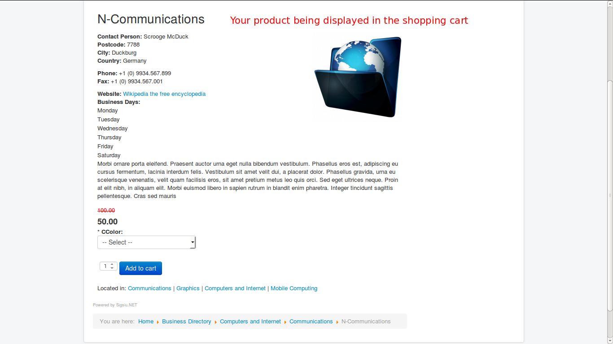

# SobiPro

### Introduction
The plugin integrates Sobipro directory component with J2Store, thus adding ecommerce capability to Sobipro. 

#### Requirements
* PHP 5.2 or higher
* Joomla 3.x
* J2Store 3 or above
* Sobipro

#### Installation Instructions 
1.In the backend, go to Components->SobiPro->Application Manager-> Here you can find an input for installing application  “Select Application”

2.After successful installation, you can now see the list displaying the j2store application.

3.Now choose the section you want enable j2store application.

###Enabling Application in the section
* Click on the Application Sections Tab -> Applications ,   you can see the list of application.Enable the J2Store   Application. 

* Now J2Store application is ready.
 

* You can start adding new entry and also treat them as J2Store product using enabling "Treat as product" from the J2Store Tab.

Fill the required fields and  "Save and exit", after  saving the entry you can see the J2Store Tab having "Treat as product" Controls.

Now set "Treat as Product" to Yes and choose the type of the product and "Save and Exit" once.

Now open the Entry you can see the J2Store Tab having all the fields.Now you product is ready and you can enter the details.

Save the changes .

####Displaying Front end
1.Go to Menus > Main Menu > Add New Menu Item and add a menu item. Choose SobiPro Section or Category->Choose functionality and set other menu parameters, then save.

2.Go to your Home page and click on the menu item you created. You'll see a category page similar to this, depending on what choices you made and what template you are using.Go to the category and click on the entries detail view finally you can see the J2Store Cart.

