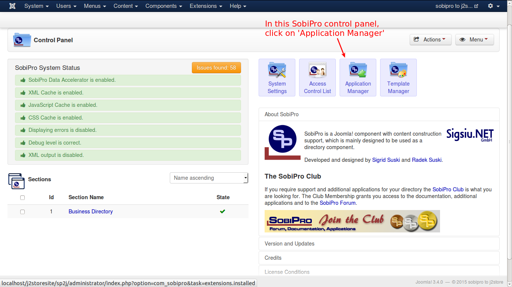
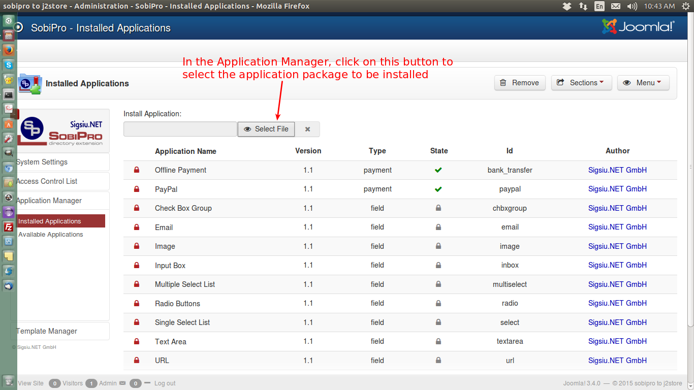
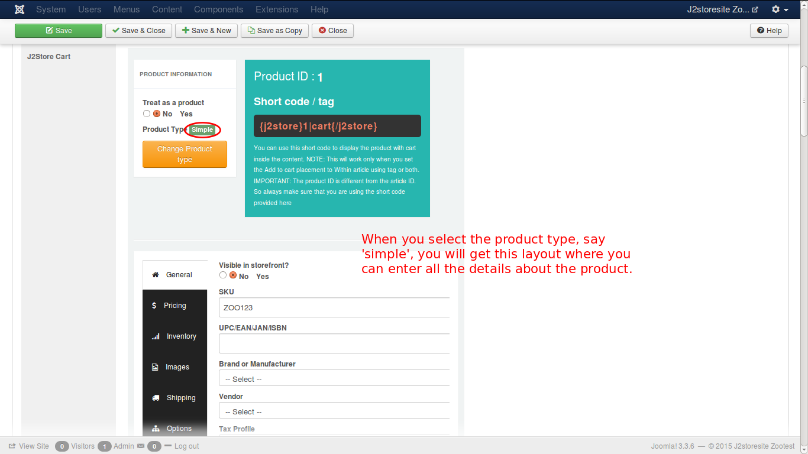

# SobiPro

### Introduction
The plugin integrates Sobipro directory component with J2Store, thus adding ecommerce capability to Sobipro. 

#### Requirements
* PHP 5.2 or higher
* Joomla 3.x
* J2Store 3 or above
* Sobipro

#### Installation Instructions 
1.In the backend, go to Components->SobiPro->Application Manager-> Here you can find an input for installing application  “Select Application”

2.After successful installation, you can now see the list displaying the j2store application.

3.Now choose the section you want enable j2store application.

###Enabling Application in the section
* Click on the Application Sections Tab -> Applications ,   you can see the list of application.Enable the J2Store   Application. 

