# Integration of SP Page Builder with J2Store

Styling is more important for all websites. Sometimes site owner may wants to organize their products in more stylish way than usual one. In that case, they will be looking to use page builder. SP Page Builder is a most popular page builder Joomla.

Now are came up with the integration plugin that would integrate SP Page Builder with J2Store Joomla eCommerce solution. So that you could display the products in the page layout you designed by using SP Page builder.

With the help of this integration plugin, you will be able to display the J2Store products via SP Page Builder in your Joomla site. It lets you insert product shortcode in any custom widgets.

Note: Our SP Page Builder add-on plugin is compatible with both SP Page Builder 2 and 3.

## Installation

1. Download our SP Page builder add-on from **[here](https://www.j2store.org/extensions/integrations/sp-page-builder.html)** and install it via Joomla installer.

2. After installing, go to Extensions > Plugins and make sure that the plugin named "J2Store - SPPageBuilder" has been enabled. If it is not enabled, please enable it.

### Use cases

Are you trying to display your products through SP Page Builder? Yes, you could do this with either Product display module or with J2Store's product shortcode. Below are two use cases that would show you how the SP Page Builder is using Product display module and product shortcode.

#### How to publish Product display module via SP Page Builder ?

Follow the below step by step instructions to display the product display module through SP Page Builder.

> Before doing this, you should enable and configure the Product Display module properly at Extensions > Modules.
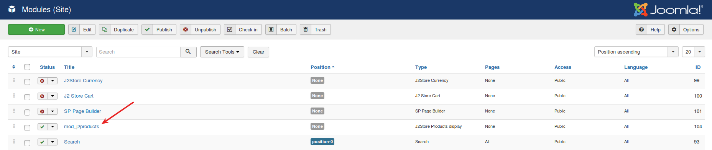

1. Create a new page by going to SP Page Builder > Pages and click NEW.

2. Give the title to your page and click on **Add New Row**.

    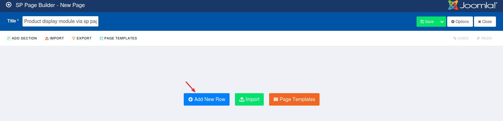

    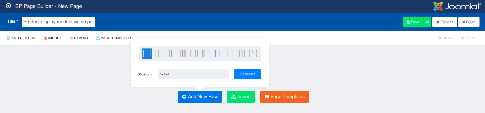

3. Now click on Add New Add-On

    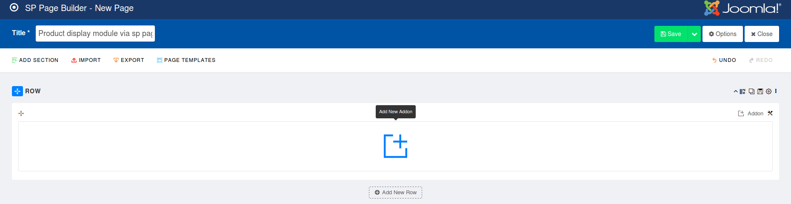
    
4. From Addons list, choose Joomla Module.

    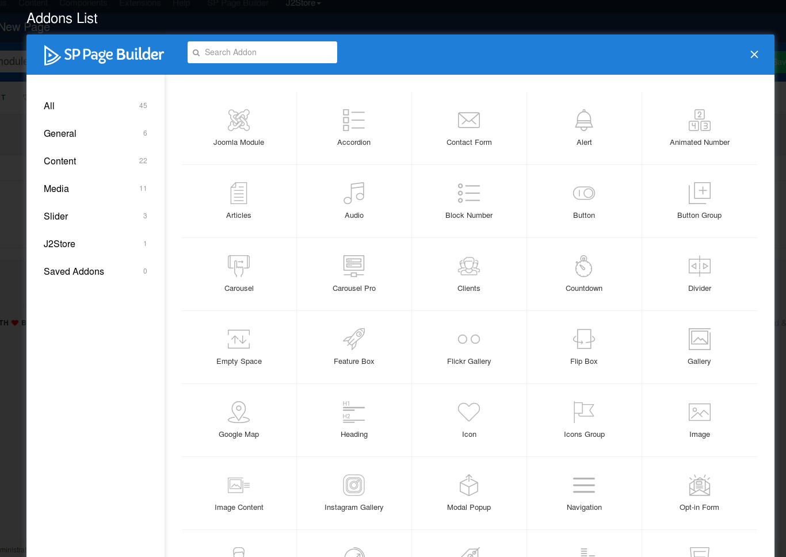

5. In the popup window displayed, enter Admin label and title and then move to the **ADDON OPTIONS** where choose **Module** to the type and choose **mod_j2products** to the Module.

    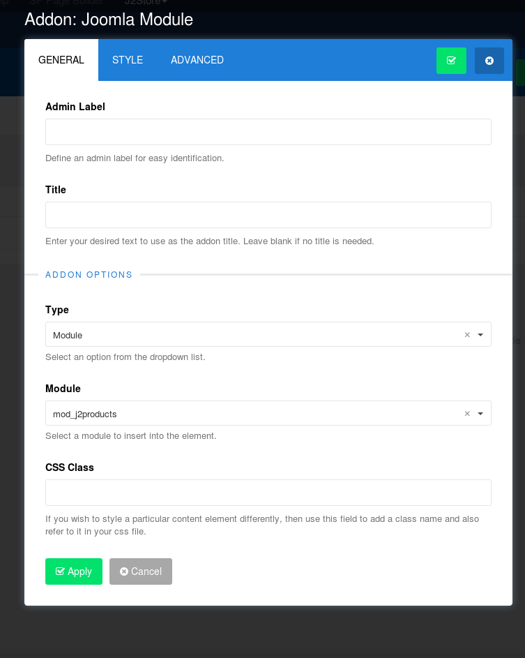
    
6. Click Apply.

#### Screenshot of frontend

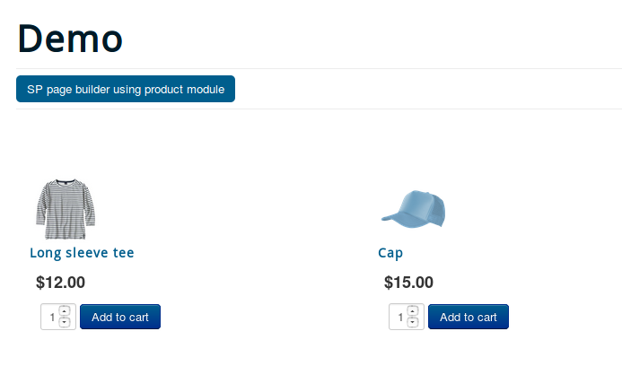

**[Direct link to the video tutorial](https://www.j2store.org/support/video-tutorials/sp-page-builder-using-product-display-module.html)**

#### How to use J2Store product shortcode via SP Page Builder ?

1. Create a new page by going to SP Page Builder > Pages and click NEW.

2. Give the title to your page and click on **Add New Row**.

3. Now click on Add New Add-On

4. In the left side menu panel of the popup window displayed, you would see J2Store. On clicking on J2Store, it would show you J2Store Add-On. Please see the screenshots below:

    
    
    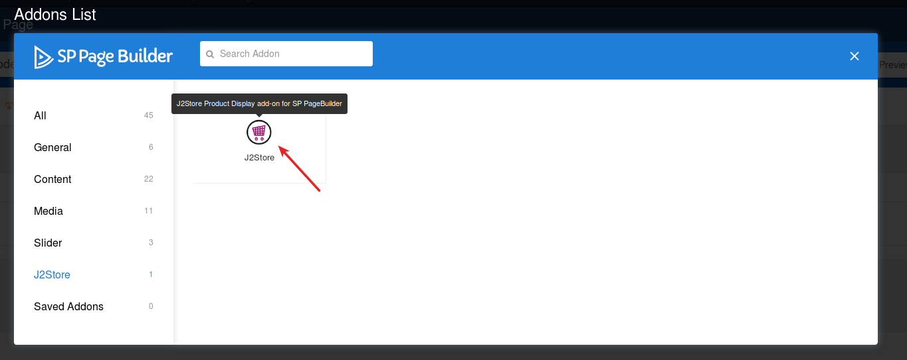
    
5. Click on J2Store Addon. it would show you the general settings and style configuration in a popup screen. Give the title and scroll down you would see the dropdown option named "Product shortcode tags". Select the tag(s) and enter the Product ID (in the text box provided next to the Product short code tags) of which you want to display.

    For example: Select the tag Thumbnail image, Cart and then enter the product ID.
    
    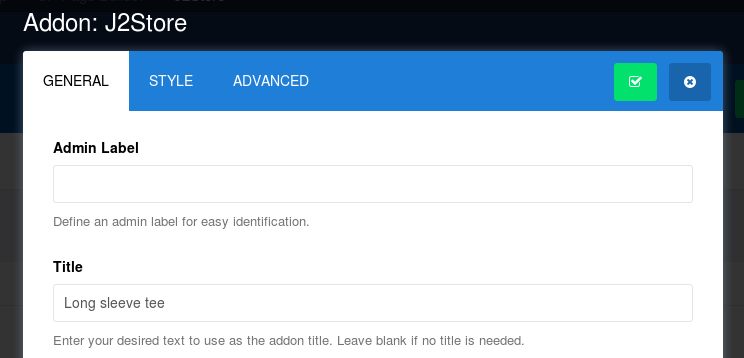
    
    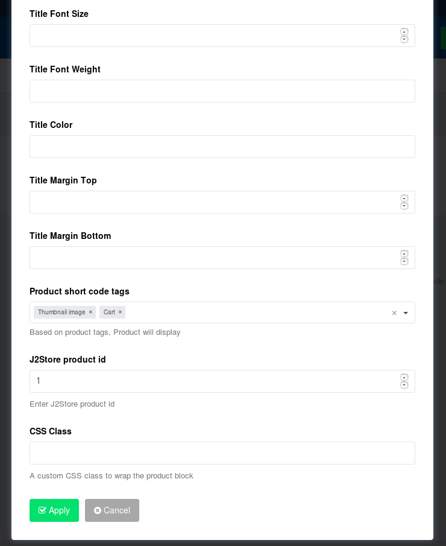
    
6. Click Apply.

#### Screenshot of frontend

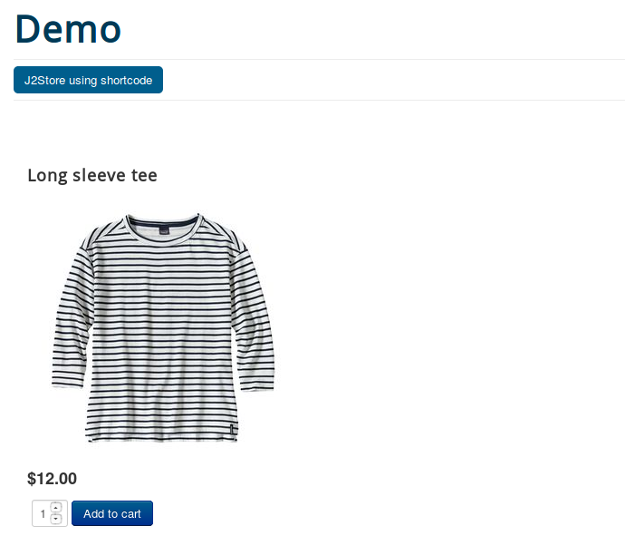