# Special Module Positions

  J2store offers special module positions to place the Joomla's custom HTML module. 
  * Go to Extensions -> Modules and create new custom module.
  * Enter the title and set the status to **Published**.
  * Simple copy the module position from the list given below and paste it in the position search box and press **Enter**.
  * Assign the module to the menu and save.
  
  #####**Following are the custom module positions :**

#### Product Category listing

 **j2store-product-list-top** - Top of product category listing page
 
 **j2store-product-list-bottom** - Bottom of product category listing page
 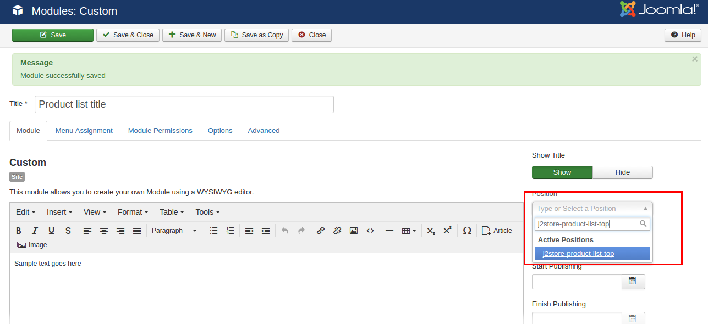
 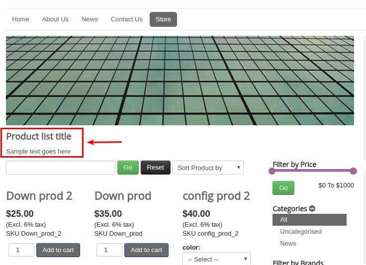
 
#### Single product view

 **j2store-single-product-top** - Top of product view layout

 **j2store-single-product-bottom** - Bottom of product view layout
  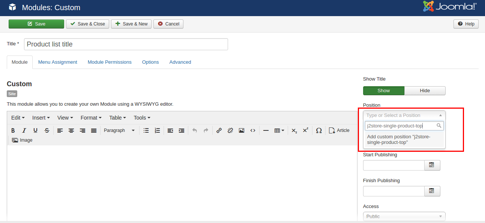
  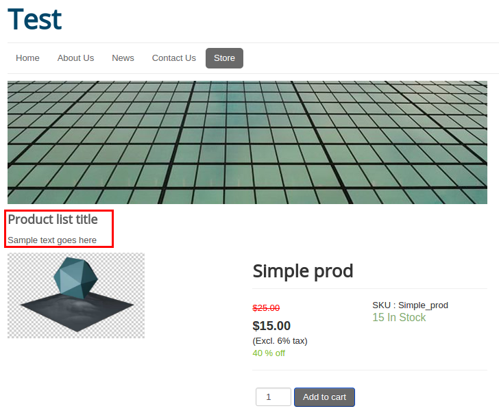
  
  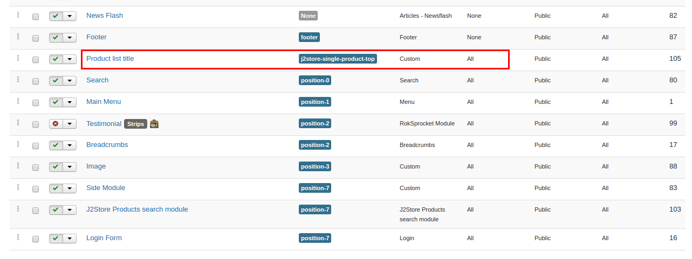
  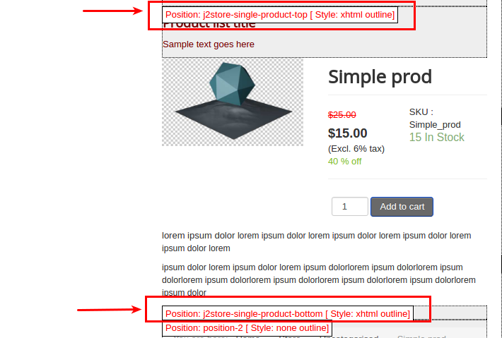

#### Filter Section

 **j2store-filter-left-top** - Top of left filter

 **j2store-filter-left-bottom** - Bottom of left filter

 **j2store-filter-right-top** - Top of right filter

 **j2store-filter-right-bottom** - Bottom of right filter
 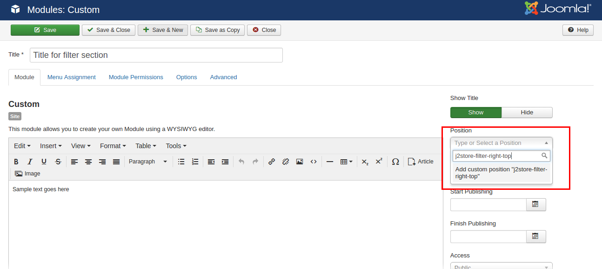
 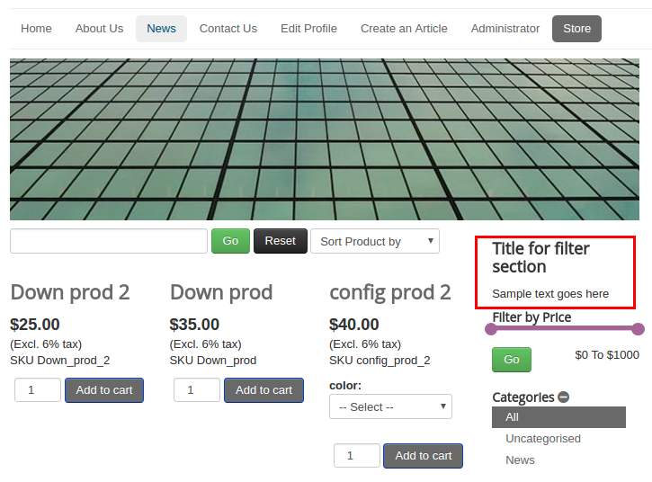

#### Cart page

 **j2store-cart-top** - Top of cart page

 **j2store-cart-bottom** - Bottom of cart page
 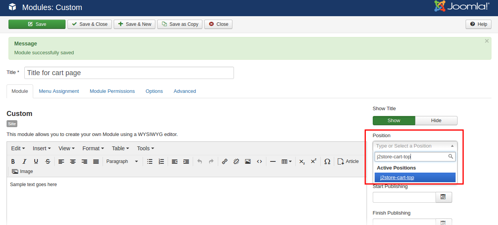
 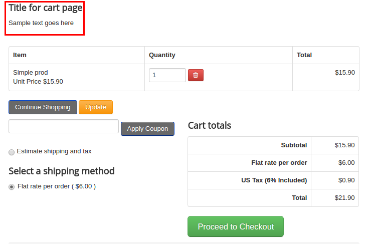
 
#### Checkout page

 **j2store-checkout-top** - Top of checkout page

 **j2store-checkout-bottom** - Bottom of checkout page
 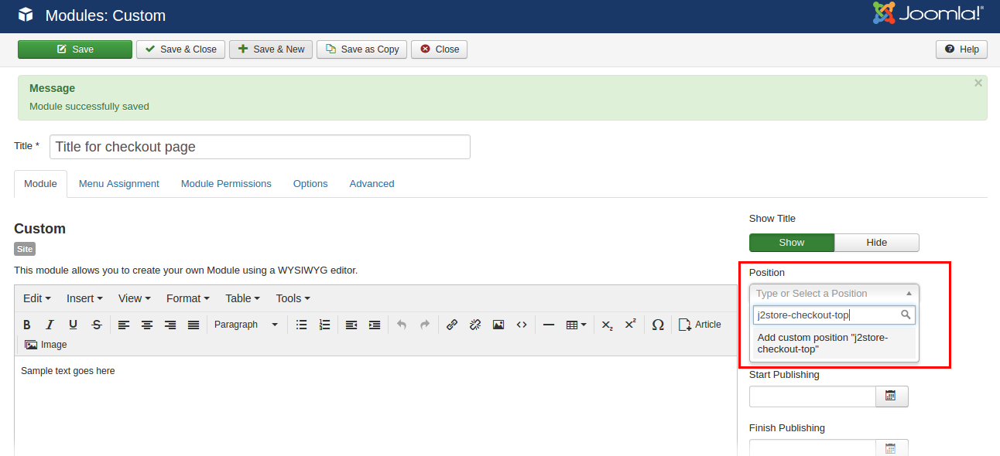
 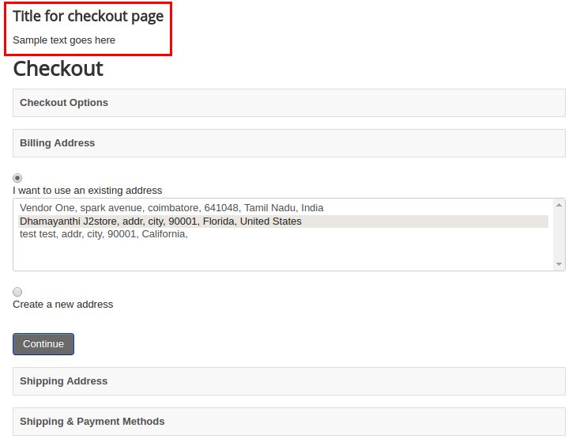
 
#### Checkout Results page

 **j2store-postpayment-top** - Top of Checkout Results page
 
 **j2store-postpayment-bottom** - Bottom of Checkout Results page
 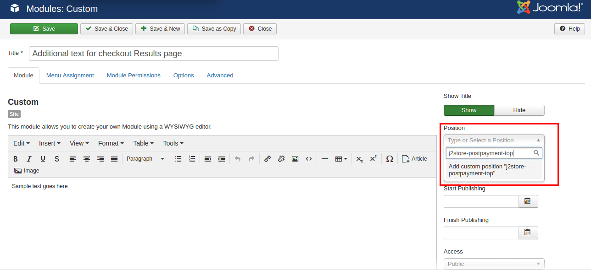
 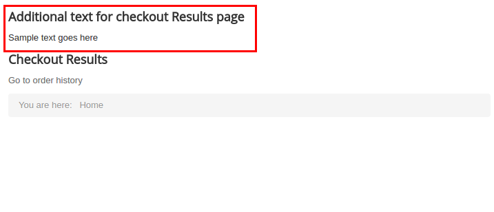