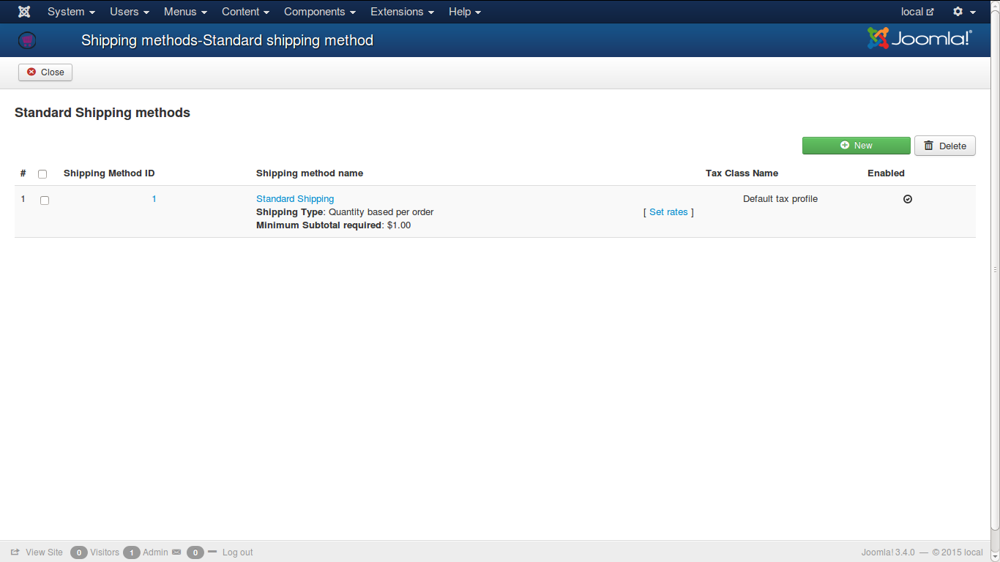
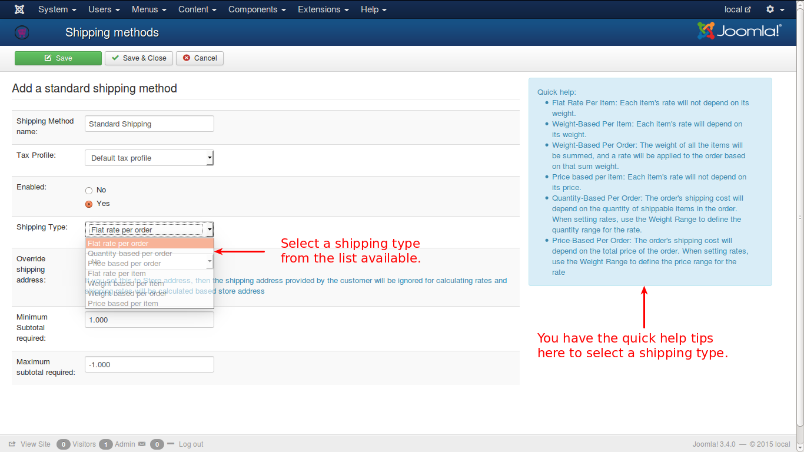

# Standard Shipping Methods

This is shipping plugin which is available in J2Store by default. It has seven shipping types. They are:

* **Flat rate per order**
* **Quantity based per order**
* **Price based per order**
* **Flat rate per item**
* **Weight based per item**
* **Weight based per order**
* **Price based per item**

See the image below:

When you click on the shipping method name, you will be directed to this screen.
