# Standard Shipping Methods

This is shipping plugin which is available in J2Store by default. It has seven shipping types. They are:

* **[Flat rate per order](#flat_rate_per_order)**
* **[Quantity based per order](#quantity_based_per_order)**
* **[Weight based per order](#weight_based_per_order)**
* **[Price based per order](#price_based_per_order)**
* **[Flat rate per item](#flat_rate_per_item)**
* **[Weight based per item](#weight_based_per_item)**
* **[Price based per item](#price_based_per_item)**

    - **[Examples](#standard_shipping_method_examples)** 
    - **[Trouble Shooting](#trouble_shooting_shipping_plugins_issues)** 
    
    
<a name="flat_rate_per_order"></a>
## Flat rate per order


A fixed rate will be charged for every order. For e.g., if the shipping cost is levied at $ 50.00 for every order, then the shipping cost is set to $ 0.00. This type of shipping can be termed as Store Pickup Method or Free Shipping Method.

See the image below on how to configure this shipping type.


You can give a meaningful name for the **Shipping Method** so that the customer understands it easily.

Select a suitable **Tax Profile** from the available list.

For any shipping method, to make it available for selection, always ensure that it is **Enabled** with '**Yes**'.

Select the **Flat rate per order** in the list.

If the shipping address needs to be overridden with store address, you can select it here.

Finally, set the minimum and maximum subtotals that are required for availing this shipping type.
**[Check the video here](https://www.j2store.org/support/video-tutorials/flat-rate-per-order.html)**
 
 <a name="quantity_based_per_order"></a>
## Quantity based per order
 
The total number of products that are to be shipped will determine the shipping cost. For e.g., the shipping cost will be $ 20.00 per order if the total number of products is up to 5 and $ 25.00 per order if the total number of products is from 6 upto 10.

See the image below to configure this shipping type:

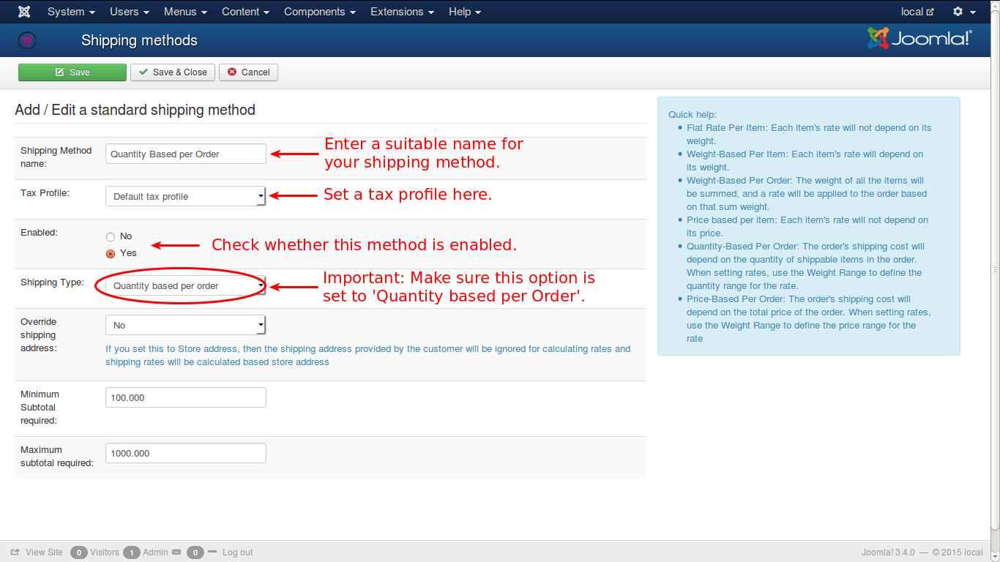

Settings are common for all the shipping types except the type to be set. For this shipping type you carefully need to select 'Quantity based per order' from the list as shown in the image.

And make sure to **Enable** this shipping type to be available for shipping selection.
**[Check the video here](https://www.j2store.org/support/video-tutorials/quantity-based-per-order.html)**
 
 <a name="weight_based_per_order"></a>
## Weight based per order

This type of shipping is calculating the cost based on the total weight of the order items. If a cost of $ 10.00 is charged for weights upto 50 Kilograms, and $ 20.00 is charged for total weights between 51 and 100 Kilograms, then an order having a total weight of 70 kilograms will attract a shipping cost of $ 20.00.

Configure this shipping method as explained in the image below:


As in the previous shipping methods, you need to give a **Shipping Method Name**, select a **Tax Profile**, **Enable** the method, and more importantly, select the type to be '**Weight based per order**'. And if necessary you can select the **Override Shipping Address** option. Enter **Minimum** and **Maximum** subtotals required for shipping.

And that's it.
**[Check the video here](https://www.j2store.org/support/video-tutorials/weight-based-per-order.html)**
```
In the standard shipping methods, no weight conversions are made.

- Always make sure that you enter the weight of the products in grams (or in kg).Please do not mix.
- In the Weight based per order -> Set rates, make sure the ranges are in Grams (or KG if all your product weight is set in kg).
```
<a name="weight_based_per_item"></a>
## Weight based per item

In this type of shipping method, the shipping cost calculation based on the weight of every item that is added to the cart.

For e.g., if the cost is fixed at $ 20.00 up to 100 Kg for an item, and for every 10 Kg there after, an additional $ 2.00 will be charged.

Let us see two examples for this. 

First, if an itme weighs, say 70 Kg, then as it falls under 100 Kg, it will be charged a flat $ 20.00.

Now, if an item weighs 200 kg, then the shipping cost for that item will be $ 20.00 upto first 100 Kgs and after that $ 2.00 per 10 kg for the next 100 Kg.

There are 10 times 10 kgs in the next 100 Kg.

So, for the next 100 kg, $ 2.00 X 10 = $ 20.00. And $ 20.00 + $ 20.00 = $ 40.00 will be the shipping cost for that item.

For configuration refer the image below.

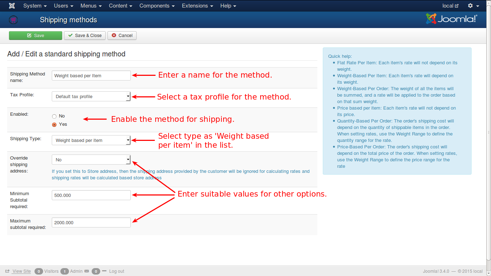

Enter all the values necessary as in other shipping methods, as shown in the image.

Select the shipping type to be '**Weight based per item**' for this item to be listed in the shipping methods.

**[Check the video here](https://www.j2store.org/support/video-tutorials/weight-based-per-item.html)**
 
 <a name="price_based_per_order"></a>
## Price based per order

The shipping cost in this type of method is calculated with price of the individual items. Some price range may be set for cost calculation and it will be followed.

Say for example, if a product or item falls under the price range of $ 100 to 1000, a shipping cost of $ 50.00 may be charged and if the item falls under the range of $ 1001 to $ 2000, the shipping cost may be fixed at $ 40.00 and so on.

**[Check the video here](https://www.j2store.org/support/video-tutorials/price-based-per-order.html)**

For configuration of this shipping method, refer the image below.


 <a name="flat_rate_per_item"></a>
## Flat rate per item

This method of shipping charges a flat shipping for every item, irrespective of the price or weight or any other attribute of the item. For e.g., the price of an item may $ 100 or $ 1000, $ 20.00 will be its shipping cost. Then it will be multiplied with the total number of products i.e., if the total number of products purchased is 10 nos, then shipping cost will be $ 20.00 X 10 which is $ 200.00.

N.B.: In this type, only one rate can be configured per geozone and weight will not be considered for shipping cost.

Consider the image below:


Enter the necessary details as in other shipping methods, and enable the method to be listed in shipping types.

For this shipping method, you need to select **Flat rate per item** in shipping options type list.
 
 
   
 
    
 <a name="price_based_per_item"></a>
## Price based per item

The shipping cost in this type of method is calculated with price of the individual items. Some price range may be set for cost calculation and it will be followed.

Say for example, if a product or item falls under the price range of $ 100 to 1000, a shipping cost of $ 50.00 may be charged and if the item falls under the range of $ 1001 to $ 2000, the shipping cost may be fixed at $ 40.00 and so on.

**[Check the video here](https://www.j2store.org/support/video-tutorials/price-based-per-item.html)**

For configuration of this shipping method, refer the image below.


### Help screen shots  
See the image below:


When you click on the shipping method name, you will be directed to this screen.


When you click 'set rates', you will be presented with this view:


After entering the data, click on the 'Create' button and you will get this:


<a name="standard_shipping_method_examples"></a>
# Standard Shipping Method examples

Let us see some examples for creating Standard Shipping Methods. 

* **[Flat rate per order](#flat_rate_per_order_example)**
* **[Quantity based per order](#quantity_based_per_order_example)**
* **[Weight based per order](#weight_based_per_order_example)**


<a name="flat_rate_per_order_example"></a>
## Flat rate per order  - Example

To create a shipping method of type **Flat rate per Order**, follow the steps given below:

> Assume that you have a store in California, USA. You will get orders from all over USA. You need to ship the consignment to the customer, with a flat $50.00 shipping rate per order. Let us see how a **Flat rate per order** shipping method can be created for your store.

1. Go to **J2Store Dashboard -> Setup -> Configuration** and select the **Store** tab, as shown in the image. Enter the details and ensure that **United States** and **California**, are selected for country and zone, respectively.


2. Go to **J2Store Dashboard -> Localization -> Geozones** and click on the **New** button in the top left corner to create new geozone, as shown in the image. 

Enter the name for the geozone as **Default Geozone** and select country and zone as **United States** and **California** respectively, as shown below. Click **Save & Close**.


3. Go to **J2Store Dashboard -> Setup**
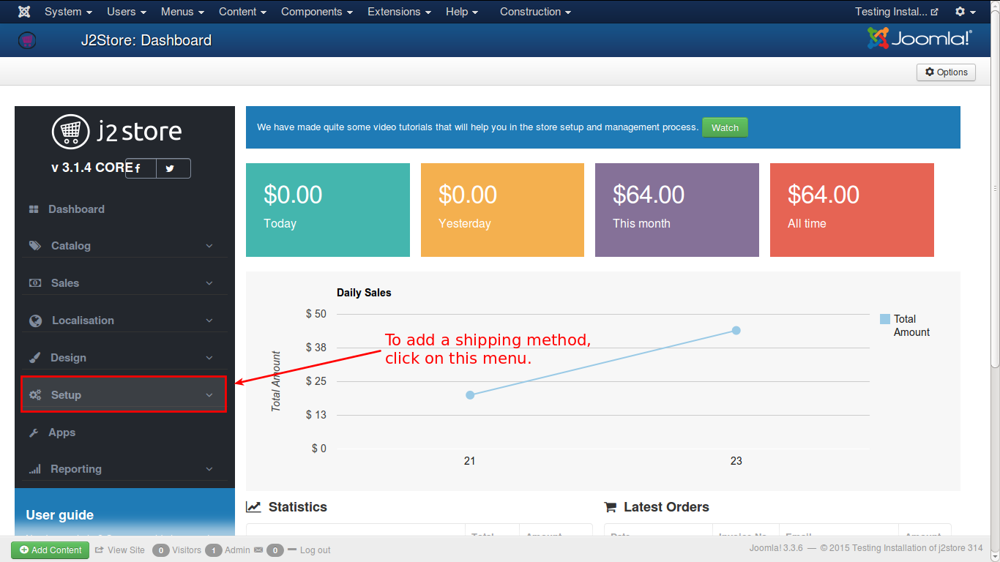

4. Select **Set Up -> Shipping Methods**


5. From the list, click on the **Create / Edit / Link** in the **Standard Shipping Methods** category
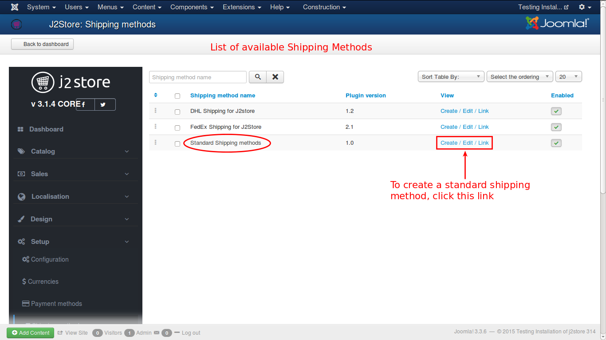

6. From the obtained window, click on the **New** button
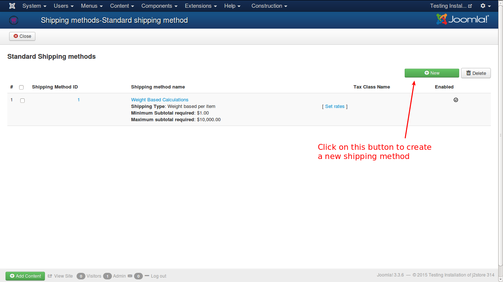

7. You will get the form to add a new shipping method

>IMPORTANT NOTE: To apply flat rate shipping method, you should enable over-riding of shipping address with store address.  If over-ride option is set to **No**, then customers in **California** only can avail this method and customers in rest of the country will not be charged with shipping cost.

8. **Save & Close** window. Now you can see the created shipping method in the list as show in the image below. Now, you need to set the rate for the shipping method. To do that, click on the link **Set Rates**.


9. You will get a pop-up window to set the rates for the shipping method, as shown below. 
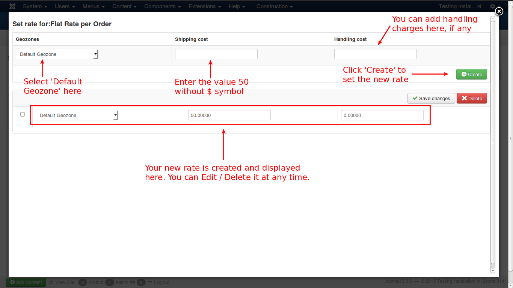

Now all are set and your shipping method is ready for use.


<a name="quantity_based_per_order_example"></a>
##  Quantity based per Order - Example

To create a shipping method of type **Quantity based per Order**, follow the steps given below:

> Assume that you have a store in California, USA. You will get orders from all over USA. You need to ship the consignment to the customer, with shipping rate based on the quantity of items per order. Let us see how a **Quantity based per order** shipping method can be created for your store.

1. Go to **J2Store Dashboard -> Setup -> Configuration** and select the **Store** tab, as shown in the image. Enter the details and ensure that **United States** and **California**, are selected for country and zone, respectively.


2. Go to **J2Store Dashboard -> Localization -> Geozones** and click on the **New** button in the top left corner to create new geozone, as shown in the image. 

Enter the name for the geozone as **Default Geozone** and select country and zone as **United States** and **California** respectively, as shown below. Click **Save & Close**.


3. Go to **J2Store Dashboard -> Setup**


4. Select **Set Up -> Shipping Methods**


5. From the list, click on the **Create / Edit / Link** in the **Standard Shipping Methods** category


6. From the window you get after you follow the previous step, click on the **New** button in the right side, as indicated in the image below.


7. You will get the form to create new shipping method. Fill in the details as shown in the image.


8. **Save & Close** window. Now you can see the created shipping method in the list as show in the image below. Now, you need to set the rate for the shipping method. To do that, click on the link **Set Rates**.


9. You will get a pop-up window to set the rates for the shipping method, as shown below. 


Now all are set and your shipping method is ready for use.


<a name="weight_based_per_order_example"></a>
## Weight based per Order - Example

To create a shipping method of type **Weight based per Order**, follow the steps given below:

> Assume that you have a store in California, USA. You will get orders from all over USA. You need to ship the consignment to the customer, with shipping rate based on weight of items per order. Let us see how a **Weight based per order** shipping method can be created for your store.

For a better understanding, consider this:

Your shop is in California, US. For shipping within California, a separate geozone is created for California and the shipping charges will be as levied as follows, provided the **minimum** quantity eligible for shipping is 50 Kgs. The below table shows the weight and the corresponding shipping charges.

| Weight (In Kilograms - Kg) | Rate (In USD - $) |
| -- | -- |
| 50 - 250 | 25 |
| 251 - 500 | 35 |
| 501 - 1000 | 50 |

Like this, you can set different rates for shipping outside California, by creating different geozones and fixing different shipping rates, based on the distances of the locations from California, as given below:

| Weight (In Kilograms - Kg) | Philadelphia Rate (In USD - $) | Texas Rate (In USD - $) | New Jersey Rate (In USD - $) |
| -- | -- | -- | -- |
| 50 - 250 | 30 | 40 | 45 |
| 251 - 500 | 40 | 50 | 50 |
| 501 - 1000 | 50 | 60 | 65 |

Now, we will see how to create a shipping method based on the weight of the order itmes.

1. Go to **J2Store Dashboard -> Setup -> Configuration** and select the **Store** tab, as shown in the image. Enter the details and ensure that **United States** and **California**, are selected for country and zone, respectively.


2. Go to **J2Store Dashboard -> Localization -> Geozones** and click on the **New** button in the top left corner to create new geozone, as shown in the image. 

Enter the name for the geozone as **Default Geozone** and select country and zone as **United States** and **California** respectively, as shown below. Click **Save & Close**.


3. Go to **J2Store Dashboard -> Setup**


4. Select **Set Up -> Shipping Methods**


5. From the list, click on the **Create / Edit / Link** in the **Standard Shipping Methods** category


6. From the window you get after you follow the previous step, click on the **New** button in the right side, as indicated in the image below.


7. You will get the form to create new shipping method. Fill in the details as shown in the image.


8. **Save & Close** window. Now you can see the created shipping method in the list as show in the image below. Now, you need to set the rate for the shipping method. To do that, click on the link **Set Rates**.
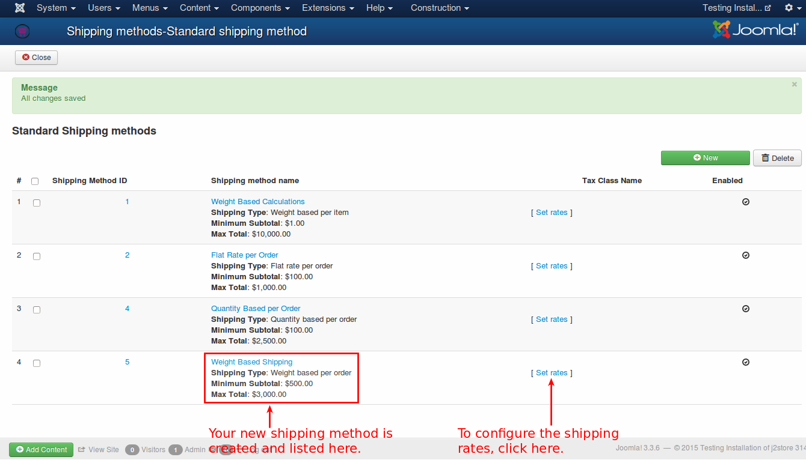

9. You will get a pop-up window to set the rates for the shipping method, as shown below. 


Now all are set and your shipping method is ready for use.

<a name="trouble_shooting_shipping_plugins_issues"></a>
# Trouble Shooting Shipping Plugins Issues


### Troubleshooting USPS, FedEx, UPS and CanadaPost shipping plugins

You have installed the shipping plugin but it doesn't show up during the checkout. Here are a list of reasons that might be preventing the plugin from fetching shipping cost real-time from the APIs of the Shipping carrier.

#### Currency
In USPS shipping plugin, if the shipping server is queried, the server will return the list of options and their corresponding rates in US $. The shipping plugin may not show the rates if USD is not present in your list of currencies and you have configured a currency other than the US $, like CAD or AUD. To avoid this issue, you must have USD as a currency  in your list of currencies. This will solve the issue.

#### Enable Shipping

Well, this might sound trivial. But some of us often forget to turn on the ***Enable Shipping Switch*** while creating the product. Make sure that Enable shipping is set to YES.

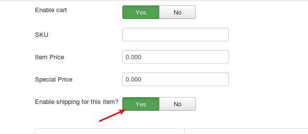

#### Weight and Dimensions

All the shipping carriers use the weight and the dimension of your product (Length, Width & Height) of your products to calculate the shipping cost (besides using the destination address). So make sure that you enter the Weight and the dimension of your product.

You should select the weight and the length measurement unit from the drop down list.

IMPORTANT for those using UPS: Only KG (Kilogram) and LB (Pound) are supported by UPS as the weight measurement units.  Similarly, only IN (Inch) and CM (Centimetres) are supported as length measurement units. There is a lot more to be taken care of.  If you use Pounds (Lbs) as the weight measurement, then the length measurement should be Inch (In). Similarly, if Kgs (Kilograms) is used, then Centimetre (cm) should be the measurement.

Also, make sure that you choose the correct measurement units in the plugin settings as well. If the measurement units used in the products does not match with the settings in the plugin, then J2Store will attempt to convert the values to the measurement unit set in the plugin.

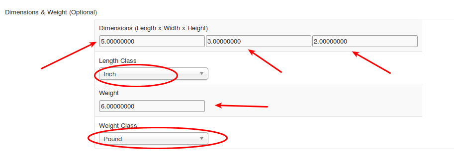

#### API credentials

All shipping carriers have a web service and provide credentials to access their Rate API. Some of the carriers like USPS offer TEST accounts as well.  Make sure you enter these credentials correctly in the Plugin. Some of the carriers provide Customer number ( like Canada Post ) and a few other parameters as well. Refer the documentation PDF that come with each plugin for more information.

#### Geozone

All the plugins come with a geozone filter setting.

If you choose a geozone, then this shipping plugin will apply only to customers coming from the countries/zones added under the chosen geozone.

During testing, make sure that this parameter is set to All geozones.

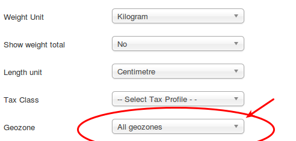

#### Debug Mode

In your plugin settings, set the Debug mode to **YES**. This will allow the plugin to log the responses sent by the APIs of the shipping carriers.

The log is stored in the /cache folder of your Joomla Root. You can use your Hosting CPanel's file manager or an FTP program like FileZilla to access the log file. The log should give you a lot of information.

>VERY IMPORTANT: Debug mode SHOULD NOT be enabled in LIVE / PRODUCTION sites.

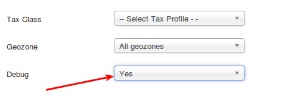

Still not working? Please create a private ticket or email us the log file. We will help you troubleshoot the plugin.


# Common mistakes to avoid when setting up Standard Shipping methods in J2Store

A number of store owners use the standard shipping methods that come integrated with J2Store.

The standard methods - flat rate, weight based, quantity based and price based - are very simple to configure and use. However, owners often make a few simple mistakes, leading to the disappearance of the shipping methods during the checkout.

This post aims to help the store owners to set up the shipping methods properly.

## 1. Enable shipping in the product parameters

While creating a product, the **Enable Shipping** param is by default set to ***No***. Most store owners do not notice this. If the product requires shipping, make sure that you set this param to ***Yes***.


## 2. Geozones

All the standard shipping methods in J2Store are bound by the Geozones. That is, you should always select a geozone while setting the rates. So, make sure that you have created the Geozones and added countries or zones inside them.

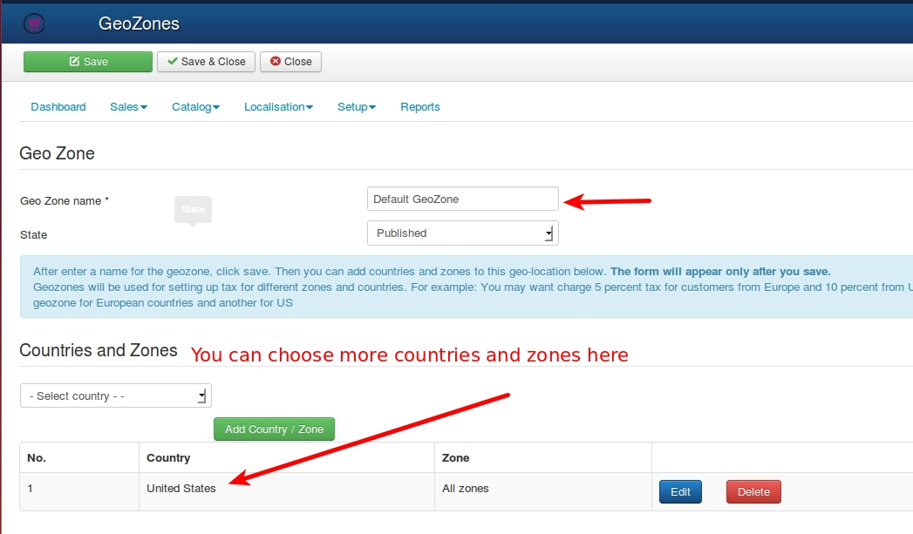

The concept of Geozone is very simple. Example: You have a store in the United States, Texas.

When you ship your goods to the nearby states, Oklahoma, Arkansas, and Louisiana, it costs you USD 20. But when you ship the same goods to California, it costs you USD 50.

So, group the Oklahoma, Arkansas, and Louisiana states into one Geozone and give it a name, for example, Nearby States. Then you create a second Geozone including California.

Refer the User guide for more examples.

## 3. Set shipping rates

After creating a shipping method (by going to J2Store admin -> Set up -> Shipping methods -> Standard Shipping Methods), you can see a link named Set Rates. Click on it to set the shipping rates for the chosen shipping type.

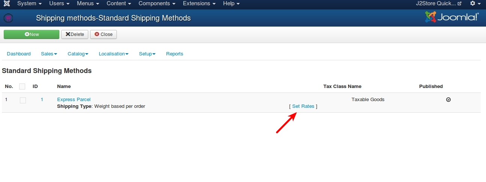

While Setting Rates, make sure that you select the Geozone. If you have two or more Geozones, then you should set rates for all. 

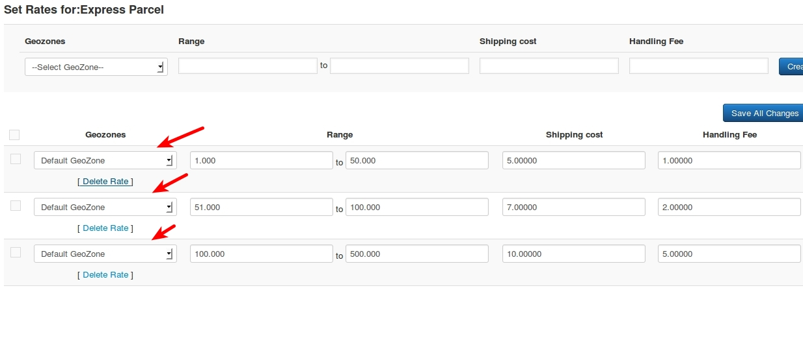


