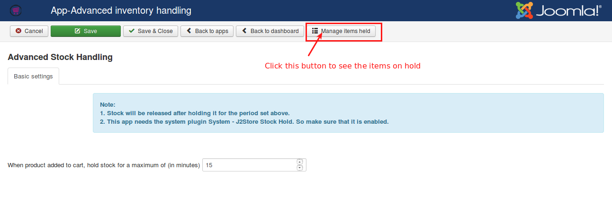
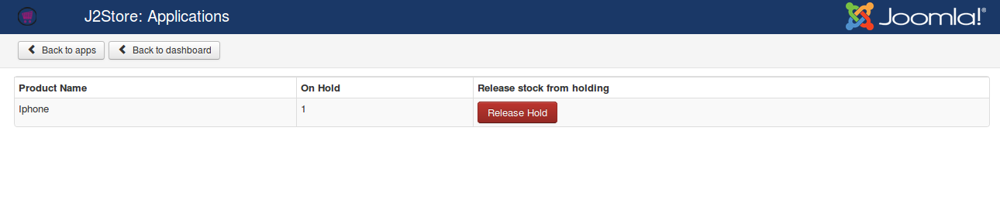
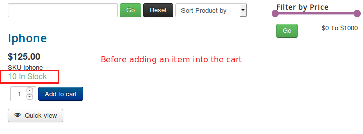
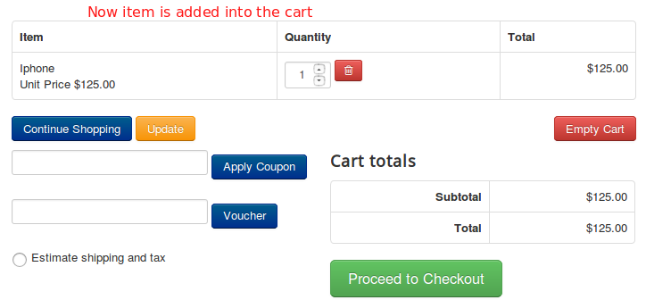
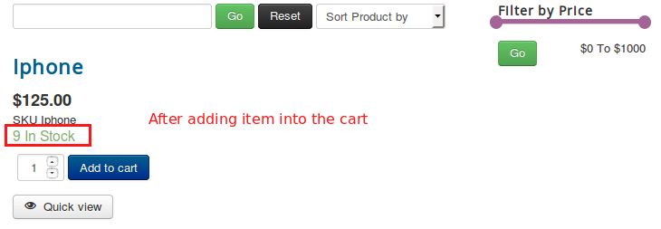

# Advanced stock handling

This app is used to control the stock when item is in cart. That is, normally in J2Store the stock will be reduced after placing an order. This app is quite different. If you installed this app, it will hold the stock once customer add an item into the cart. You can set the time limit for how long the stock should be on hold. For example set time limit to 15 minutes. Once the time limit exceeds the stock will get released.

For example, say the stock of a product is 5 and if customer comes to store and add an item into the cart, the stock will get reduced to 4. And the product stock shows to another customer as 4 instead of 5. If customer not finished this purchase within 15 minutes and left from store, the stock will get released and changed to 5 .

#### Requirements

1. PHP version 5.4 or higher
2. Joomla 3.x or higher
3. J2Store 3.2.11 or higher

#### Installation

1. Download the app from our site and install it using Joomla installer.
2. After installing this plugin, go to J2Store > Apps and click on **Enable** to activate the app.
3. Once enabled the app, click on **Open** to setup the basic settings of the app.

#### Basic Settings

There is no complex configuration for this app. Just set time limit as like in below image

You can manage the stock holded item by clicking on **Manage items held** on top of the Basic settings page.

#### Frontend

