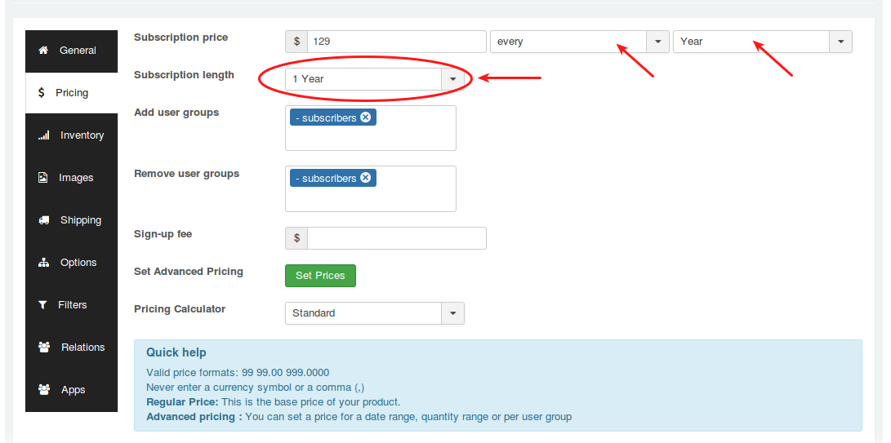

# One term subscription

#### How to create a non-recurring (one term) subscription plan?

Non recurring is a single term subscription in which the subscription will be terminated at the specific period and does not allow for auto renewal. Subscriber will have to subscribe for the plan next time manually.

Lets see an example for single term subscription. For example, consider you are providing service for $129 for one year.

##### Step - 1 Creating product

1. Go to Article manager and create a new article

2. Move to J2Store cart tab

3. Select YES to Treat as product

4. Choose product type either Simple Subscription or Variable Subscription.

##### Step - 2 Setting up price based on non - recurring

1. Now navigate to **Pricing** section

2. Enter the price **$129** in the price text box.

3. Next to price text box, you can see two dropdowns. In the first dropdown, choose **every** and choose **year** from second dropdown.

4. Set **1 Year** to Subscription length.

5. Choose your usergroups and save.

Here is the **[Direct link to video](https://www.j2store.org/support/video-tutorials/selling-one-time-subscriptions-with-manual-renewals.html)**.