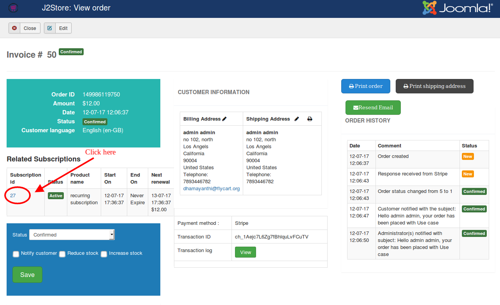
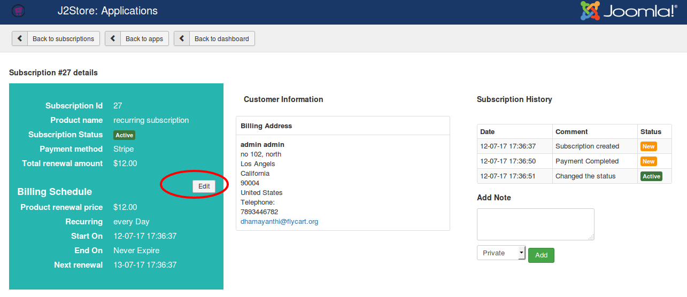
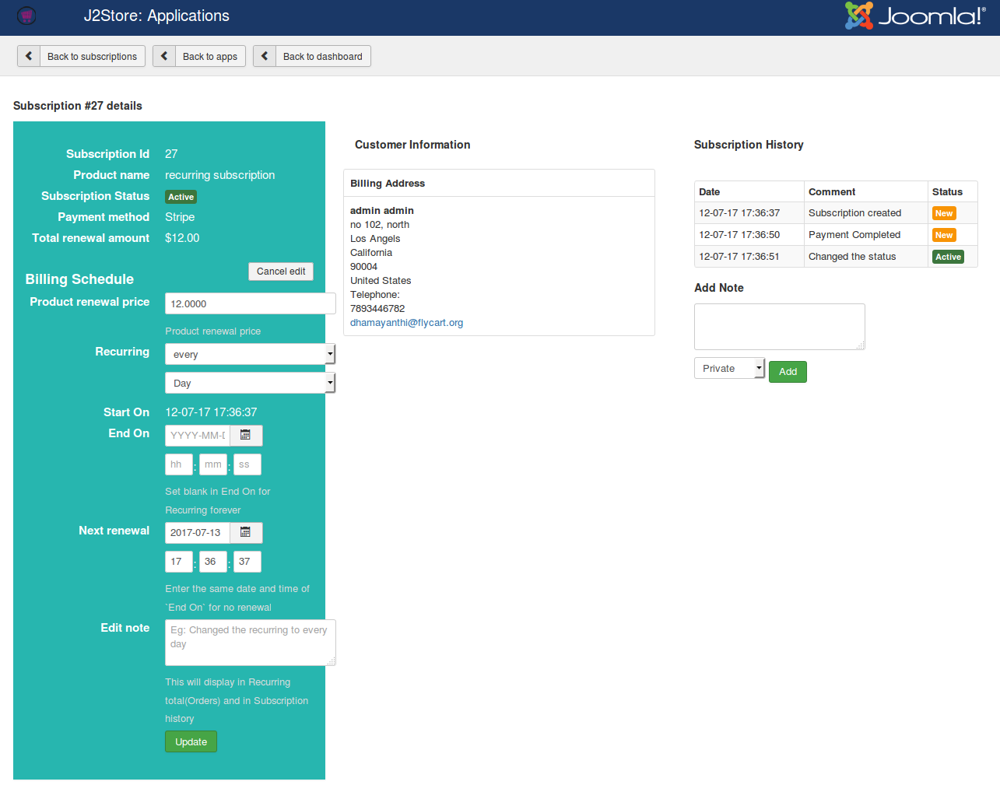
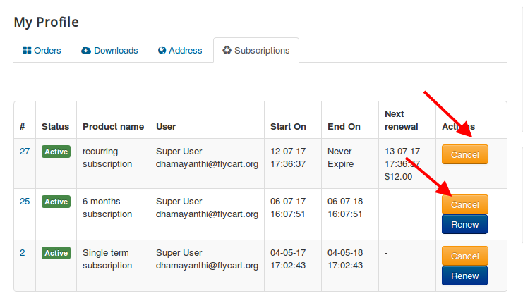
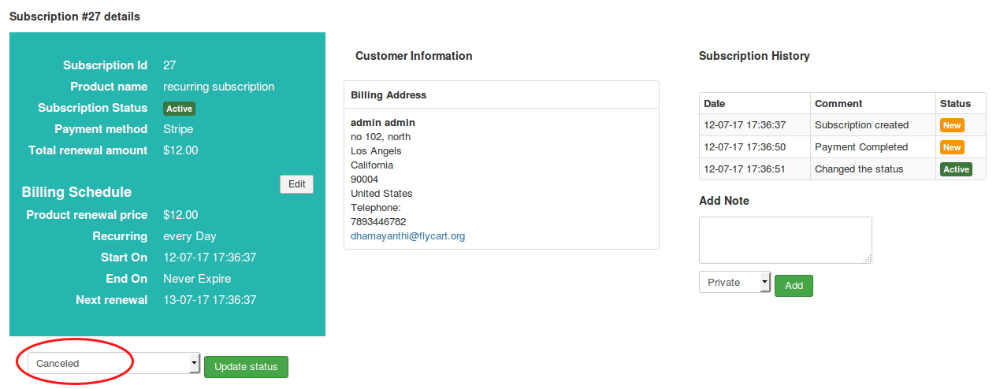
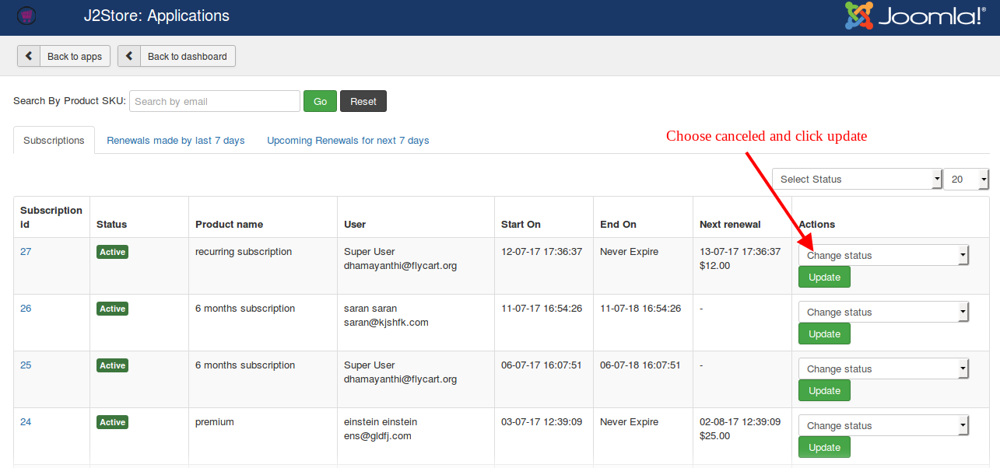

# Troubelshooting guide

### How to write template override for subscription emails

Copy all files in
/plugins/j2store/app_subscriptionproduct/app_subscriptionproduct/mailtemplates

to
/template/YOUR-SITE-TEMPLATE/html/plugins/j2store/app_subscriptionproduct

Now edit
/templates/YOUR-SITE-TEMPLATE/html/plugins/j2store/app_subscriptionproduct/notify_expire.php

Make changes and save.

### How to edit subscription from backend?

Sometimes you may want to change renewal date or next renewal amount. To do this, you will have to edit the subscription from backend. Follow below steps to edit the subscription from backend:

1. Go to J2Store > Sales > Orders

2. Edit the order and open order history page

3. You will see the Subscription table. Click on Subscription id (for example, 5) to edit the subscription.

4. On subscription page, you will see green colored panel where you could see the **Edit** button.

5. Click on this edit button to edit / change renewal price, recurring period, next renewal date.

### How to cancel subscription ?

Cancelling subscription can be done by both store admin as well as subscriber.

#### Cancelling subscription by subscriber

* On frontend order history page , move to subscription tab. You will see the **Cancel** button on last column (named "Actions") of the table.

* Clicking on Cancel button will cancel the subscription.

#### Cancelling subscription by store owner in two ways:

**First way:**

* Go to J2Store > Sales > Orders

* Open / Edit your order.

* You will see the subscription table. Click on Subscripiton id to cancel the subscripiton.

* After clicking on subscription id, you will be getting subscription page. On this page, you will see the option to update status. Choose Canceled from dropdown list and click on **Update status** button. The subscription will be cancelled.

**Second way:**

* Go to J2Store > Apps and open Subscription Products app.

* On top of the page, Click on **Subscriptions** button.

* You will see the subscriptions list in a table. On the last column (Actions) of the table, choose the status **Canceled** and click on Update button. The subscription will be cancelled.
