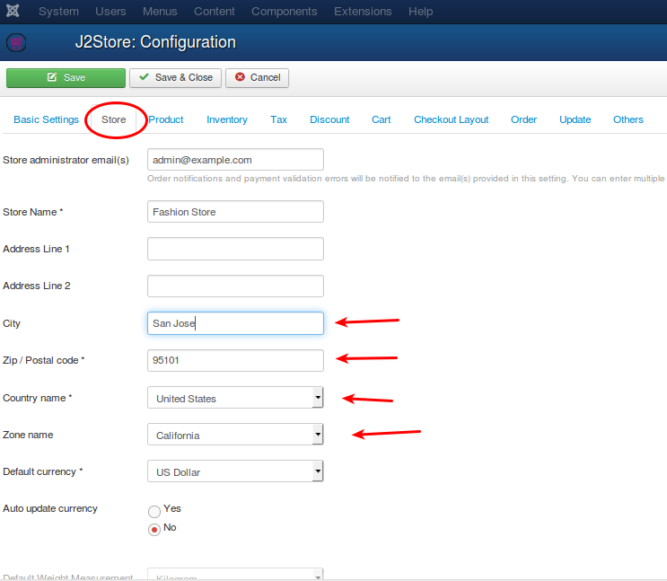

# Tax Configuration

This section will help you configure the tax for your store.

The customer is charged tax based on the billing or shipping address. 
Before we go on to the details of tax rates, you should configure your store location information correctly in Set up -> Configuration -> Store tab

* City
* Zip / Postal code
* Country
* Zone

The above settings will be used to calculate the base tax rates and display prices including tax or exclusing tax when customer visits your website
