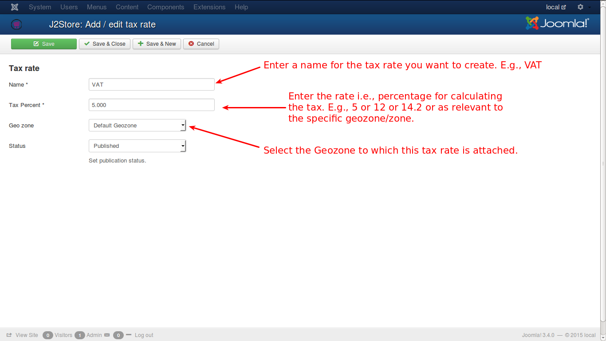

# Tax Rate

A tax rate is the percentage of an individual's taxable income or a corporation's earning that is owed to the state, federal and in some cases, municipal governments.

For example, VAT is a tax class which is globally accepted and when creating it, you need to give the following details associated with it.

#### VAT

Value Added Tax - the globally accepted and practiced tax system. Percentage may vary as and when it is revised by the countries or authorities concerned.

* VAT is the name given to the tax rate while creating it
* Percentage of VAT is also set
* This tax rate is attached to a geozone which will include all the zones/countries that practice this tax rate
* Finally it is enabled for use by the customer

