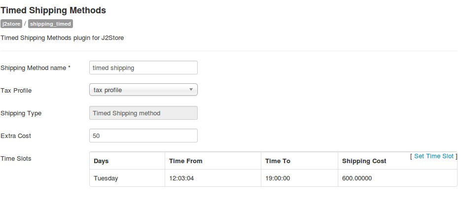

# Timed Shipping Plugins

The Timed Shipping Plugin for J2Store allows you to charge shipping based on days and time.

### Requirements
* PHP 5.2 or higher
* Joomla 2.5 or above
* J2store 2.7.3 or above

### Installation
1. Use the joomla installer to install the plugin.
2. In the backend, go to Extensions -> Plugin Manager and open the j2store Timed Shipping Plugin (type = **j2store**).
3. Enable the plugin.
4. Click "Edit plugin params" link.
5. Enter the parameters (read the explanation about each parameter given below).
6. Click "Set Time Slot Link".
7. Enter day, time from, time to, shipping cost (read the explanation about each field given below).
8. Click "Create Time Slot".
9. Close Popup.
10. Click "Save".

### Parameters
#### Shipping Method Name
This will be displayed to the customer (Eg: Parcel Post).

#### Tax Profile
If you DO NOT want to charge tax on the shipping/postage cost, then dont select anything here. If you want to charge tax, then select a tax profile.

#### Extra Cost
It will be added to the shipping cost. Set 0 if you dont want to charge anything extra.

#### Time Slots
You can add, edit time slots by clicking the link.

Check the image below to understand how to set to time slots.

The image below illustrates how a timed shipping method plugin will look like.

