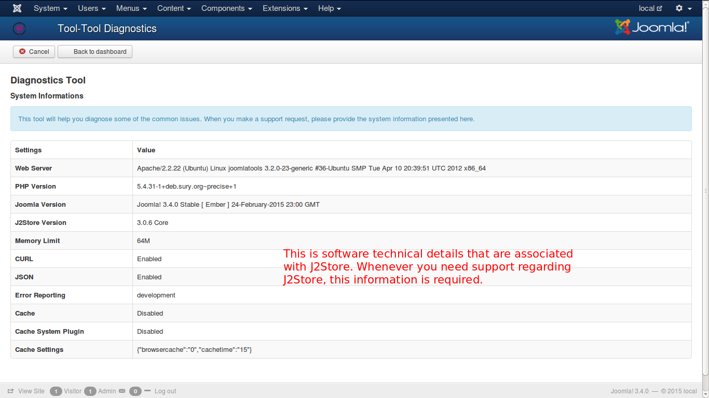
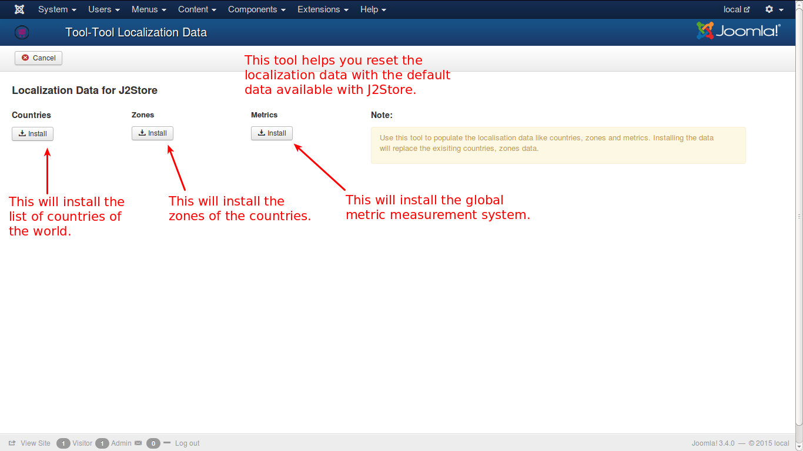

# Tools

This page lists the available tools for specific actions. They are:

* Diagnostics Tool
* J2Store Tool Localization Data

#### Diagnostics Tool
**System Informations**

These are the basic system informations that are required to be supplied when you need support with respect to J2Store.

| Settings | Value |
| -- | -- |
| **Web Server** | Apache/2.2.22 (Ubuntu) Linux joomlatools 3.2.0-23-generic #36-Ubuntu SMP Tue Apr 10 20:39:51 UTC 2012 x86_64  |
| **PHP Version** | 5.4.31-1+deb.sury.org~precise+1  |
| **Joomla Version** | Joomla! 3.4.0 Stable [ Ember ] 24-February-2015 23:00 GMT |
| **J2Store Version** | 3.0.6 Core  |
| **Memory Limit** | 64M |
| **CURL** | Enabled |
| **JSON** | Enabled |
| **Error Reporting** | Development |
| **Cache** | Disabled |
| **Cache System Plugin** | Disabled |
| **Cache Settings** | {"browsercache":"0","cachetime":"15"}  |

#### J2Store Tool Localization Data

This tool helps you in resetting the localization data for your cart, as and when necessary. If you wish to reset the data you can do so by clicking the install button provided in the page, selectively.

**Countries** - If you install countries, list of all the countries in the world will be loaded in your countries table, thus replacing old data if any.

**Zones** - This will replace the zones present in the table with the default zones of J2Store.

**Metrics** - This will reset the metric system to weigh and meausring lengths with the default data of J2Store.

