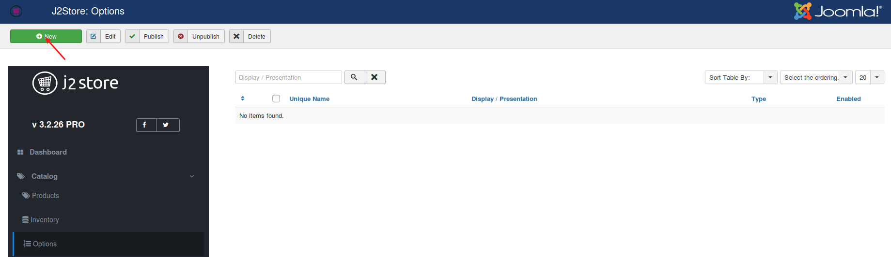
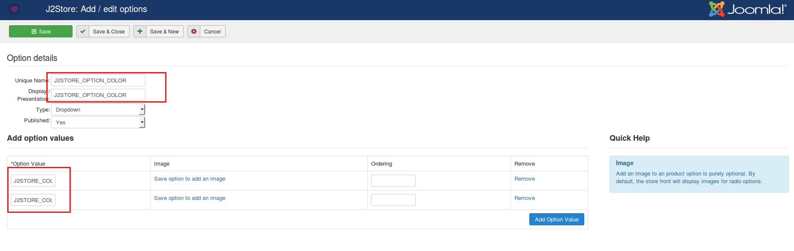
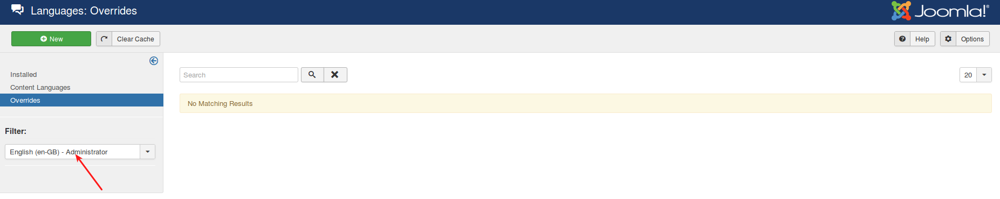
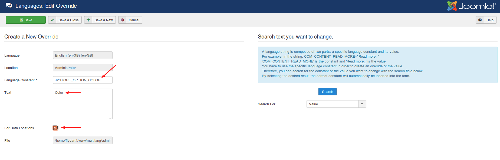
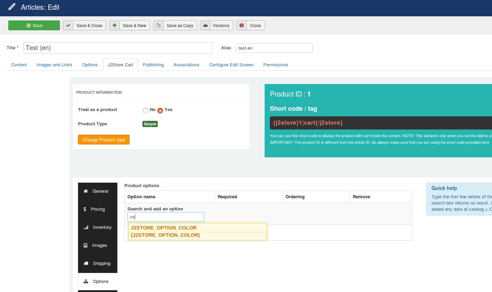
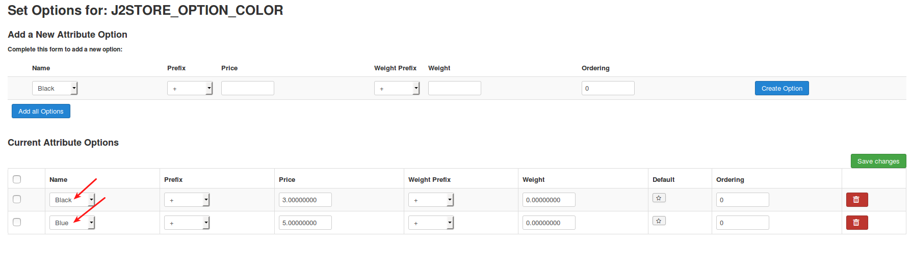
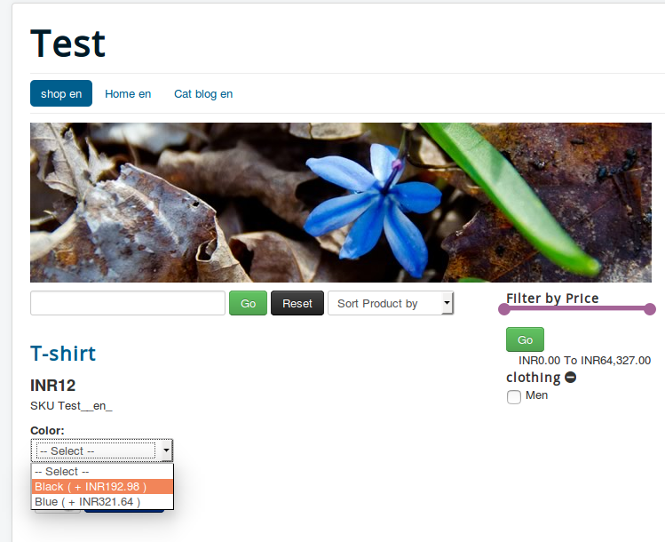

# Translating product options

Do yo want to translate your product option to site's languages? Yes, it is possible in J2Store by using Joomla's default language oveerride method.

All you have to do is give the language string as your option name and create the language override for it.

Let's see below how to translate the product options.

#### Creating product options

1. Go to J2Store > Catalog > Options and click new

2. Enter the name for your option and option values. Both name should be in **language string**. Refer below image:

#### Creating language override

1. Go to Extensions > Languages > Overrides and set the filter to **Administrator** location and then click **New**.

2. Enter the language string (which is given as a option name) and give its value in the Text box. Choose **For Both locations** and save.

3. Likewise, create language override option values.

#### Adding options to the product

1. Go to Article manager and edit your product

2. Move to J2Store Cart tab and then navigate to Options tab

3. Search for the options and add to it and save.

4. Click on **Set values** to create the option values for the product and save.

#### Relevant screenshot of frontend

