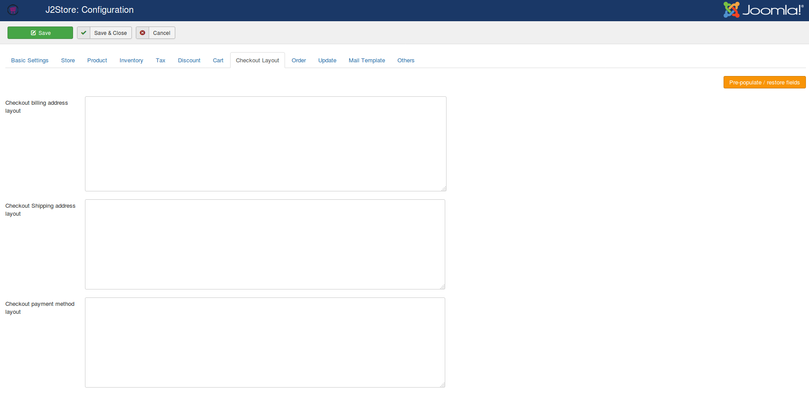
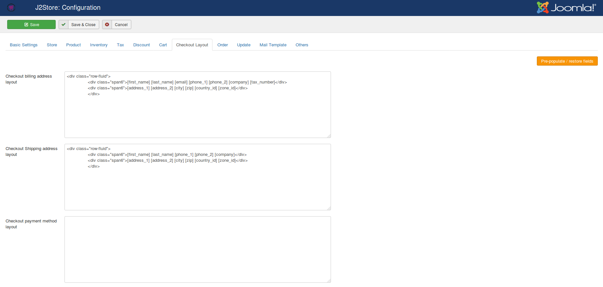
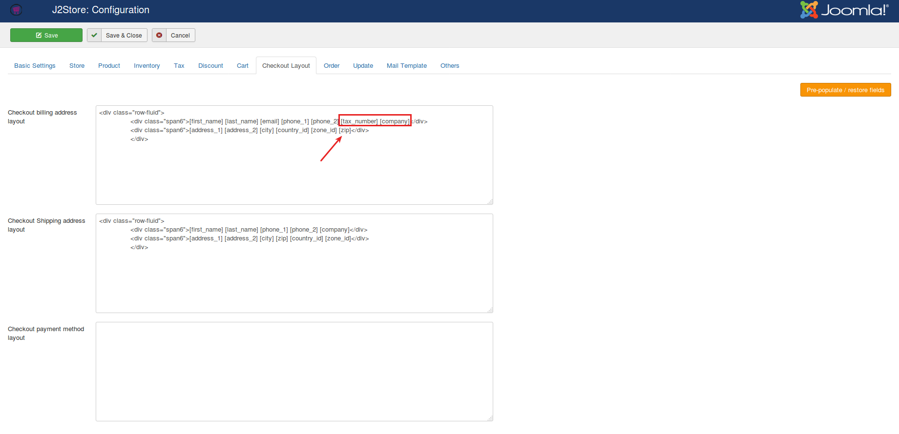
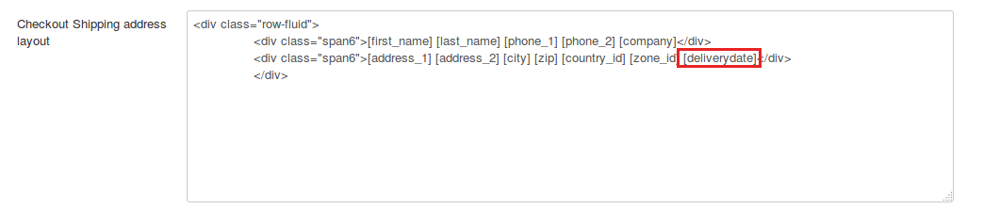

## Troubleshooting Easy checkout

* **[How to reorder checkout fileds](#reorder)**
* **[Translating easy checkout](#translation)**
* **[How to create template override for Easy checkout ?](#template-override)**

### How to reorder checkout fields ?

As like J2Store's standard checkout, the checkout fields could also be re-ordered in Easy checkout as well. You could place the checkout fields wherever you wants inside the checkout page.

Here are the steps to be followed:

Go to J2Store > Configuration > Checkout layout tab

You will see the textarea for 3 layout sections (Billing, Shipping, Payment), where you could add the shortcode of the checkout fields.
For example, [first_name]

The checkout page will display all the fields that are added here.

To add all the checkout core fields, click on Pre-populate / Restore fields at the right corner of the page.

Now the page will be looking like below:

Now re-order the fields as your wish. See the screenshot below:

If you have created custom fields and wants to add reorder them, that could also be possible.
For example, if you have field Delivery date, then add the shortcode ([deliverydate]) of it inside the text area.

### Translating Easy checkout

J2Store and Easy checkout shares most of the language strings. 

For example, if your site is in Dutch language
Here are the steps to create dutch translation file for easy checkout.

Copy 
/administrator/language/en-GB/en-GB.com_easycheckout.ini

To
/administrator/language/nl-NL/en-GB.com_easycheckout.ini

Now rename the file **en-GB.com_easycheckout.ini** under /administrator/language/nl-NL/ to

**nl-NL.com_easycheckout.ini**

Now edit
/administrator/language/nl-NL/nl-NL.com_easycheckout.ini

Now replace the values for all the language strings related to easy checkout.

For example,
EASYCHECKOUT_CUSTOMER_INFORMATION="Customer information"

Replace Customer information with your value and save.

### How to create template override for Easy checkout ?

If you would like to customize the Easy checkout page, that could be possible by creating template override. Carrying out customizations through template override will not overwrite the changes if you update it in future.

Here are the instructions to be followed:

The files that controls Easy checkout page are located at

/components/com_easycheckout/views/checkout/

For example, if you wants to customize the login form, then copy below file

/components/com_easycheckout/views/checkout/tmpl/default_login_form.php

And paste it under

/templates/YOUR-SITE-TEMPLATE/html/com_easycheckout/checkout/default_login_form.php

Edit

/templates/YOUR-SITE-TEMPLATE/html/com_easycheckout/checkout/default_login_form.php

Make your changes and save.